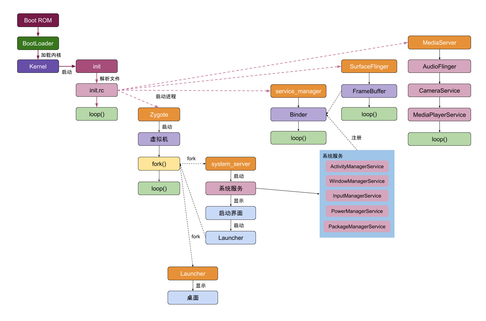
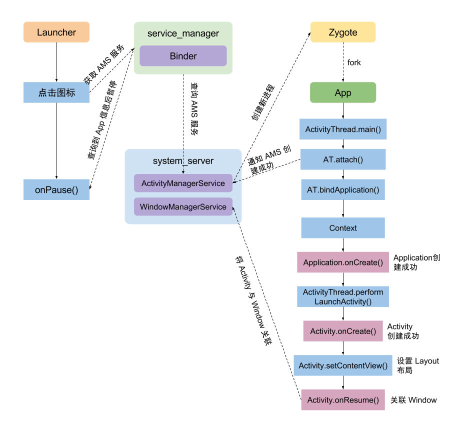
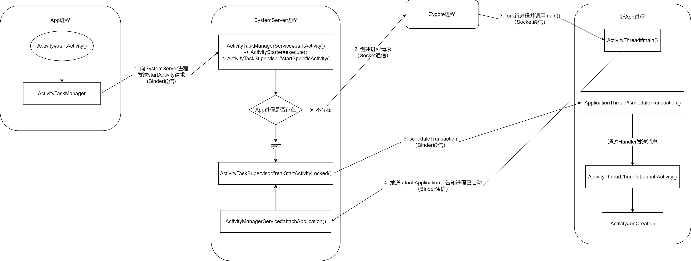

# Activity 原生启动流程

## 系统界面 Launcher 

为了解 VA 是如何启动 Activity 的，我们需要先知道 Android 是如何启动 Activity 的。在 Android 系统启动以后，系统已经启动了 Zygote，ServiceManager，SystemServer 等系统进程。

`ServiceManager` 进程中完成了 `Binder` 初始化；`SystemServer` 进程中 ActivityManagerService，`WindowManagerService`，`PackageManagerService` 等系统服务在 `ServiceManager` 中已经注册；最后启动了 `Launcher` 桌面应用。




`Launcher` 作为用户的交互界面，在用户点击 APP 图标的时候提供了打开应用的能力。不同的手机厂商可能会根据 `Launcher` 做一些定制，比如 `miui` 就是如此，但最终的原理是一致的。

应用安装的时候，通过 `PackageManagerService` 解析 apk 的 `AndroidManifest.xml` 文件，提取出这个 apk 的信息写入到 `packages.xml` 文件中，这些信息包括：权限、应用包名、icon、apk 的安装位置、版本、userID 等等。packages.xml 文件位于系统目录下/data/system/packages.xml。

## 启动应用流程



当用户点击桌面上的应用图标后，Launcher 会通过 service_manager 向 AMS 服务发出请求，查询对应的 APP 信息，然后由 Zygote 创建目标 APP 进程。



先梳理一下大致的流程：
1. Launcher 通过 Binder 方式沟通 AMS 
2. AMS 先检查这个 APP 进程是不是已经创建了
3. 如果已经创建，则直接调用 `realStartActivityLocked` 直接到第 7 步
4. 否则，AMS 接到请求后让 Zygote 通过 fork 创建 APP 进程，完成 `Application.onCreate` 、创建应用的上下文和其他各种必要对象，这些对象会在 AMS 中留有备份进行保留。
5. 新创建的 APP 进程通过 Binder 发送 `ATTACH_APPLICATION_TRANSACTION` 通知 AMS 
6. AMS 接到 `ATTACH_APPLICATION_TRANSACTION` 后调用 `realStartActivityLocked` 
7. 设置进程为顶部 Activity，为新进程创建事务发送调度命令 `H.EXECUTE_TRANSACTION`
8. 进程处理命令消息时调用 Activity.onCreate 并且初始化应用自己的视图

具体到代码实现中，分为几个步骤，首先启动步骤从 Launcher 开始：

1. 检查将要打开的目标 APP 的 Activity 是否存在，如果存在就不需要打开了

`Launcher.startActivitySafel` -> `Launcher.startActivity`

2. 打开目标 Activity

`Activity.startActivity`

3. 通过 ATSM 服务调用该服务提供的 startActivity

`Activity.startActivityForResult` - `Instrumentation.execStartActivity` - `ActivityTaskManager.getService().startActivity`

`ActivityManagerNative.getDefault()` 会返回一个 `ActivityManagerProxy` 作为 Launcher 中使用 `ActivityTaskManager` 的代理，该代理的 startActivity 会发送 `START_ACTIVITY_TRANSACTION` 来通知 `ActivityTaskManager`

完成上述过程后，进程从 `Launcher` 切换到 `system_server` 中的 `ActivityManagerService`，也就是 AMS。

1. 在 startActivityAsUser 中会先获取用户的 UserID 作为参数然后往下调用 getActivityStartController 中的 starter 

`startActivity` - `startActivityAsUser` 

2. 创建新的 intent 对象，获取 ApplicationPackageManager 

`ActivityStackSupervisor.startActivityMayWait` - `resolveActivity`

3. 获取 intent 所指向的 Activity 信息，并保存到 Intent 对象。

`PackageManagerService.resolveIntent()`  - `queryIntentActivities()`

4. 获取到调用者的进程信息，通过 `Intent.FLAG_ACTIVITY_FORWARD_RESULT` 判断是否需要进行 `startActivityForResult` 处理。检查调用者是否有权限来调用指定的 Activity

5. Activity 有多种启动模式，对 launchMode 的处理，创建 Task 等操作。启动 Activity 所在进程，已存在则直接 `onResume()`，不存在则创建 Activity 并处理是否触发 `onNewIntent()`。

`ActivityStackSupervisor.startActivityUncheckedLocked` - `startActivityLocked`

6. 若找到 resume 状态的 Activity，执行 `startPausingLocked()` 暂停该 Activity，同时暂停所有处于后台栈的 Activity，这里一般来说会把桌面，也就是 Launcher 暂停掉。

`ActivityStack.resumeTopActivityInnerLocked`

7. 获取要启动的Activity进程信息，若成功，则表示进程已经启动了，通过 `realStartActivityLocked` 启动这个 activity；否则，通过 AMS 代理调用 startProcessAsync 去创建进程。前者的条件就是前面所述的目标 APP 已经启动过的情况，后者则是从头开始创建这个 APP 进程。

`ActivityStackSupervisor.startSpecificActivity`

我们考虑后者的情况，程序将会往下调用 `startProcessAsync` 创建新进程：

```java
    void startProcessAsync(ActivityRecord activity, boolean knownToBeDead, boolean isTop,String hostingType) {
        try {
            ...
            // 发布消息以启动进程，以避免在持有 ATMS 锁的情况下调用 AMS 可能出现死锁。
            final Message m = PooledLambda.obtainMessage(ActivityManagerInternal::startProcess,
                    mAmInternal, activity.processName, activity.info.applicationInfo, knownToBeDead,
                    isTop, hostingType, activity.intent.getComponent());
            mH.sendMessage(m);
        } finally {
            Trace.traceEnd(TRACE_TAG_WINDOW_MANAGER);
        }
    }
```

startProcessAsync 会通过消息的方式让 ATMS 服务在处理该消息时创建对应的进程，调用目标为 `ActivityManagerInternal::startProcess`

而 `ActivityManagerInternal::startProcess` 调用`ActivityManagerService::startProcessLocked` 调用 `ProcessList::startProcessLocked` 调用 `ProcessList::startProcess`

如果目标进程是 top app，设置 flag 保证启动的最高优先级，并最终在 startProcess 中创建对应的目标进程，也就是 APP 的进程。

在进程创建成功后，将当前进程切换到新进程，并将 `ActivityThread` 类加载到新进程，调用 `ActivityThread.main`

1. `ActivityThread.main` ：创建主线程的 Looper 对象，创建 `ActivityThread` 对象，`ActivityThread.attach()` 建立 Binder 通道，开启 `Looper.loop()` 消息循环
2. `ActivityThread.attach`：创建 `ActivityManagerProxy` 对象，调用基于 `IActivityManager` 接口的 Binder 通道 `ActivityManagerProxy.attachApplication()`

```java
    public static void main(String[] args) {
        ...
        //初始化当前进程的 Looper 对象
        Looper.prepareMainLooper();
        ...
        ActivityThread thread = new ActivityThread();
        //此处创建Application
        thread.attach(false, startSeq);
 
        if (sMainThreadHandler == null) {
            sMainThreadHandler = thread.getHandler();
        }
 
        if (false) {
            Looper.myLooper().setMessageLogging(new
                    LogPrinter(Log.DEBUG, "ActivityThread"));
        }
 
        // 调用 Looper 的 loop 方法开启无限循环。
        Looper.loop();
 
        throw new RuntimeException("Main thread loop unexpectedly exited");
    }
```

Looper 会持续从消息队列中获取消息，然后处理指定的任务。其中，attach 函数调用时会发送 `ATTACH_APPLICATION_TRANSACTION` 通知 system_server 中的服务。

此时，应用的 `ActivityThread` 和 `ApplicationThread` 已经被创建，并创建了消息循环机制。当调用 `ActivityThread.attach` 时，内部会调用 `ActivityManagerProxy.attachApplication` ，通过 Binder 来调用 AMS 中的 `attachApplication` 函数，此时会把 `ApplicationThread` 传递过去。

`attachApplication` - `attachApplicationLocked` 主要有两个关键函数需要关注：

- bindApplication
- ActivityTaskManagerService.LocalService#attachApplication

```java
private boolean attachApplicationLocked(@NonNull IApplicationThread thread,
                                        int pid, int callingUid, long startSeq) {
    synchronized (mProcLock) {
        app.mState.setCurAdj(ProcessList.INVALID_ADJ);
        app.mState.setSetAdj(ProcessList.INVALID_ADJ);
        app.mState.setVerifiedAdj(ProcessList.INVALID_ADJ);
        mOomAdjuster.setAttachingSchedGroupLSP(app);
        app.mState.setForcingToImportant(null);
        updateProcessForegroundLocked(app, false, 0, false);
        app.mState.setHasShownUi(false);
        app.mState.setCached(false);
        app.setDebugging(false);
        app.setKilledByAm(false);
        app.setKilled(false);
        app.setUnlocked(StorageManager.isUserKeyUnlocked(app.userId));
    }
    // 移除进程超时信息
    mHandler.removeMessages(PROC_START_TIMEOUT_MSG, app);

    final ProviderInfoList providerList = ProviderInfoList.fromList(providers);
    if (app.getIsolatedEntryPoint() != null) {
        thread.runIsolatedEntryPoint(
            app.getIsolatedEntryPoint(), app.getIsolatedEntryPointArgs());
    } else if (instr2 != null) {
        thread.bindApplication(processName, appInfo,
                               app.sdkSandboxClientAppVolumeUuid, app.sdkSandboxClientAppPackage,
                               providerList,
                               instr2.mClass,
                               profilerInfo, instr2.mArguments,
                               instr2.mWatcher,
                               instr2.mUiAutomationConnection, testMode,
                               mBinderTransactionTrackingEnabled, enableTrackAllocation,
                               isRestrictedBackupMode || !normalMode, app.isPersistent(),
                               new Configuration(app.getWindowProcessController().getConfiguration()),
                               app.getCompat(), getCommonServicesLocked(app.isolated),
                               mCoreSettingsObserver.getCoreSettingsLocked(),
                               buildSerial, autofillOptions, contentCaptureOptions,
                               app.getDisabledCompatChanges(), serializedSystemFontMap,
                               app.getStartElapsedTime(), app.getStartUptime());
    } else {
        thread.bindApplication(processName, appInfo,
                               app.sdkSandboxClientAppVolumeUuid, app.sdkSandboxClientAppPackage,
                               providerList, null, profilerInfo, null, null, null, testMode,
                               mBinderTransactionTrackingEnabled, enableTrackAllocation,
                               isRestrictedBackupMode || !normalMode, app.isPersistent(),
                               new Configuration(app.getWindowProcessController().getConfiguration()),
                               app.getCompat(), getCommonServicesLocked(app.isolated),
                               mCoreSettingsObserver.getCoreSettingsLocked(),
                               buildSerial, autofillOptions, contentCaptureOptions,
                               app.getDisabledCompatChanges(), serializedSystemFontMap,
                               app.getStartElapsedTime(), app.getStartUptime());
    }

    if (normalMode) {
        try {
            // 最终调用ActivityTaskManagerService.LocalService#attachApplication()
            didSomething = mAtmInternal.attachApplication(app.getWindowProcessController());
        } catch (Exception e) {
        }
    }

    return true;
}

```

我们先关注 `thread.bindApplication` ，thread 就是刚刚由新进程传过来的。

函数先调用 `bindApplication` 向进程发送 `H.BIND_APPLICATION` 命令，进程收到该命令后，通过 `handleBindApplication` 处理：

```java
private void handleBindApplication(AppBindData data) {    
    // 初始化context
    final ContextImpl appContext = ContextImpl.createAppContext(this, data.info);       
    // 初始化Instrumentation
    if (ii != null) {
        initInstrumentation(ii, data, appContext);
    } else {
        mInstrumentation = new Instrumentation();
        mInstrumentation.basicInit(this);
    }    
    Application app; 
    try {
        // 初始化Application
        // 调用LoadedApk#makeApplicationInner()
        app = data.info.makeApplicationInner(data.restrictedBackupMode, null);           
        mInstrumentation.onCreate(data.instrumentationArgs);        
        // 回调Application#onCreate()
        mInstrumentation.callApplicationOnCreate(app);
    } finally {
    }
}
```

`handleBindApplication` 初始化 `context`，然后初始化 `Instrumentation` 对象，创建 `Application` 对象，并调用该对象的 `onCreate`

初始化流程调用链为 `makeApplication` - `newApplication` :

```java
private void handleBindApplication(AppBindData data) {    
    // 初始化context
    final ContextImpl appContext = ContextImpl.createAppContext(this, data.info);       
    // 初始化Instrumentation
    if (ii != null) {
        initInstrumentation(ii, data, appContext);
    } else {
        mInstrumentation = new Instrumentation();
        mInstrumentation.basicInit(this);
    }    
    Application app; 
    try {
        // 初始化Application
        // 调用LoadedApk#makeApplicationInner()
        app = data.info.makeApplicationInner(data.restrictedBackupMode, null);           
        mInstrumentation.onCreate(data.instrumentationArgs);        
        // 回调Application#onCreate()
        mInstrumentation.callApplicationOnCreate(app);
    } finally {
    }
}


public Application makeApplication(boolean forceDefaultAppClass,Instrumentation instrumentation) {
    
    if (mApplication != null) {   
       return mApplication;
    }
    
    String appClass = mApplicationInfo.className;
    java.lang.ClassLoader cl = getClassLoader();
    
    //此时新建一个 Application 的 ContextImpl 对象，
    ContextImpl appContext = ContextImpl.createAppContext(mActivityThread, this);
    
    //通过在 handleBindApplication 创建的 mInstrumentation 对象新建一个 Application 对象，同时进行 attach。
    app = mActivityThread.mInstrumentation.newApplication(cl, appClass, appContext);
    appContext.setOuterContext(app);
}

public Application newApplication(ClassLoader cl, String className, Context context) {    
    return newApplication(cl.loadClass(className), context);
}
Instrumentation类：
static public Application newApplication(Class<?> clazz, Context context)  {
    //实例化 Application
    Application app = (Application)clazz.newInstance();     
    
    // Application 和 context绑定
    app.attach(context);    
    return app;
}
//attach 就是将新建的 ContextImpl 赋值到 mBase，这个 ContextImpl 对象就是所有Application 内 Context 的具体实现，同时赋值一些其他的信息如 mLoadedApk。
final void attach(Context context) {    
    mBase = base;  
    mLoadedApk = ContextImpl.getImpl(context).mPackageInfo;
}

```

然后是 `makeApplicationInner` 的细节

```java
public Application makeApplicationInner(boolean forceDefaultAppClass,
                                        Instrumentation instrumentation) {
    return makeApplicationInner(forceDefaultAppClass, instrumentation, false);
}

private Application makeApplicationInner(boolean forceDefaultAppClass,
                                         Instrumentation instrumentation, boolean allowDuplicateInstances) {
    if (mApplication != null) {
        return mApplication;
    }

    synchronized (sApplications) {
        final Application cached = sApplications.get(mPackageName);
        if (cached != null) {
            if (!allowDuplicateInstances) {
                mApplication = cached;
                return cached;
            }
        }
    }

    Application app = null;

    final String myProcessName = Process.myProcessName();
    String appClass = mApplicationInfo.getCustomApplicationClassNameForProcess(
        myProcessName);


    try {
        final java.lang.ClassLoader cl = getClassLoader();
        if (!mPackageName.equals("android")) { 
            initializeJavaContextClassLoader(); 
        }
        // 初始化Application的上下文
        ContextImpl appContext = ContextImpl.createAppContext(mActivityThread, this);
        // 创建Application实例
        app = mActivityThread.mInstrumentation.newApplication(
            cl, appClass, appContext);
        appContext.setOuterContext(app);
    } catch (Exception e) {
    }
    mActivityThread.mAllApplications.add(app);
    mApplication = app;
    if (!allowDuplicateInstances) {
        synchronized (sApplications) {
            sApplications.put(mPackageName, app);
        }
    }

    if (instrumentation != null) {
        try {
            // 回调Application#onCreate()
            instrumentation.callApplicationOnCreate(app);
        } catch (Exception e) {
        }
    }
    return app;
}
```

对于新创建的这个进程而言，当 `callApplicationOnCreate` 完成调用以后，这个进程的上下文，以及 `Application` 对象和 `Instrumentation` 对象都完成的创建和初始化。而在进程这波完成上述的初始化过程中，AMS 那边也没闲着，在发送完相应的命令以后， `ActivityManagerService#attachApplicationLocked` 继续往下调用 ` ActivityTaskManagerService.LocalService#attachApplication`

```java
public boolean attachApplication(WindowProcessController wpc) throws RemoteException {
    synchronized (mGlobalLockWithoutBoost) {
        try {
            // 调用RootWindowContainer#attachApplication()
            // 最终调用AttachApplicationHelper#test()
            return mRootWindowContainer.attachApplication(wpc);
        } finally {           
        }
    }
}

public boolean test(ActivityRecord r) {
    if (r.finishing || !r.showToCurrentUser() || !r.visibleIgnoringKeyguard
            || r.app != null || mApp.mUid != r.info.applicationInfo.uid
            || !mApp.mName.equals(r.processName)) {
        return false;
    }

    try {
        // 调用ActivityTaskSupervisor#realStartActivityLocked()
        if (mTaskSupervisor.realStartActivityLocked(r, mApp,
                mTop == r && r.getTask().canBeResumed(r) /* andResume */,
                true /* checkConfig */)) {
            mHasActivityStarted = true;
        }
    } catch (RemoteException e) {
    }
    return false;
}
```

可以注意到，最终这个函数将往下执行 `ActivityTaskSupervisor#realStartActivityLocked` 完成最后的步骤。而如果**此前不需要创建新进程，那么刚打开 APP 的时候就会从这个地方开始恢复进程的状态**了。

```java
boolean realStartActivityLocked(ActivityRecord r, WindowProcessController proc,
        boolean andResume, boolean checkConfig) throws RemoteException {            
    // 创建启动Activity的事务 
    final ClientTransaction clientTransaction = ClientTransaction.obtain(proc.getThread(), r.token);
    final boolean isTransitionForward = r.isTransitionForward();
    final IBinder fragmentToken = r.getTaskFragment().getFragmentToken();
    // 添加callback
    clientTransaction.addCallback(LaunchActivityItem.obtain(new Intent(r.intent),
                    System.identityHashCode(r), r.info,                 
                    mergedConfiguration.getGlobalConfiguration(),
                    mergedConfiguration.getOverrideConfiguration(), r.compat,
                    r.getFilteredReferrer(r.launchedFromPackage), task.voiceInteractor,
                    proc.getReportedProcState(), r.getSavedState(), r.getPersistentSavedState(),
                    results, newIntents, r.takeOptions(), isTransitionForward,
                    proc.createProfilerInfoIfNeeded(), r.assistToken, activityClientController,
                    r.shareableActivityToken, r.getLaunchedFromBubble(), fragmentToken));
 
    // 设置Activity启动后的生命周期状态
    final ActivityLifecycleItem lifecycleItem;
    if (andResume) {
        // RESUME状态
        lifecycleItem = ResumeActivityItem.obtain(isTransitionForward);
    } else {
        // PAUSE状态
        lifecycleItem = PauseActivityItem.obtain();
    }
    // 设置状态
    clientTransaction.setLifecycleStateRequest(lifecycleItem);

    // 开启事务，最终调用ClientLifecycleManager#scheduleTransaction()
    mService.getLifecycleManager().scheduleTransaction(clientTransaction);                         
    return true;
}

```

函数首先创建 Activity 事务，设置对应的 callback ，以及对应的生命周期 `ActivityLifecycleItem`，最终开始调度事务 `lientLifecycleManager#scheduleTransaction`。

```java
// 启动Activity的事务
void scheduleTransaction(ClientTransaction transaction) throws RemoteException {
    final IApplicationThread client = transaction.getClient();
    // 调用ClientTransaction#schedule()
    transaction.schedule(); 
}

public void schedule() throws RemoteException {
    // 调用ApplicationThread#scheduleTransaction()
    mClient.scheduleTransaction(this);
}

@Override
public void scheduleTransaction(ClientTransaction transaction) throws RemoteException {
    // 最终调用ClientTransactionHandler#scheduleTransaction()
    ActivityThread.this.scheduleTransaction(transaction);
}

void scheduleTransaction(ClientTransaction transaction) {
    transaction.preExecute(this);
    // 发送消息，在H类中接收消息
    sendMessage(ActivityThread.H.EXECUTE_TRANSACTION, transaction);
}
```

可以看到，最终由 AMS 向进程发出 `H.EXECUTE_TRANSACTION` 命令，这个命令同样会被进程那边接受并处理：

```java
class H extends Handler {
    public void handleMessage(Message msg) {
        switch (msg.what) {
            case EXECUTE_TRANSACTION:
                final ClientTransaction transaction = (ClientTransaction) msg.obj;
                // 执行事务
                mTransactionExecutor.execute(transaction);
                if (isSystem()) {
                    transaction.recycle();
                }
                break;
        }
    }
}
```

```java
public void execute(ClientTransaction transaction) {
    // 调用TransactionExecutor#executeCallbacks()
    executeCallbacks(transaction);
    // 执行lifecycleState
    executeLifecycleState(transaction);

    mPendingActions.clear();
}
```

这个函数最终会往下调用 `ClientTransactionHandler#handleLaunchActivity`，最为抽象类的方法，实际调用 `ActivityThread#handleLaunchActivity` ：

```java
public Activity handleLaunchActivity(ActivityClientRecord r,
        PendingTransactionActions pendingActions, Intent customIntent) {  
 	// 在创建Activity之前初始化
    if (ThreadedRenderer.sRendererEnabled
            && (r.activityInfo.flags & ActivityInfo.FLAG_HARDWARE_ACCELERATED) != 0) {
        HardwareRenderer.preload();
    }
    // 获取WMS服务，初始化WindowManager
    WindowManagerGlobal.initialize();
    // GraphicsEnvironment提示一个activity正在进程上启动
    GraphicsEnvironment.hintActivityLaunch();
    // 启动Activity，调用ActivityThread#performLaunchActivity()
    final Activity a = performLaunchActivity(r, customIntent); 
    return a;
}
```

`handleLaunchActivity` 最终回调目标 `Activity` 的 `onConfigurationChanged`，初始化 `WindowManagerService`，调用 `ActivityThread.performLaunchActivity`。

```java
ActivityThread.performLaunchActivity() {
    //类似 Application 的创建过程，通过 classLoader 加载 activity.
    activity = mInstrumentation.newActivity(classLoader, 
               component.getClassName(), r.intent);
    //因为 Activity 有界面，所以其 Context 是 ContextThemeWrapper 类型，但实现类仍是ContextImpl.
    Context appContext = createBaseContextForActivity(r, activity);
    activity.attach(context,mInstrumentation,application,...);
    //与 Window 进行关联
    
    //调用 activity 的 onCreate()方法。
    mInstrumentation.callActivityOnCreate(activity,...)
}

public void callActivityOnCreate(Activity activity, Bundle icicle) {
    prePerformCreate(activity);
    // 调用Activity#performCreate()
    activity.performCreate(icicle);
    postPerformCreate(activity);
}
```

`callActivityOnCreate` 中会回调 `Activity.performCreate` ，其中调用 `Activity` 的 `onCreate` 、`Activity.setContentView`、`ActivityThread.performResumeActivity`，`performResumeActivity` 最终会回调 `onResume`。

总之，到这里之后，新应用的进程算是创建完成了。

# 结余

弯弯绕绕一大圈，有不少的同名函数，在整理这些资料的时候也是被绕晕了好几次了，希望最终写出来的流程没有太混乱吧。如果有哪里写的不对，还请师傅们多多指教。

# 参考文章

https://blog.csdn.net/hgy413/article/details/100071667
https://blog.csdn.net/hgy413/article/details/95465321
https://zhuanlan.zhihu.com/p/151010577
https://juejin.cn/post/7028124957141893150
https://github.com/jeanboydev/Android-ReadTheFuckingSourceCode/blob/master/article/android/framework/Android-Activity%E5%90%AF%E5%8A%A8%E8%BF%87%E7%A8%8B.md
https://blog.csdn.net/g984160547/article/details/120676574
https://blog.csdn.net/qq_14876133/article/details/141362098
[VirtualApp拆解之二：Activity启动流程 - 简书](https://www.jianshu.com/p/f95fd575a57c)