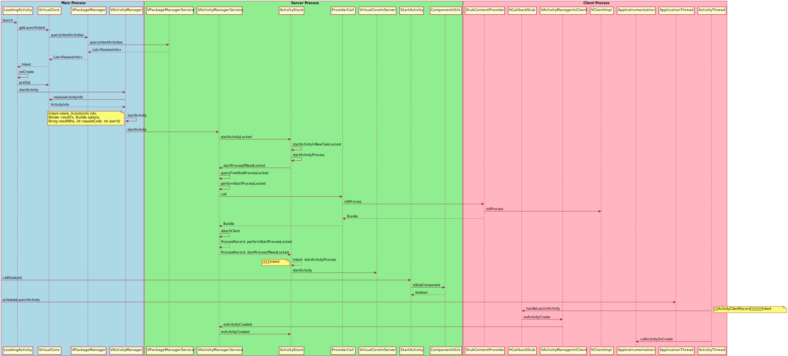

# 前言

在了解了正常环境下 app 的 activity 是如何被启动的以后，接下來我们希望能够了解一下 VirtualApp 中是如何启动目标 app 的。不过整个流程涉及到了对部分 Service 的 Hook，但这些内容却不是本节我们重点关心的内容，因此会有相应的介绍，但或许并不全面。

# 容器内 APP 启动流程

## 点击启动应用时发生了啥

当用户点击了视图上目标应用的图标后，触发点击事件并向下调用，在 blackbox 中将来到 `launchApk` 函数：

```java
public boolean launchApk(String packageName, int userId) {  
  Intent launchIntentForPackage =  
      getBPackageManager().getLaunchIntentForPackage(packageName, userId);  
  if (launchIntentForPackage == null) {  
    return false;  
  }  
  startActivity(launchIntentForPackage, userId);  
  return true;  
}

public void startActivity(Intent intent, int userId) {  
  if (mClientConfiguration.isEnableLauncherActivity()) {  
    LauncherActivity.launch(intent, userId);  
  } else {  
    getBActivityManager().startActivity(intent, userId);  
  }  
}

public static void launch(Intent intent, int userId) {  
  Intent splash = new Intent();  
  splash.setClass(SandBoxCore.getContext(), LauncherActivity.class);  
  splash.addFlags(Intent.FLAG_ACTIVITY_NEW_TASK);  
  
  splash.putExtra(LauncherActivity.KEY_INTENT, intent);  
  splash.putExtra(LauncherActivity.KEY_PKG, intent.getPackage());  
  splash.putExtra(LauncherActivity.KEY_USER_ID, userId);  
  SandBoxCore.getContext().startActivity(splash);  
}
```

`mClientConfiguration.isEnableLauncherActivity` 是恒真的，因此最终会调用 `LauncherActivity.launch` ，在该函数中，`blackbox` 初始化了一个 `Intent`，然后调用原生的 `startActivity` 函数来进入 `LauncherActivity`，在进入时，会调用该对象的 `onCreate` 函数：

```java
@Override  
protected void onCreate(@Nullable Bundle savedInstanceState) {  
  super.onCreate(savedInstanceState);  
  // 获取启动当前 Activity 的 Intent
  Intent intent = getIntent();  
  if (intent == null) {  
    finish();  
    return;  
  }  
  // 获取需要启动的对于 APP 的相关信息
  Intent launchIntent = intent.getParcelableExtra(KEY_INTENT);  
  String packageName = intent.getStringExtra(KEY_PKG);  
  int userId = intent.getIntExtra(KEY_USER_ID, 0);  
  
  PackageInfo packageInfo =  
      SandBoxCore.getBPackageManager().getPackageInfo(packageName, 0, userId);  
  if (packageInfo == null) {  
    Slog.e(TAG, packageName + " not installed!");  
    finish();  
    return;  
  }  
  Drawable drawable = packageInfo.applicationInfo.loadIcon(SandBoxCore.getPackageManager());  
  setContentView(R.layout.activity_launcher);  
  findViewById(R.id.iv_icon).setBackgroundDrawable(drawable);  
  // 调用 BActivityManager.startActivity 在 Blackbox 中启动应用
  new Thread(() -> SandBoxCore.getBActivityManager().startActivity(launchIntent, userId)).start();  
}
```

函数首先获取之前那个 splash ，然后从中读取出需要启动的目标应用的包名和用户 ID，并通过包名来读取包的相关信息，最后调用 `BActivityManager.startActivity` 来在 Blackbox 中启动应用。

```java
public void startActivity(Intent intent, int userId) {  
  try {  
    getService().startActivity(intent, userId);  
  } catch (RemoteException e) {  
    e.printStackTrace();  
  }  
}

public Service getService() {  
  if (mService != null  
      && mService.asBinder().pingBinder()  
      && mService.asBinder().isBinderAlive()) {  
    return mService;  
  }  
  try {  
    mService =  
        Reflector.on(getTClass().getName() + "$Stub")  
            .method("asInterface", IBinder.class)  
            .call(SandBoxCore.get().getService(getServiceName()));  
    mService  
        .asBinder()  
        .linkToDeath(  
            new IBinder.DeathRecipient() {  
              @Override  
              public void binderDied() {  
                mService.asBinder().unlinkToDeath(this, 0);  
                mService = null;  
              }  
            },  
            0);  
    return getService();  
  } catch (Throwable e) {  
    e.printStackTrace();  
    return null;  
  }  
}
```

`getService` 函数会返回对应的 Service ，在这个函数中将会返回 `BActivityManagerService`，这里涉及到了一个我们尚且没有关注过的问题，VirtualApp 是如何伪造各种系统 Service 的？

## 那些系统服务如何被 Hook

在应用的 `Manifest` 里声明了这么一段：

```xml
<provider  
  android:name=".core.system.SystemCallProvider"  
  android:authorities="${applicationId}.blackbox.SystemCallProvider"  
  android:exported="false"  
  android:process="@string/black_box_service_name" />
```

在启动 Blackbox 的时候，`handleBindApplication` 中会主动调用对应 `ContentProvider` 下的 `onCreate` 函数：

```java
@Override  
public boolean onCreate() {  
  return initSystem();  
}  
  
private boolean initSystem() {  
  BlackBoxSystem.getSystem().startup();  
  return true;  
}

public void startup() {  
  // 如果已经启动过了，则直接返回即可
  if (isStartup.getAndSet(true)) return;  
  BEnvironment.load();  

  // 将需要 hook 的系统 Service 代理放入 mServices
  mServices.add(BPackageManagerService.get());  
  mServices.add(BUserManagerService.get());  
  mServices.add(BActivityManagerService.get());  
  mServices.add(BJobManagerService.get());  
  mServices.add(BStorageManagerService.get());  
  mServices.add(BPackageInstallerService.get());  
  mServices.add(BXposedManagerService.get());  
  mServices.add(BProcessManagerService.get());  
  mServices.add(BAccountManagerService.get());  
  mServices.add(BLocationManagerService.get());  
  mServices.add(BNotificationManagerService.get());  
  // 遍历每个 Service 并调用 systemReady 完成准备工作
  for (ISystemService service : mServices) {  
    service.systemReady();  
  }  
  // 遍历 blackbox 中每个预先安装的应用，如果有哪个尚未安装完成，重新恢复安装
  List<String> preInstallPackages = AppSystemEnv.getPreInstallPackages();  
  for (String preInstallPackage : preInstallPackages) {  
    try {  
      if (!BPackageManagerService.get().isInstalled(preInstallPackage, BUserHandle.USER_ALL)) {  
        PackageInfo packageInfo =  
            SandBoxCore.getPackageManager().getPackageInfo(preInstallPackage, 0);  
        BPackageManagerService.get()  
            .installPackageAsUser(  
                packageInfo.applicationInfo.sourceDir,  
                InstallOption.installBySystem(),  
                BUserHandle.USER_ALL);  
      }  
    } catch (PackageManager.NameNotFoundException ignored) {  
    }  
  }  
  initJarEnv();  
}
```

我们重点关注的是 `mServices` 这个成员，在注意到它将 `BActivityManagerService` 放入了数组，并调用对应的 `systemReady` ：

```java
public BActivityManagerService() {  
  mBroadcastManager = BroadcastManager.startSystem(this, mPms);  
}

@Override  
public void systemReady() {  
  mBroadcastManager.startup();  
}
public void startup() {  
  mPms.addPackageMonitor(this);  
  List<BPackageSettings> bPackageSettings = mPms.getBPackageSettings();  
  for (BPackageSettings bPackageSetting : bPackageSettings) {  
    BPackage bPackage = bPackageSetting.pkg;  
    registerPackage(bPackage);  
  }  
}
```

最终会为每个包注册一个 `BroadcastReceiver` ：

```java
private void addReceiver(String packageName, BroadcastReceiver receiver) {  
  List<BroadcastReceiver> broadcastReceivers = mReceivers.get(packageName);  
  if (broadcastReceivers == null) {  
    broadcastReceivers = new ArrayList<>();  
    mReceivers.put(packageName, broadcastReceivers);  
  }  
  broadcastReceivers.add(receiver);  
}
```

而这个 `SystemCallProvider` 本身也作为一个 IBinder，将它管理的这些 Service 暴露给其他应用使用：

```java
@Nullable  
@Override  
public Bundle call(@NonNull String method, @Nullable String arg, @Nullable Bundle extras) {  
  Slog.d(TAG, "call: " + method + ", " + extras);  
  if ("VM".equals(method)) {  
    Bundle bundle = new Bundle();  
    if (extras != null) {  
      String name = extras.getString("_B_|_server_name_");  
      BundleCompat.putBinder(bundle, "_B_|_server_", ServiceManager.getService(name));  
    }  
    return bundle;  
  }  
  return super.call(method, arg, extras);  
}
```

`ServiceManager.getService` 可以能够根据参数来返回对应的 Service：

```java
public static IBinder getService(String name) {  
  return get().getServiceInternal(name);  
}
public static ServiceManager get() {  
  if (sServiceManager == null) {  
    synchronized (ServiceManager.class) {  
      if (sServiceManager == null) {  
        sServiceManager = new ServiceManager();  
      }  
    }  
  }  
  return sServiceManager;  
}
private ServiceManager() {  
  mCaches.put(ACTIVITY_MANAGER, BActivityManagerService.get());  
  mCaches.put(JOB_MANAGER, BJobManagerService.get());  
  mCaches.put(PACKAGE_MANAGER, BPackageManagerService.get());  
  mCaches.put(STORAGE_MANAGER, BStorageManagerService.get());  
  mCaches.put(USER_MANAGER, BUserManagerService.get());  
  mCaches.put(XPOSED_MANAGER, BXposedManagerService.get());  
  mCaches.put(ACCOUNT_MANAGER, BAccountManagerService.get());  
  mCaches.put(LOCATION_MANAGER, BLocationManagerService.get());  
  mCaches.put(NOTIFICATION_MANAGER, BNotificationManagerService.get());  
}
public IBinder getServiceInternal(String name) {  
  return mCaches.get(name);  
}
```

如果 `ServiceManager` 没初始化的话就先创建并初始化，将所有的 Service 都放入 `mCaches`，并在需要的时候返回该对象。最终其他需要使用这些服务的应用就都能够通过 Binder 拿到这些对应的对象了。

对这些获取 Service 的对象来说，他们本该获取到原生的 `ActivityManagerService` ，却被 `BActivityManagerService` 替换掉了，对应的去调用那些本该调用的方法时，自然这些方法也就一起被 Hook 掉了。

一般来说我们都是通过 `getSystemService` 来获取对应的服务的：

```java
@Override
public Object getSystemService(String name) {
	// this 是 ContextImpl
    return SystemServiceRegistry.getSystemService(this, name);
}
```

而在 Blackbox 的 HookManager 中注册了对各种对象的钩子：

```java
public void init() {  
  if (SandBoxCore.get().isBlackProcess() || SandBoxCore.get().isServerProcess()) {  
    addInjector(new IDisplayManagerProxy());  
    addInjector(new OsStub());  
    addInjector(new IActivityManagerProxy());  
    addInjector(new IPackageManagerProxy());  
    addInjector(new ITelephonyManagerProxy());  
    addInjector(new HCallbackProxy());  
    addInjector(new IAppOpsManagerProxy());  
    addInjector(new INotificationManagerProxy());  
    addInjector(new IAlarmManagerProxy());  
    addInjector(new IAppWidgetManagerProxy());  
    addInjector(new ContentServiceStub());  
    addInjector(new IWindowManagerProxy());  
    addInjector(new IUserManagerProxy());  
    addInjector(new RestrictionsManagerStub());  
    addInjector(new IMediaSessionManagerProxy());  
    addInjector(new ILocationManagerProxy());  
    addInjector(new IStorageManagerProxy());  
    addInjector(new ILauncherAppsProxy());  
    addInjector(new IJobServiceProxy());  
    addInjector(new IAccessibilityManagerProxy());  
    addInjector(new ITelephonyRegistryProxy());  
    addInjector(new IDevicePolicyManagerProxy());  
    addInjector(new IAccountManagerProxy());  
    addInjector(new IConnectivityManagerProxy());  
    addInjector(new IClipboardManagerProxy());  
    addInjector(new IPhoneSubInfoProxy());  
    addInjector(new IMediaRouterServiceProxy());  
    addInjector(new IPowerManagerProxy());  
    addInjector(new IContextHubServiceProxy());  
    addInjector(new IVibratorServiceProxy());  
    addInjector(new IPersistentDataBlockServiceProxy());  
    addInjector(AppInstrumentation.get());  
    /*  
     * It takes time to test and enhance the compatibility of WifiManager     * (only tested in Android 10).     * commented by BlackBoxing at 2022/03/08     * */    addInjector(new IWifiManagerProxy());  
    addInjector(new IWifiScannerProxy());  
    // 12.0  
    if (BuildCompat.isS()) {  
      addInjector(new IActivityClientProxy(null));  
      addInjector(new IVpnManagerProxy());  
    }  
    // 11.0  
    if (BuildCompat.isR()) {  
      addInjector(new IPermissionManagerProxy());  
    }  
    // 10.0  
    if (BuildCompat.isQ()) {  
      addInjector(new IActivityTaskManagerProxy());  
    }  
    // 9.0  
    if (BuildCompat.isPie()) {  
      addInjector(new ISystemUpdateProxy());  
    }  
    // 8.0  
    if (BuildCompat.isOreo()) {  
      addInjector(new IAutofillManagerProxy());  
      addInjector(new IDeviceIdentifiersPolicyProxy());  
      addInjector(new IStorageStatsManagerProxy());  
    }  
    // 7.1  
    if (BuildCompat.isN_MR1()) {  
      addInjector(new IShortcutManagerProxy());  
    }  
    // 7.0  
    if (BuildCompat.isN()) {  
      addInjector(new INetworkManagementServiceProxy());  
    }  
    // 6.0  
    if (BuildCompat.isM()) {  
      addInjector(new IFingerprintManagerProxy());  
      addInjector(new IGraphicsStatsProxy());  
    }  
    // 5.0  
    if (BuildCompat.isL()) {  
      addInjector(new IJobServiceProxy());  
    }  
  }  
  injectAll();  
}
```

我们主要看 `IActivityManagerProxy` 是如何对 `ActivityManager` 进行 hook 的：

```java
@Override  
protected void inject(Object base, Object proxy) {  
  Object iActivityManager = null;  
  if (BuildCompat.isOreo()) {  
    iActivityManager = BRActivityManagerOreo.get().IActivityManagerSingleton();  
  } else if (BuildCompat.isL()) {  
    iActivityManager = BRActivityManagerNative.get().gDefault();  
  }  
  BRSingleton.get(iActivityManager)._set_mInstance(proxy);  
}
```

这里有一个 `_set_mInstance` 实际上是 `blackreflection` 的语法糖，它通过反射的方式来修改 `gDefault().mInstance` 。我们在上一节中提到过启动应用时会通过 `ActivityManagerNative.getDefault` 来得到 `ActivityManagerProxy` ，这里会将结果给改成 `Proxy`，也就是用 `IActivityManagerProxy` 来代理原本的返回对象。

比如说 `getServices` 函数会被 hook 为：

```java
@ProxyMethod("getServices")  
public static class GetServices extends MethodHook {  
  @Override  
  protected Object hook(Object who, Method method, Object[] args) throws Throwable {  
    RunningServiceInfo runningServices =  
        BActivityManager.get()  
            .getRunningServices(BActivityThread.getAppPackageName(), BActivityThread.getUserId());  
    if (runningServices == null) {  
      return new ArrayList<>();  
    }  
    return runningServices.mRunningServiceInfoList;  
  }  
}
```

> 可以注意到，在注入 Service Hook 的时候是有做进程判断的，因为主进程肯定还是需要和 Service 进行正常沟通的，如果全都 Hook 掉的话，主进程也无法正常通信了。所以在满足`isBlackProcess` 或 `isServerProcess` 时才会注入那些代理，也就是那些需要启动的内部应用或是服务进程才会注入。

顺带一提，ServerProcess 中包含了这么几个：

```xml
<provider  
  android:name=".core.system.SystemCallProvider"  
  android:authorities="${applicationId}.blackbox.SystemCallProvider"  
  android:exported="false"  
  android:process="@string/black_box_service_name" />
<receiver  
  android:name=".proxy.ProxyBroadcastReceiver"  
  android:enabled="true"  
  android:exported="true"  
  android:process="@string/black_box_service_name">  
  <intent-filter>    <action android:name="${applicationId}.stub_receiver" />  
  </intent-filter></receiver>
<service  
  android:name=".core.system.DaemonService"  
  android:exported="false"  
  android:process="@string/black_box_service_name" />
<service  
  android:name=".core.system.DaemonService$DaemonInnerService"  
  android:exported="false"  
  android:process="@string/black_box_service_name" />
```

## BActivityManagerService.startActivity 如何启动应用

接下来我们回到 `BActivityManagerService.startActivity` 来看看它如何启动应用。

```java
@Override  
public void startActivity(Intent intent, int userId) {  
  UserSpace userSpace = getOrCreateSpaceLocked(userId);  
  synchronized (userSpace.mStack) {  
    userSpace.mStack.startActivityLocked(userId, intent, null, null, null, -1, -1, null);  
  }  
}
```

这里向下继续调用 `startActivityLocked`，不过这个函数有点长，这里主要关注两个几个关键步骤即可：

```java
public int startActivityLocked(  
    int userId,  
    Intent intent,  
    String resolvedType,  
    IBinder resultTo,  
    String resultWho,  
    int requestCode,  
    int flags,  
    Bundle options) {  
  synchronized (mTasks) {  
    synchronizeTasks();  
  }  
  
  ResolveInfo resolveInfo =  
      BPackageManagerService.get().resolveActivity(intent, GET_ACTIVITIES, resolvedType, userId);  
  if (resolveInfo == null || resolveInfo.activityInfo == null) {  
    return 0;  
  }  
  Log.d(TAG, "startActivityLocked : " + resolveInfo.activityInfo);  
  ActivityInfo activityInfo = resolveInfo.activityInfo;  
  
  ActivityRecord sourceRecord = findActivityRecordByToken(userId, resultTo);  
  if (sourceRecord == null) {  
    resultTo = null;  
  }  
  TaskRecord sourceTask = null;  
  if (sourceRecord != null) {  
    sourceTask = sourceRecord.task;  
  }  
  
  String taskAffinity = ComponentUtils.getTaskAffinity(activityInfo);  
  
  int launchModeFlags = 0;  
  boolean singleTop =  
      containsFlag(intent, Intent.FLAG_ACTIVITY_SINGLE_TOP)  
          || activityInfo.launchMode == ActivityInfo.LAUNCH_SINGLE_TOP;  
  boolean newTask = containsFlag(intent, Intent.FLAG_ACTIVITY_NEW_TASK);  
  boolean clearTop = containsFlag(intent, Intent.FLAG_ACTIVITY_CLEAR_TOP);  
  boolean clearTask = containsFlag(intent, Intent.FLAG_ACTIVITY_CLEAR_TASK);  
  
  TaskRecord taskRecord = null;  
  switch (activityInfo.launchMode) {  
    case ActivityInfo.LAUNCH_SINGLE_TOP:  
    case ActivityInfo.LAUNCH_MULTIPLE:  
    case ActivityInfo.LAUNCH_SINGLE_TASK:  
      taskRecord = findTaskRecordByTaskAffinityLocked(userId, taskAffinity);  
      if (taskRecord == null && !newTask) {  
        taskRecord = sourceTask;  
      }  
      break;  
    case ActivityInfo.LAUNCH_SINGLE_INSTANCE:  
      taskRecord = findTaskRecordByTaskAffinityLocked(userId, taskAffinity);  
      break;  
  }  
  
  // 如果还没有task则新启动一个task  
  if (taskRecord == null || taskRecord.needNewTask()) {  
    return startActivityInNewTaskLocked(userId, intent, activityInfo, resultTo, launchModeFlags);  
  }  
  // 移至前台  
  mAms.moveTaskToFront(taskRecord.id, 0);  
  
  boolean notStartToFront = false;  
  if (clearTop || singleTop || clearTask) {  
    notStartToFront = true;  
  }  
  
  boolean startTaskToFront =  
      !notStartToFront  
          && ComponentUtils.intentFilterEquals(taskRecord.rootIntent, intent)  
          && taskRecord.rootIntent.getFlags() == intent.getFlags();  
  
  if (startTaskToFront) return 0;  
  
  ActivityRecord topActivityRecord = taskRecord.getTopActivityRecord();  
  ActivityRecord targetActivityRecord =  
      findActivityRecordByComponentName(userId, ComponentUtils.toComponentName(activityInfo));  
  ActivityRecord newIntentRecord = null;  
  boolean ignore = false;  
  
  if (clearTop) {  
    if (targetActivityRecord != null) {  
      // 目标栈上面所有activity出栈  
      synchronized (targetActivityRecord.task.activities) {  
        for (int i = targetActivityRecord.task.activities.size() - 1; i >= 0; i--) {  
          ActivityRecord next = targetActivityRecord.task.activities.get(i);  
          if (next != targetActivityRecord) {  
            next.finished = true;  
            Log.d(TAG, "makerFinish: " + next.component.toString());  
          } else {  
            if (singleTop) {  
              newIntentRecord = targetActivityRecord;  
            } else {  
              // clearTop并且不是singleTop，目标也finish，重建。  
              targetActivityRecord.finished = true;  
            }  
            break;  
          }  
        }  
      }  
    }  
  }  
  
  if (singleTop && !clearTop) {  
    if (ComponentUtils.intentFilterEquals(topActivityRecord.intent, intent)) {  
      newIntentRecord = topActivityRecord;  
    } else {  
      synchronized (mLaunchingActivities) {  
        for (ActivityRecord launchingActivity : mLaunchingActivities) {  
          if (!launchingActivity.finished  
              && launchingActivity.component.equals(intent.getComponent())) {  
            // todo update onNewIntent from intent  
            ignore = true;  
          }  
        }  
      }  
    }  
  }  
  
  if (activityInfo.launchMode == ActivityInfo.LAUNCH_SINGLE_TASK && !clearTop) {  
    if (ComponentUtils.intentFilterEquals(topActivityRecord.intent, intent)) {  
      newIntentRecord = topActivityRecord;  
    } else {  
      ActivityRecord record =  
          findActivityRecordByComponentName(userId, ComponentUtils.toComponentName(activityInfo));  
      if (record != null) {  
        // 需要调用目标onNewIntent  
        newIntentRecord = record;  
        // 目标栈上面所有activity出栈  
        synchronized (taskRecord.activities) {  
          for (int i = taskRecord.activities.size() - 1; i >= 0; i--) {  
            ActivityRecord next = taskRecord.activities.get(i);  
            if (next != record) {  
              next.finished = true;  
            } else {  
              break;  
            }  
          }  
        }  
      }  
    }  
  }  
  
  if (activityInfo.launchMode == ActivityInfo.LAUNCH_SINGLE_INSTANCE) {  
    newIntentRecord = topActivityRecord;  
  }  
  
  // clearTask finish All  
  if (clearTask && newTask) {  
    for (ActivityRecord activity : taskRecord.activities) {  
      activity.finished = true;  
    }  
  }  
  
  finishAllActivity(userId);  
  
  if (newIntentRecord != null) {  
    // 通知onNewIntent  
    deliverNewIntentLocked(newIntentRecord, intent);  
    return 0;  
  } else if (ignore) {  
    return 0;  
  }  
  
  if (resultTo == null) {  
    ActivityRecord top = taskRecord.getTopActivityRecord();  
    if (top != null) {  
      resultTo = top.token;  
    }  
  } else if (sourceTask != null) {  
    ActivityRecord top = sourceTask.getTopActivityRecord();  
    if (top != null) {  
      resultTo = top.token;  
    }  
  }  
  return startActivityInSourceTask(  
      intent,  
      resolvedType,  
      resultTo,  
      resultWho,  
      requestCode,  
      flags,  
      options,  
      userId,  
      topActivityRecord,  
      activityInfo,  
      launchModeFlags);  
}
```

首先我们关注 `startActivityInNewTaskLocked` ，对于那些需要新启动的情况，使用该函数创建对应的任务：

```java
private int startActivityInNewTaskLocked(  
    int userId, Intent intent, ActivityInfo activityInfo, IBinder resultTo, int launchMode) {  
  ActivityRecord record = newActivityRecord(intent, activityInfo, resultTo, userId);  
  Intent shadow = startActivityProcess(userId, intent, activityInfo, record);  
  
  shadow.addFlags(Intent.FLAG_ACTIVITY_MULTIPLE_TASK);  
  shadow.addFlags(Intent.FLAG_ACTIVITY_NEW_DOCUMENT);  
  shadow.addFlags(Intent.FLAG_ACTIVITY_NEW_TASK);  
  shadow.addFlags(launchMode);  
  
  SandBoxCore.getContext().startActivity(shadow);  
  return 0;  
}
```

该函数创建了一个 `shadow` ，它实际上是用来创建一个虚假的 `Intent` 的，我们往下跟踪 `startActivityProcess` ：

```java
private Intent startActivityProcess(  
    int userId, Intent intent, ActivityInfo info, ActivityRecord record) {  
  ProxyActivityRecord stubRecord = new ProxyActivityRecord(userId, info, intent, record);  
  ProcessRecord targetApp =  
      BProcessManagerService.get()  
          .startProcessLocked(  
              info.packageName, info.processName, userId, -1, Binder.getCallingPid());  
  if (targetApp == null) {  
    throw new RuntimeException("Unable to create process, name:" + info.name);  
  }  
  return getStartStubActivityIntentInner(intent, targetApp.bpid, userId, stubRecord, info);  
}
```

`targetApp` 初始化了我们将要启动的目标应用的相关信息：

```java
public ProcessRecord startProcessLocked(  
    String packageName, String processName, int userId, int bpid, int callingPid) {  
  ApplicationInfo info = BPackageManagerService.get().getApplicationInfo(packageName, 0, userId);  
  if (info == null) return null;  
  ProcessRecord app;  
  int buid = BUserHandle.getUid(userId, BPackageManagerService.get().getAppId(packageName));  
  synchronized (mProcessLock) {  
    Map<String, ProcessRecord> bProcess = mProcessMap.get(buid);  
  
    if (bProcess == null) {  
      bProcess = new HashMap<>();  
    }  
    if (bpid == -1) {  
      app = bProcess.get(processName);  
      if (app != null) {  
        if (app.initLock != null) {  
          app.initLock.block();  
        }  
        if (app.bActivityThread != null) {  
          return app;  
        }  
      }  
      bpid = getUsingBPidL();  
      Slog.d(TAG, "init bUid = " + buid + ", bPid = " + bpid);  
    }  
    if (bpid == -1) {  
      throw new RuntimeException("No processes available");  
    }  
    app = new ProcessRecord(info, processName);  
    app.uid = Process.myUid();  
    app.bpid = bpid;  
    app.buid = BPackageManagerService.get().getAppId(packageName);  
    app.callingBUid = getBUidByPidOrPackageName(callingPid, packageName);  
    app.userId = userId;  
  
    bProcess.put(processName, app);  
    mPidsSelfLocked.add(app);  
  
    synchronized (mProcessMap) {  
      mProcessMap.put(buid, bProcess);  
    }  
    if (!initAppProcessL(app)) {  
      // init process fail  
      bProcess.remove(processName);  
      mPidsSelfLocked.remove(app);  
      app = null;  
    } else {  
      app.pid = getPid(SandBoxCore.getContext(), ProxyManifest.getProcessName(app.bpid));  
    }  
  }  
  return app;  
}
```

可以看到主要就是一些 ID 的初始化，不过注意，其中 bpid 指的其实是对 Blackbox 来说的进程 ID ，因为对系统来说只有 Blackbox 这一个进程，但是对 Blackbox 来说却需要管理其中启动的不同应用。

其中还包括了一个 `initAppProcessL` 用来初始化 app：

```java
private boolean initAppProcessL(ProcessRecord record) {  
  Log.d(TAG, "initProcess: " + record.processName);  
  AppConfig appConfig = record.getClientConfig();  
  Bundle bundle = new Bundle();  
  bundle.putParcelable(AppConfig.KEY, appConfig);  
  Bundle init =  
      ProviderCall.callSafely(  
          record.getProviderAuthority(), "_Black_|_init_process_", null, bundle);  
  IBinder appThread = BundleCompat.getBinder(init, "_Black_|_client_");  
  if (appThread == null || !appThread.isBinderAlive()) {  
    return false;  
  }  
  attachClientL(record, appThread);  
  
  createProc(record);  
  return true;  
}
```

这是一个通过 Binder 来调用 `initprocess` 函数的接口函数，对应调用为：

```java
@Nullable  
@Override  
public Bundle call(@NonNull String method, @Nullable String arg, @Nullable Bundle extras) {  
  if (method.equals("_Black_|_init_process_")) {  
    assert extras != null;  
    extras.setClassLoader(AppConfig.class.getClassLoader());  
    AppConfig appConfig = extras.getParcelable(AppConfig.KEY);  
    BActivityThread.currentActivityThread().initProcess(appConfig);  
  
    Bundle bundle = new Bundle();  
    BundleCompat.putBinder(bundle, "_Black_|_client_", BActivityThread.currentActivityThread());  
    return bundle;  
  }  
  return super.call(method, arg, extras);  
}
```

向下调用 `initProcess` 函数：

```java
public void initProcess(AppConfig appConfig) {  
  synchronized (mConfigLock) {  
    if (this.mAppConfig != null && !this.mAppConfig.packageName.equals(appConfig.packageName)) {  
      // 该进程已被attach  
      throw new RuntimeException(  
          "reject init process: "  
              + appConfig.processName  
              + ", this process is : "  
              + this.mAppConfig.processName);  
    }  
    this.mAppConfig = appConfig;  
    IBinder iBinder = asBinder();  
    try {  
      iBinder.linkToDeath(  
          new DeathRecipient() {  
            @Override  
            public void binderDied() {  
              synchronized (mConfigLock) {  
                try {  
                  iBinder.linkToDeath(this, 0);  
                } catch (RemoteException ignored) {  
                }  
                mAppConfig = null;  
              }  
            }  
          },  
          0);  
    } catch (RemoteException e) {  
      e.printStackTrace();  
    }  
  }  
}
```

这里将 `appConfig` 设置到了 `BActivityThread` 对象里去。

然后再调用 `getStartStubActivityIntentInner` ，不过参数其实只有刚才的 `bpid`，对应参数中的 `vpid`：

```java
private Intent getStartStubActivityIntentInner(  
    Intent intent, int vpid, int userId, ProxyActivityRecord target, ActivityInfo activityInfo) {  
  Intent shadow = new Intent();  
  TypedArray typedArray = null;  
  try {  
    Resources resources =  
        PackageManagerCompat.getResources(SandBoxCore.getContext(), activityInfo.applicationInfo);  
    int id;  
    if (activityInfo.theme != 0) {  
      id = activityInfo.theme;  
    } else {  
      id = activityInfo.applicationInfo.theme;  
    }  
    assert resources != null;  
    typedArray = resources.newTheme().obtainStyledAttributes(id, BRRstyleable.get().Window());  
    boolean windowIsTranslucent =  
        typedArray.getBoolean(BRRstyleable.get().Window_windowIsTranslucent(), false);  
    if (windowIsTranslucent) {  
    // 使用 vpid 查找
      shadow.setComponent(  
          new ComponentName(  
              SandBoxCore.getHostPkg(), ProxyManifest.TransparentProxyActivity(vpid)));  
    } else {  
    // 使用 vpid 查找
      shadow.setComponent(  
          new ComponentName(SandBoxCore.getHostPkg(), ProxyManifest.getProxyActivity(vpid)));  
    }  
    Slog.d(TAG, activityInfo + ", windowIsTranslucent: " + windowIsTranslucent);  
  } catch (Throwable e) {  
    e.printStackTrace();  
    shadow.setComponent(  
        new ComponentName(SandBoxCore.getHostPkg(), ProxyManifest.getProxyActivity(vpid)));  
  } finally {  
    if (typedArray != null) {  
      typedArray.recycle();  
    }  
  }  
  ProxyActivityRecord.saveStub(  
      shadow, intent, target.mActivityInfo, target.mActivityRecord, target.mUserId);  
  return shadow;  
}
```

这个 vpid 参数会用来查找 Blackbox 提前在 Manifest 中占坑的 Activity ：

```xml
<activity  
  android:name=".proxy.ProxyActivity$P0"  
  android:configChanges="mcc|mnc|locale|touchscreen|keyboard|keyboardHidden|navigation|orientation|screenLayout|uiMode|screenSize|smallestScreenSize|fontScale"  
  android:exported="true"  
  android:process=":p0"  
  android:supportsPictureInPicture="true"  
  android:taskAffinity="com.hello.sandbox.task_affinity"  
  android:theme="@style/BTheme" />  
<activity  
  android:name=".proxy.ProxyActivity$P1"  
  android:configChanges="mcc|mnc|locale|touchscreen|keyboard|keyboardHidden|navigation|orientation|screenLayout|uiMode|screenSize|smallestScreenSize|fontScale"  
  android:exported="true"  
  android:process=":p1"  
  android:supportsPictureInPicture="true"  
  android:taskAffinity="com.hello.sandbox.task_affinity"  
  android:theme="@style/BTheme" />
```

这样的 Activity 总共有 50 个，相当于 Blackbox 最多能支持同时启动 50 个内部应用。

这个操作相当于构造了一个用于启动 `ProxyActivity` 的 `Intent`，最终再将这个对象传给系统 AMS 来启动它：

```java
SandBoxCore.getContext().startActivity(shadow);
```

AMS 收到这个请求后自然是正常启动这个 Activity 了，因为所有行为都合法。但是当 AMS 完成了相关启动后，在前文我们提到过，会给这个新的 Activity 发一个  `H.EXECUTE_TRANSACTION` 命令，而这个命令会被 `handleLaunchActivity` 处理，但是这个函数其实在之前是被 Hook 掉了的：

```java
addInjector(new HCallbackProxy());
```

这个 HCallbackProxy 中是这样注入的：

```java
private Handler getH() {  
  Object currentActivityThread = SandBoxCore.mainThread();  
  return BRActivityThread.get(currentActivityThread).mH();  
}
private Handler.Callback getHCallback() {  
  return BRHandler.get(getH()).mCallback();  
}

@Override  
public void injectHook() {  
  mOtherCallback = getHCallback();  
  if (mOtherCallback != null  
      && (mOtherCallback == this  
          || mOtherCallback.getClass().getName().equals(this.getClass().getName()))) {  
    mOtherCallback = null;  
  }  
  BRHandler.get(getH())._set_mCallback(this);  
}
```

最终是把 `mCallback` 对象用 `HCallbackProxy` 给替换掉了，从而把下面的消息处理函数 `handleMessage` 给换掉了。不过如果不是我们需要处理的消息，会重新调用原本的函数来处理。

最终调用自己实现的 `handleLaunchActivity` 函数：

```java
public synchronized void handleBindApplication(String packageName, String processName) {  
  if (isInit()) return;  
  try {  
    CrashHandler.create();  
  } catch (Throwable ignored) {  
  }  
  
  PackageInfo packageInfo =  
      SandBoxCore.getBPackageManager()  
          .getPackageInfo(packageName, PackageManager.GET_PROVIDERS, BActivityThread.getUserId());  
  ApplicationInfo applicationInfo = packageInfo.applicationInfo;  
  if (packageInfo.providers == null) {  
    packageInfo.providers = new ProviderInfo[] {};  
  }  
  mProviders.addAll(Arrays.asList(packageInfo.providers));  
  Slog.d(TAG, "handleBindApplication mProviders=" + mProviders);  
  
  Object boundApplication = BRActivityThread.get(SandBoxCore.mainThread()).mBoundApplication();  
  
  Context packageContext = createPackageContext(applicationInfo);  
  Object loadedApk = BRContextImpl.get(packageContext).mPackageInfo();  
  BRLoadedApk.get(loadedApk)._set_mSecurityViolation(false);  
  // fix applicationInfo  
  BRLoadedApk.get(loadedApk)._set_mApplicationInfo(applicationInfo);  
  
  int targetSdkVersion = applicationInfo.targetSdkVersion;  
  if (targetSdkVersion < Build.VERSION_CODES.GINGERBREAD) {  
    StrictMode.ThreadPolicy newPolicy =  
        new StrictMode.ThreadPolicy.Builder(StrictMode.getThreadPolicy()).permitNetwork().build();  
    StrictMode.setThreadPolicy(newPolicy);  
  }  
  if (Build.VERSION.SDK_INT >= Build.VERSION_CODES.N) {  
    if (targetSdkVersion < Build.VERSION_CODES.N) {  
      StrictModeCompat.disableDeathOnFileUriExposure();  
    }  
  }  
  if (Build.VERSION.SDK_INT >= Build.VERSION_CODES.P) {  
    WebView.setDataDirectorySuffix(getUserId() + ":" + packageName + ":" + processName);  
  }  
  
  VirtualRuntime.setupRuntime(processName, applicationInfo);  
  
  BRVMRuntime.get(BRVMRuntime.get().getRuntime())  
      .setTargetSdkVersion(applicationInfo.targetSdkVersion);  
  if (BuildCompat.isS()) {  
    BRCompatibility.get().setTargetSdkVersion(applicationInfo.targetSdkVersion);  
  }  
  
  NativeCore.init(Build.VERSION.SDK_INT);  
  assert packageContext != null;  
  IOCore.get().enableRedirect(packageContext);  
  
  AppBindData bindData = new AppBindData();  
  bindData.appInfo = applicationInfo;  
  bindData.processName = processName;  
  bindData.info = loadedApk;  
  bindData.providers = mProviders;  
  
  ActivityThreadAppBindDataContext activityThreadAppBindData =  
      BRActivityThreadAppBindData.get(boundApplication);  
  activityThreadAppBindData._set_instrumentationName(  
      new ComponentName(bindData.appInfo.packageName, Instrumentation.class.getName()));  
  activityThreadAppBindData._set_appInfo(bindData.appInfo);  
  activityThreadAppBindData._set_info(bindData.info);  
  activityThreadAppBindData._set_processName(bindData.processName);  
  activityThreadAppBindData._set_providers(bindData.providers);  
  
  mBoundApplication = bindData;  
  
  // ssl适配  
  if (BRNetworkSecurityConfigProvider.getRealClass() != null) {  
    Security.removeProvider("AndroidNSSP");  
    BRNetworkSecurityConfigProvider.get().install(packageContext);  
  }  
  Application application;  
  try {  
    onBeforeCreateApplication(packageName, processName, packageContext);  
    if (BuildCompat.isT()){  
      BEnvironment.getAllDex(packageName).forEach(new Consumer<String>() {  
        @Override  
        public void accept(String s) {  
          new File(s).setReadOnly();  
        }  
      });  
    }  
    application = BRLoadedApk.get(loadedApk).makeApplication(false, null);  
    mInitialApplication = application;  
    BRActivityThread.get(SandBoxCore.mainThread())._set_mInitialApplication(mInitialApplication);  
    ContextCompat.fix(  
        (Context) BRActivityThread.get(SandBoxCore.mainThread()).getSystemContext());  
    ContextCompat.fix(mInitialApplication);  

    installProviders(mInitialApplication, bindData.processName, bindData.providers);  
    try {  
      fixAiLiaoPhoto(mInitialApplication);  
    } catch (Throwable e) {  
      e.printStackTrace();  
    }  
    onBeforeApplicationOnCreate(packageName, processName, application);  
    AppInstrumentation.get().callApplicationOnCreate(application);  
    onAfterApplicationOnCreate(packageName, processName, application);  
    NativeCore.init_seccomp();  
    HookManager.get().checkEnv(HCallbackProxy.class);  

    if (BuildConfig.DEBUG) {  
      Log.d(  
          TAG,  
          "Instrumentation class name "  
              + AppInstrumentation.get().getCurrInstrumentation().getClass().getName());  
    }  
  } catch (Exception e) {  
    e.printStackTrace();  
    throw new RuntimeException("Unable to makeApplication", e);  
  }  
}
```

看起来似乎有些复杂，这里稍微总结一下。

首先 `handleLaunchActivity` 这个函数会有多次调用，不只是收到 `LAUNCH_ACTIVITY` 时，还有 `EXECUTE_TRANSACTION` 的时候也一样会调用（似乎是兼容版本），因此看着流程里会有多次提前返回，是因为时机还没到。

以及我们知道，一个 APP 在启动时有可能会创建多个 Activity，第一个创建的 `Activity` 需要额外的调用 `bindApplication` 去绑定 `Application` 对象，这个也是我们前文正常流程里提到过的。

```java
public synchronized void handleBindApplication(String packageName, String processName) {  
  if (isInit()) return;  
  try {  
    CrashHandler.create();  
  } catch (Throwable ignored) {  
  }  
  
  PackageInfo packageInfo =  
      SandBoxCore.getBPackageManager()  
          .getPackageInfo(packageName, PackageManager.GET_PROVIDERS, BActivityThread.getUserId());  
  ApplicationInfo applicationInfo = packageInfo.applicationInfo;  
  if (packageInfo.providers == null) {  
    packageInfo.providers = new ProviderInfo[] {};  
  }  
  mProviders.addAll(Arrays.asList(packageInfo.providers));  
  Slog.d(TAG, "handleBindApplication mProviders=" + mProviders);  
  
  Object boundApplication = BRActivityThread.get(SandBoxCore.mainThread()).mBoundApplication();  
  
  Context packageContext = createPackageContext(applicationInfo);  
  Object loadedApk = BRContextImpl.get(packageContext).mPackageInfo();  
  BRLoadedApk.get(loadedApk)._set_mSecurityViolation(false);  
  // fix applicationInfo  
  BRLoadedApk.get(loadedApk)._set_mApplicationInfo(applicationInfo);  
  
  int targetSdkVersion = applicationInfo.targetSdkVersion;  
  if (targetSdkVersion < Build.VERSION_CODES.GINGERBREAD) {  
    StrictMode.ThreadPolicy newPolicy =  
        new StrictMode.ThreadPolicy.Builder(StrictMode.getThreadPolicy()).permitNetwork().build();  
    StrictMode.setThreadPolicy(newPolicy);  
  }  
  if (Build.VERSION.SDK_INT >= Build.VERSION_CODES.N) {  
    if (targetSdkVersion < Build.VERSION_CODES.N) {  
      StrictModeCompat.disableDeathOnFileUriExposure();  
    }  
  }  
  if (Build.VERSION.SDK_INT >= Build.VERSION_CODES.P) {  
    WebView.setDataDirectorySuffix(getUserId() + ":" + packageName + ":" + processName);  
  }  
  
  VirtualRuntime.setupRuntime(processName, applicationInfo);  
  
  BRVMRuntime.get(BRVMRuntime.get().getRuntime())  
      .setTargetSdkVersion(applicationInfo.targetSdkVersion);  
  if (BuildCompat.isS()) {  
    BRCompatibility.get().setTargetSdkVersion(applicationInfo.targetSdkVersion);  
  }  
  
  NativeCore.init(Build.VERSION.SDK_INT);  
  assert packageContext != null;  
  IOCore.get().enableRedirect(packageContext);  
  
  AppBindData bindData = new AppBindData();  
  bindData.appInfo = applicationInfo;  
  bindData.processName = processName;  
  bindData.info = loadedApk;  
  bindData.providers = mProviders;  
  
  ActivityThreadAppBindDataContext activityThreadAppBindData =  
      BRActivityThreadAppBindData.get(boundApplication);  
  activityThreadAppBindData._set_instrumentationName(  
      new ComponentName(bindData.appInfo.packageName, Instrumentation.class.getName()));  
  activityThreadAppBindData._set_appInfo(bindData.appInfo);  
  activityThreadAppBindData._set_info(bindData.info);  
  activityThreadAppBindData._set_processName(bindData.processName);  
  activityThreadAppBindData._set_providers(bindData.providers);  
  
  mBoundApplication = bindData;  
  
  // ssl适配  
  if (BRNetworkSecurityConfigProvider.getRealClass() != null) {  
    Security.removeProvider("AndroidNSSP");  
    BRNetworkSecurityConfigProvider.get().install(packageContext);  
  }  
  Application application;  
  try {  
    onBeforeCreateApplication(packageName, processName, packageContext);  
    if (BuildCompat.isT()){  
      BEnvironment.getAllDex(packageName).forEach(new Consumer<String>() {  
        @Override  
        public void accept(String s) {  
          new File(s).setReadOnly();  
        }  
      });  
    }  
    application = BRLoadedApk.get(loadedApk).makeApplication(false, null);  
    mInitialApplication = application;  
    BRActivityThread.get(SandBoxCore.mainThread())._set_mInitialApplication(mInitialApplication);  
    ContextCompat.fix(  
        (Context) BRActivityThread.get(SandBoxCore.mainThread()).getSystemContext());  
    ContextCompat.fix(mInitialApplication);
```

函数一样很长，总结一下内容：

1. 获取 APK 信息 `packageInfo` 
2. 修改  `LoadedApk` 中的 `mSecurityViolation` 和 `mApplicationInfo` 为目标应用
3. 设置进程名和命令行中的参数名为目标函数 `VirtualRuntime.setupRuntime`
4. 设置 `TargetSdkVersion`
5. 初始化 Blackbox 自己的 sdk 动态库 `NativeCore.init`
6. 路径重定向 `IOCore.get().enableRedirect` 
7. 调用 `makeApplication`  以构建子程序包的 `Application` 对象，并且替换原来通过 Host Stub 生成的 `mInitialApplication`。注意，这个时候新生成的 `LoadedApk` 代表了目标应用，其中的很多资源路径全都被替换为目标应用的路径了，加载资源时将会从被替换后的路径去查找。
8. 注册 Providers
9. 通过 `callApplicationOnCreate` 调用 `Application` 下的 `OnCreate` ，这会创建或初始化对应的上下文、`Instrumentation`、`Application`，目标应用生命周期开始
10. 初始化 seccomp，这是 Blackbox 后续提供的新功能，Virtualbox 是没有这个的 `NativeCore.init_seccomp`

在 `handleBindApplication` 完成后我们回到 `handleLaunchActivity` 继续往下：

```java
int taskId =  
    BRIActivityManager.get(BRActivityManagerNative.get().getDefault())  
        .getTaskForActivity(token, false);  
SandBoxCore.getBActivityManager()  
    .onActivityCreated(taskId, token, stubRecord.mActivityRecord);
```

这里有一个 `onActivityCreated` ：

```java
public void onActivityCreated(  
    ProcessRecord processRecord, int taskId, IBinder token, ActivityRecord record) {  
  synchronized (mLaunchingActivities) {  
    mLaunchingActivities.remove(record);  
    mHandler.removeMessages(LAUNCH_TIME_OUT, record);  
  }  
  synchronized (mTasks) {  
    synchronizeTasks();  
    TaskRecord taskRecord = mTasks.get(taskId);  
    if (taskRecord == null) {  
      taskRecord =  
          new TaskRecord(taskId, record.userId, ComponentUtils.getTaskAffinity(record.info));  
      taskRecord.rootIntent = record.intent;  
      mTasks.put(taskId, taskRecord);  
    }  
    record.token = token;  
    record.processRecord = processRecord;  
    record.task = taskRecord;  
    taskRecord.addTopActivity(record);  
    Log.d(TAG, "onActivityCreated : " + record.component.toString());  
  }  
}
```

将 Activity 指定。

```java
LaunchActivityItemContext launchActivityItemContext = BRLaunchActivityItem.get(r); 
launchActivityItemContext._set_mIntent(stubRecord.mTarget);  
launchActivityItemContext._set_mInfo(activityInfo);
```

最后将 `mIntent` 和 `mInfo` 替换成目标应用。

这个函数从这一步结束后会返回一个 false，之前一直没注意到，但实际上当其返回 false 的时候，会回到原函数：

```java
@Override  
public boolean handleMessage(@NonNull Message msg) {  
  if (!mBeing.getAndSet(true)) {  
    try {  
      if (BuildCompat.isPie()) {  
        if (msg.what == BRActivityThreadH.get().EXECUTE_TRANSACTION()) {  
          final Boolean a = handleLaunchActivity(msg);  
          if (a != null && a) {  
            getH().sendMessageAtFrontOfQueue(Message.obtain(msg));  
            return true;  
          }  
        }  
      } else {  
        if (msg.what == BRActivityThreadH.get().LAUNCH_ACTIVITY()) {  
          final Boolean a = handleLaunchActivity(msg);  
          if (a != null && a) {  
            getH().sendMessageAtFrontOfQueue(Message.obtain(msg));  
            return true;  
          }  
        }  
      }  
      if (msg.what == BRActivityThreadH.get().CREATE_SERVICE()) {  
        return handleCreateService(msg.obj);  
      }  
      if (mOtherCallback != null) {  
        return mOtherCallback.handleMessage(msg);  
      }  
      return false;  
    } finally {  
      mBeing.set(false);  
    }  
  }  
  return false;  
}
```

当 `handleLaunchActivity` 返回 false 后，程序继续往下执行 `mOtherCallback.handleMessage` ，这个 `mOtherCallback` 就是原本的那个处理对象，通过它来调用原本的那个 `handleLaunchActivity` 。

在原先的那个处理函数中：

```java
public Activity handleLaunchActivity(ActivityClientRecord r,
        PendingTransactionActions pendingActions, Intent customIntent) {  
 	// 在创建Activity之前初始化
    if (ThreadedRenderer.sRendererEnabled
            && (r.activityInfo.flags & ActivityInfo.FLAG_HARDWARE_ACCELERATED) != 0) {
        HardwareRenderer.preload();
    }
    // 获取WMS服务，初始化WindowManager
    WindowManagerGlobal.initialize();
    // GraphicsEnvironment提示一个activity正在进程上启动
    GraphicsEnvironment.hintActivityLaunch();
    // 启动Activity，调用ActivityThread#performLaunchActivity()
    final Activity a = performLaunchActivity(r, customIntent); 
    return a;
}
```

注意这里的 `ActivityClientRecord` 被传进了 `performLaunchActivity` ：

```java
    private Activity performLaunchActivity(ActivityClientRecord r, Intent customIntent) {
        ......
                Activity activity = null;
                try {
                    // 重点* 1. 通过Instrumentation 反射创建 Activity
                    java.lang.ClassLoader cl = appContext.getClassLoader();
                    activity = mInstrumentation.newActivity(
                            cl, component.getClassName(), r.intent);
                    ......
                }
                try {
                    ......
                    // 重点* 2. 执行 attach 流程
                    activity.attach(appContext, this, getInstrumentation(), r.token,r.ident, app, r.intent, r.activityInfo, title, r.parent,r.embeddedID, r.lastNonConfigurationInstances, config,r.referrer, r.voiceInteractor, window, r.activityConfigCallback,r.assistToken, r.shareableActivityToken);
                    if (r.isPersistable()) {
                        mInstrumentation.callActivityOnCreate(activity, r.state, r.persistentState);
                    } else {
                        重点* 3. OnCreate流程
                        mInstrumentation.callActivityOnCreate(activity, r.state);
                    }
                    // 设置状态为 ON_CREATE（1）
                    r.setState(ON_CREATE);
                } ......
        ......
    }
```
.
由于我们预先已经把相关的资源路径全部替换成目标应用了，这里会创建目标应用的内存实例对象，获取的 classloader 也都是指向目标应用的路径，使用它们创建 `Activity` 并最终调用 `callActivityOnCreate`。以及目标的相关 dex 和动态库也都在这里被加载进内存。

```java
public class Instrumentation {
    public Activity newActivity(ClassLoader cl, String className,
                                Intent intent)
            throws InstantiationException, IllegalAccessException,
            ClassNotFoundException {
        String pkg = intent != null && intent.getComponent() != null
                ? intent.getComponent().getPackageName() : null;
        return getFactory(pkg).instantiateActivity(cl, className, intent);
    }
}
```

```java
public class AppComponentFactory extends android.app.AppComponentFactory {
    public @NonNull Activity instantiateActivityCompat(@NonNull ClassLoader cl,
                                                       @NonNull String className, @Nullable Intent intent)
            throws InstantiationException, IllegalAccessException, ClassNotFoundException {
        try {
            // 通过mClassLoader 调用loadClass加载的。
            return (Activity) cl.loadClass(className).getDeclaredConstructor().newInstance();
        } catch (InvocationTargetException | NoSuchMethodException e) {
            throw new RuntimeException("Couldn't call constructor", e);
        }
    }
}
```

另外，`AppInstrumentation` 把这个函数做了个 Hook：

```java
@Override  
public void callActivityOnCreate(  
    Activity activity, Bundle icicle, PersistableBundle persistentState) {  
  mBaseInstrumentation.callActivityOnCreate(activity, icicle, persistentState);  
  for (AppLifecycleCallback appLifecycleCallback : SandBoxCore.get().getAppLifecycleCallbacks()) {  
    appLifecycleCallback.onActivityCreated(activity, icicle);  
  }  
}
```

`mBaseInstrumentation.callActivityOnCreate` 会调用原生的 `callActivityOnCreate` ，这个里面会去调用 `Activity` 的 `OnCreate`。

## 流程图

最后贴一份流程图，来自于 [alen17](https://www.jianshu.com/u/2a88bf20e37c)


# 参考文章
https://blog.csdn.net/ganyao939543405/article/details/76177392
https://zhuanlan.zhihu.com/p/151010577
https://www.cnblogs.com/revercc/p/16813435.html
https://www.jianshu.com/p/f95fd575a57c