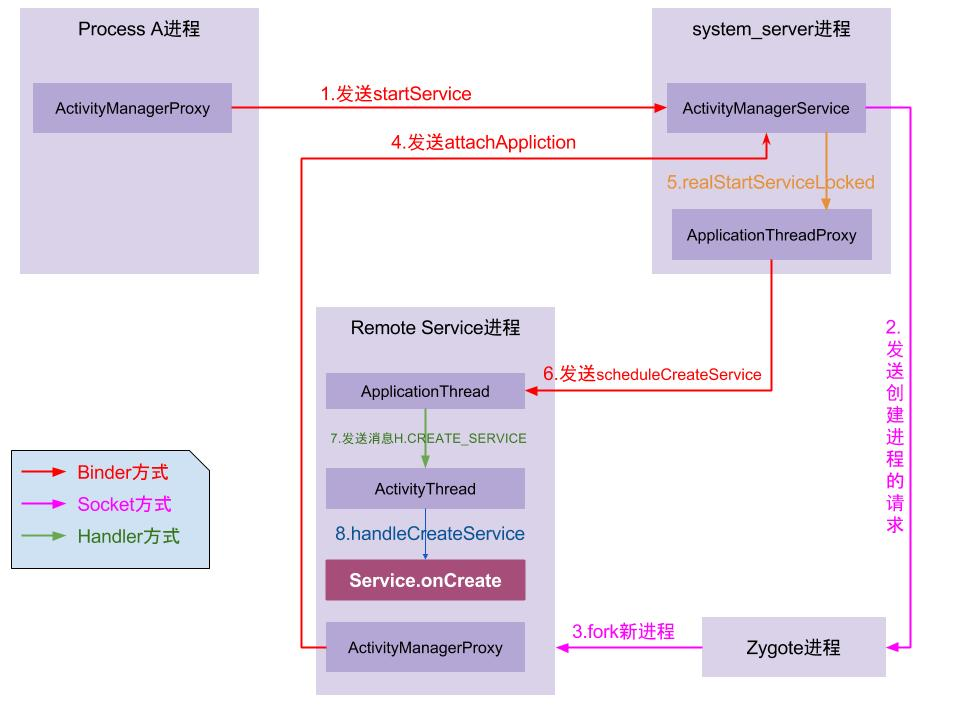

# 前言

在前文中我们分析了 VirtualApp 如何在容器内启动目标应用，但一个完整的 APP 除了它本身的代码外，它还有可能创建自己的服务。于是我想要试图了解它是否有在这个过程中做些什么。

与 Activity 不同的是，Service 的生命周期是代码手动管理的，光是这样就能省略掉很多复杂的流程。不过同 Activity 一样，想要创建 Service 仍然需要在 Manifest 中提前占好坑位，通过一些 Hook 等方式实现替换。

# 容器内 Service 启动流程

## 原生 Service 的创建流程

先贴一张大致的流程图吧，这里直接引用了 gityuan 大佬的博客内容，原文可在参考文章里找到。



1. Process A 进程采用 Binder IPC 向 system_server 进程发起 startService 请求；
2. system_server 进程接收到请求后，向 zygote 进程发送创建进程的请求；
3. zygote 进程 fork 出新的子进程 Remote Service 进程；
4. Remote Service 进程，通过 Binder IPC 向 sytem_server 进程发起 attachApplication 请求；
5. system_server 进程在收到请求后，进行一系列准备工作后，再通过 binder IPC 向 remote Service 进程发送 scheduleCreateService 请求；
6. Remote Service 进程的binder线程在收到请求后，通过 handler 向主线程发送 CREATE_SERVICE 消息；
7. 主线程在收到 Message 后，通过发射机制创建目标 Service，并回调 Service.onCreate() 方法。

嗯，相比 Activity 要简单多了。一言蔽之就是，进程调用 `startService` 让 AMS 给这个服务创建个新进程，然后再去调用这个服务中的初始化函数。

## VirtualApp 环境中的兼容 startService

> 网上查了一些 `VirtualApp` 关于 Service 的实现，但当我在 Blackbox 中对照时发现，似乎后者的实现不太一样，这里我只写出我自己的理解。

从 `startService` 函数开始：

```java
@ProxyMethod("startService")  
public static class StartService extends MethodHook {  
  @Override  
  protected Object hook(Object who, Method method, Object[] args) throws Throwable {  
    Intent intent = (Intent) args[1];  
    String resolvedType = (String) args[2];  
    ResolveInfo resolveInfo =  
        SandBoxCore.getBPackageManager()  
            .resolveService(intent, 0, resolvedType, BActivityThread.getUserId());  
    if (resolveInfo == null) {  
      return method.invoke(who, args);  
    }  
  
    int requireForegroundIndex = getRequireForeground();  
    boolean requireForeground = false;  
    if (requireForegroundIndex != -1) {  
      requireForeground = (boolean) args[requireForegroundIndex];  
    }  
    return SandBoxCore.getBActivityManager()  
        .startService(intent, resolvedType, requireForeground, BActivityThread.getUserId());  
  }  
  
  public int getRequireForeground() {  
    if (BuildCompat.isOreo()) {  
      return 3;  
    }  
    return -1;  
  }  
}
```

函数本身没做什么事，主要还是向下调用 `BActivityManagerService.startService`：

```java
@Override  
public ComponentName startService(  
    Intent intent, String resolvedType, boolean requireForeground, int userId) {  
  UserSpace userSpace = getOrCreateSpaceLocked(userId);  
  synchronized (userSpace.mActiveServices) {  
    userSpace.mActiveServices.startService(intent, resolvedType, requireForeground, userId);  
  }  
  return null;  
}
```

为用户创建 `userSpace` ，然后再往下调用 `ActiveServices.startService` ：

```java
public void startService(  
    Intent intent, String resolvedType, boolean requireForeground, int userId) {  
  ResolveInfo resolveInfo = resolveService(intent, resolvedType, userId);  
  if (resolveInfo == null) return;  
  //            throw new RuntimeException("resolveService service exception");  
  ServiceInfo serviceInfo = resolveInfo.serviceInfo;  
  ProcessRecord processRecord =  
      BProcessManagerService.get()  
          .startProcessLocked(  
              serviceInfo.packageName,  
              serviceInfo.processName,  
              userId,  
              -1,  
              Binder.getCallingPid());  
  if (processRecord == null) {  
    throw new RuntimeException("Unable to create " + serviceInfo.name);  
  }  
  RunningServiceRecord runningServiceRecord = getOrCreateRunningServiceRecord(intent);  
  runningServiceRecord.mServiceInfo = serviceInfo;  
  
  runningServiceRecord.getAndIncrementStartId();  
  final Intent stubServiceIntent =  
      createStubServiceIntent(intent, serviceInfo, processRecord, runningServiceRecord);  
  new Thread(  
          new Runnable() {  
            @Override  
            public void run() {  
              try {  
                SandBoxCore.getContext().startService(stubServiceIntent);  
              } catch (Throwable e) {  
                e.printStackTrace();  
              }  
            }  
          })  
      .start();  
}
```

先通过 `resolveService` 来获取到需要启动的 Service 的相关信息，接下来调用 `createStubServiceIntent` 来伪造 `Intent`：

```java
private Intent createStubServiceIntent(  
    Intent targetIntent,  
    ServiceInfo serviceInfo,  
    ProcessRecord processRecord,  
    RunningServiceRecord runningServiceRecord) {  
  Intent stub = new Intent();  
  ComponentName stubComp =  
      new ComponentName(  
          SandBoxCore.getHostPkg(), ProxyManifest.getProxyService(processRecord.bpid));  
  stub.setComponent(stubComp);  
  stub.setAction(UUID.randomUUID().toString());  
  ProxyServiceRecord.saveStub(  
      stub,  
      targetIntent,  
      serviceInfo,  
      runningServiceRecord,  
      processRecord.userId,  
      runningServiceRecord.mStartId.get());  
  return stub;  
}
```

这里会将 `Intent` 替换成提前在 `Manifest` 中占坑好的 `ProxyService$Pn`，最后调用原生的 `startService` 去启动这个 `ProxyService` ：

```java
SandBoxCore.getContext().startService(stubServiceIntent);
```

于是乎流程就回到了正常的启动过程中去，但注意，这样一来，启动的不就是 `ProxyService` 了吗？

在上面的流程中可以知道，当 AMS 完成创建的相关步骤后会主动给主线程发 `CREATE_SERVICE` 的消息，而在被 Hook 了的主线程中会调用 `handleCreateService`：

```java
private boolean handleCreateService(Object data) {  
  if (BActivityThread.getAppConfig() != null) {  
    String appPackageName = BActivityThread.getAppPackageName();  
    assert appPackageName != null;  
  
    ServiceInfo serviceInfo = BRActivityThreadCreateServiceData.get(data).info();  
    if (!serviceInfo.name.equals(ProxyManifest.getProxyService(BActivityThread.getAppPid()))  
        && !serviceInfo.name.equals(  
            ProxyManifest.getProxyJobService(BActivityThread.getAppPid()))) {  
      Slog.d(TAG, "handleCreateService: " + data);  
      Intent intent = new Intent();  
      intent.setComponent(new ComponentName(appPackageName, serviceInfo.name));  
      SandBoxCore.getBActivityManager()  
          .startService(intent, null, false, BActivityThread.getUserId());  
      return true;  
    }  
  }  
  return false;  
}

public ComponentName startService(  
    Intent intent, String resolvedType, boolean requireForeground, int userId) {  
  try {  
    return getService().startService(intent, resolvedType, requireForeground, userId);  
  } catch (RemoteException e) {  
    e.printStackTrace();  
  }  
  return null;  
}
```

如果创建的目标不是 `ProxyJobService` 或 `ProxyService` 的话就会往下调用，但这里我们创建的目标就是 `ProxyService`，因此这里返回 false 后会调用原生的那个处理函数真正创建这个 Service 。

而在正常的创建流程中，最后会向下调用这个 `Service` 的 `OnCreate` 和 `onStartCommand`，其中后者这个函数是在服务每次启动时都会调用的，因此通过 Hook 它来实现替换服务：

```java
@Override  
public int onStartCommand(Intent intent, int flags, int startId) {  
  AppServiceDispatcher.get().onStartCommand(intent, flags, startId);  
  return START_NOT_STICKY;  
}

public int onStartCommand(Intent proxyIntent, int flags, int startId) {  
  ProxyServiceRecord stubRecord = ProxyServiceRecord.create(proxyIntent);  
  if (stubRecord.mServiceIntent == null || stubRecord.mServiceInfo == null) {  
    return START_NOT_STICKY;  
  }  
  
  //        Log.d(TAG, "onStartCommand: " + component.toString());  
  Service service = getOrCreateService(stubRecord);  
  if (service == null) return START_NOT_STICKY;  
  stubRecord.mServiceIntent.setExtrasClassLoader(service.getClassLoader());  
  ServiceRecord record = findRecord(stubRecord.mServiceIntent);  
  record.setStartId(stubRecord.mStartId);  
  try {  
    int i = service.onStartCommand(stubRecord.mServiceIntent, flags, stubRecord.mStartId);  
    SandBoxCore.getBActivityManager().onStartCommand(proxyIntent, stubRecord.mUserId);  
    return i;  
  } catch (Throwable e) {  
    e.printStackTrace();  
  }  
  return START_NOT_STICKY;  
}
```

在下面这个 `onStartCommand` 里去加载真正的目标服务相关的代码和对象：

```java
private Service getOrCreateService(ProxyServiceRecord proxyServiceRecord) {  
  Intent intent = proxyServiceRecord.mServiceIntent;  
  ServiceInfo serviceInfo = proxyServiceRecord.mServiceInfo;  
  IBinder token = proxyServiceRecord.mToken;  
  
  ServiceRecord record = findRecord(intent);  
  if (record != null && record.getService() != null) {  
    return record.getService();  
  }  
  Service service = BActivityThread.currentActivityThread().createService(serviceInfo, token);  
  if (service == null) return null;  
  record = new ServiceRecord();  
  record.setService(service);  
  mService.put(new Intent.FilterComparison(intent), record);  
  return service;  
}
```

重点关注调用的 `createService` 函数：

```java
public Service createService(ServiceInfo serviceInfo, IBinder token) {  
  if (!BActivityThread.currentActivityThread().isInit()) {  
    BActivityThread.currentActivityThread()  
        .bindApplication(serviceInfo.packageName, serviceInfo.processName);  
  }  
  ClassLoader classLoader = BRLoadedApk.get(mBoundApplication.info).getClassLoader();  
  Service service;  
  try {  
    service = (Service) classLoader.loadClass(serviceInfo.name).newInstance();  
  } catch (Exception e) {  
    e.printStackTrace();  
    Slog.e(TAG, "Unable to instantiate service " + serviceInfo.name + ": " + e.toString());  
    return null;  
  }
```

可以看到，程序在这里将服务的代码加载进内存并构建为 Service 对象。

最后再调用它本身的 `onStartCommand` 函数收个尾：

```java
int i = service.onStartCommand(stubRecord.mServiceIntent, flags, stubRecord.mStartId);
```

## VirtualApp 环境中的兼容 bindService

启动服务还有另外一种通过 `bindService` 实现的方法，不过同前面的方法并没有太大变化。

```java
@ProxyMethod("bindService")  
public static class BindService extends MethodHook {  
  
  @Override  
  protected Object hook(Object who, Method method, Object[] args) throws Throwable {  
    Intent intent = (Intent) args[2];  
    if (BuildCompat.isT() && intent != null) {  
      // bindwebview 的 服务 不需要代理 , 类似还需要添加其他机型的适配  
      ComponentName componentName = intent.getComponent();  
      if (componentName != null) {  
        String webviewClass = "org.chromium.content.app.SandboxedProcessService0";  
        String webviewPackage = "com.huawei.webview";  
        if (webviewClass.equals(componentName.getClassName())  
            && webviewPackage.equals(componentName.getPackageName())) {  
          return method.invoke(who, args);  
        }  
      }  
    }  
    if (intent != null) {  
      ComponentName componentName = intent.getComponent();  
      if (componentName != null) {  
        String screenOrientationServiceClass =  
            "com.hello.sandbox.ui.screen.ScreenOrientationService";  
        String miheappPackage = "com.hello.miheapp";  
        if (screenOrientationServiceClass.equals(componentName.getClassName())  
            && miheappPackage.equals(componentName.getPackageName())) {  
          return method.invoke(who, args);  
        }  
      }  
    }  
    String resolvedType = (String) args[3];  
    IServiceConnection connection = (IServiceConnection) args[4];  
  
    int userId = intent.getIntExtra("_B_|_UserId", -1);  
    userId = userId == -1 ? BActivityThread.getUserId() : userId;  
    ResolveInfo resolveInfo =  
        SandBoxCore.getBPackageManager().resolveService(intent, 0, resolvedType, userId);  
    if (resolveInfo != null || AppSystemEnv.isOpenPackage(intent.getComponent())) {  
      Intent proxyIntent =  
          SandBoxCore.getBActivityManager()  
              .bindService(  
                  intent,  
                  connection == null ? null : connection.asBinder(),  
                  resolvedType,  
                  userId);  
      if (connection != null) {  
        if (intent.getComponent() == null && resolveInfo != null) {  
          intent.setComponent(  
              new ComponentName(  
                  resolveInfo.serviceInfo.packageName, resolveInfo.serviceInfo.name));  
        }  
        IServiceConnection proxy = ServiceConnectionDelegate.createProxy(connection, intent);  
        args[4] = proxy;  
  
        WeakReference<?> weakReference =  
            BRLoadedApkServiceDispatcherInnerConnection.get(connection).mDispatcher();  
        if (weakReference != null) {  
          BRLoadedApkServiceDispatcher.get(weakReference.get())._set_mConnection(proxy);  
        }  
      }  
      if (proxyIntent != null) {  
        args[2] = proxyIntent;  
        return method.invoke(who, args);  
      }  
    }  
    return 0;  
  }  
  
  @Override  
  protected boolean isEnable() {  
    return SandBoxCore.get().isBlackProcess() || SandBoxCore.get().isServerProcess();  
  }  
}
```

函数执行过程中主要关注下面这个函数：

```java
public Intent bindService(Intent intent, final IBinder binder, String resolvedType, int userId) {  
  ResolveInfo resolveInfo = resolveService(intent, resolvedType, userId);  
  if (resolveInfo == null) return intent;  
  ServiceInfo serviceInfo = resolveInfo.serviceInfo;  
  ProcessRecord processRecord =  
      BProcessManagerService.get()  
          .startProcessLocked(  
              serviceInfo.packageName,  
              serviceInfo.processName,  
              userId,  
              -1,  
              Binder.getCallingPid());  
  
  if (processRecord == null) {  
    throw new RuntimeException("Unable to create " + serviceInfo.name);  
  }  
  
  RunningServiceRecord runningServiceRecord;  
  synchronized (mRunningServiceRecords) {  
    runningServiceRecord = getOrCreateRunningServiceRecord(intent);  
    runningServiceRecord.mServiceInfo = serviceInfo;  
  
    if (binder != null) {  
      ConnectedServiceRecord connectedService = mConnectedServices.get(binder);  
      boolean isBound = false;  
      if (connectedService != null) {  
        isBound = true;  
      } else {  
        connectedService = new ConnectedServiceRecord();  
        try {  
          binder.linkToDeath(  
              new IBinder.DeathRecipient() {  
                @Override  
                public void binderDied() {  
                  binder.unlinkToDeath(this, 0);  
                  mConnectedServices.remove(binder);  
                }  
              },  
              0);  
        } catch (RemoteException e) {  
          e.printStackTrace();  
        }  
        connectedService.mIBinder = binder;  
        connectedService.mIntent = intent;  
        mConnectedServices.put(binder, connectedService);  
      }  
  
      if (!isBound) {  
        runningServiceRecord.incrementBindCountAndGet();  
      }  
      runningServiceRecord.mConnectedServiceRecord = connectedService;  
    }  
  }  
  return createStubServiceIntent(intent, serviceInfo, processRecord, runningServiceRecord);  
}
```

`startProcessLocked` 函数相信已经不陌生了，就是之前 Activity 时用到的那个，然后最后仍然是执行 `createStubServiceIntent` 来创建一个用来启动 `ProxyService` 的 `Intent`。

然后最后调用的是原生的那个 bindService：

```java
return method.invoke(who, args);
```

然后在创建的服务完成以后会主动调用 `onBind`：

```java
@Nullable  
@Override  
public IBinder onBind(Intent intent) {  
  return AppServiceDispatcher.get().onBind(intent);  
}

public IBinder onBind(Intent proxyIntent) {  
  ProxyServiceRecord serviceRecord = ProxyServiceRecord.create(proxyIntent);  
  Intent intent = serviceRecord.mServiceIntent;  
  ServiceInfo serviceInfo = serviceRecord.mServiceInfo;  
  
  if (intent == null || serviceInfo == null) return null;  
  
  //        Log.d(TAG, "onBind: " + component.toString());  
  
  Service service = getOrCreateService(serviceRecord);  
  if (service == null) return null;  
  intent.setExtrasClassLoader(service.getClassLoader());  
  
  ServiceRecord record = findRecord(intent);  
  record.incrementAndGetBindCount(intent);  
  if (record.hasBinder(intent)) {  
    if (record.isRebind()) {  
      service.onRebind(intent);  
      record.setRebind(false);  
    }  
    return record.getBinder(intent);  
  }  
  
  try {  
    IBinder iBinder = service.onBind(intent);  
    record.addBinder(intent, iBinder);  
    return iBinder;  
  } catch (Throwable e) {  
    e.printStackTrace();  
  }  
  return null;  
}
```

可以看到也是一样在这个时候去加载真正的目标代码并启动该服务的。

## 总结

这套流程跟网上搜到的很多资料有些不同，笔者查到的很多资料都表示直接调用 `scheduleCreateService` 去创建对应服务，而不再经过原生的 AMS 。但在阅读 Blackbox 的代码后我们可以发现实际情况并非如此，启动 Service 跟启动 Activity 有很多地方很相似，它们同样需要提前占坑，并以类似伪造 Intent 的方式去启动对应的目标，然后通过 Hook 的方式来替换真正的目标。

# 参考文章

https://gityuan.com/2016/03/06/start-service/
https://blog.csdn.net/qq_26460841/article/details/118441738