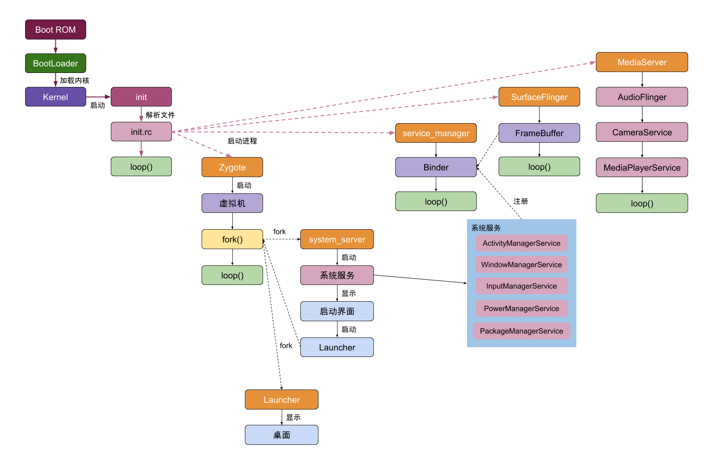
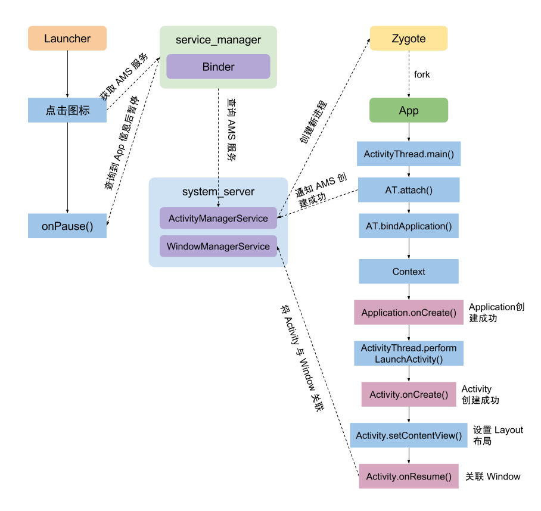
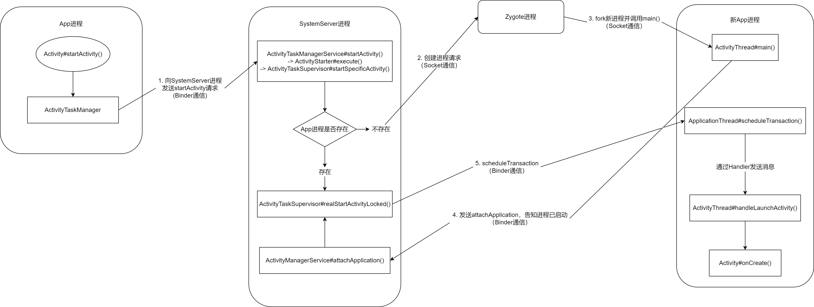
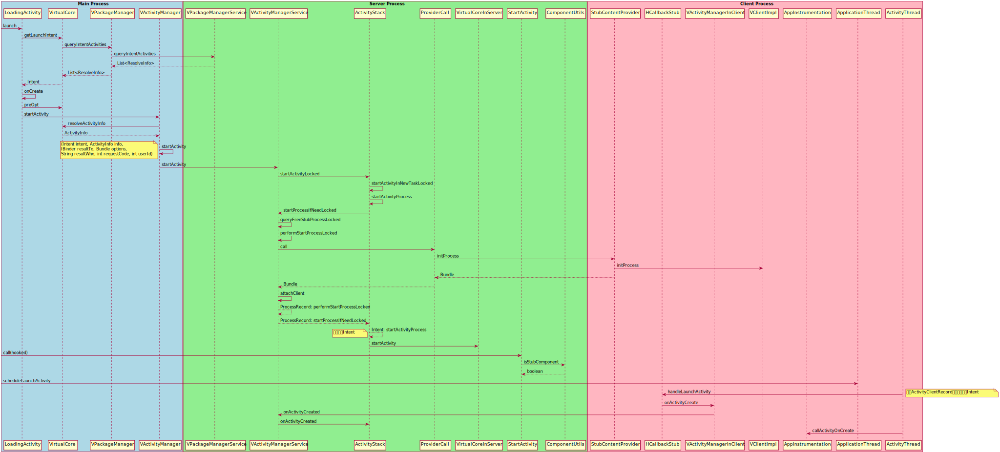

# 前言的前言

本篇作为**总集篇**将对本系列全文进行总结，以下是本系列的速览规划：

0. VirtualApp 原理速览 - 框架体系概述
1. Activity 启动流程 - 我想我们需要先清楚正常的应用是如何启动的
2. 容器内 APP 启动流程 - 四大组件 Activity 是如何实现的
3. 容器内 Service 启动流程 - 四大组件 Service 是如何实现的
4. Broadcast Receiver 容器内实现 - 四大组件 Broadcast Receiver 是如何实现的
5. Content Provider 容器内实现 - 四大组件 Content Provider 是如何实现的
6. 路径重定向和 Xposed 注入时机分析 - 容器内应用的数据访问如何正常进行以及 Xposed 是如何被注入的

您可在如下仓库找到本系列文章的单篇内容：

[VirtualAppQuickReview: https://github.com/ErodedElk/VirtualAppQuickReview](https://github.com/ErodedElk/VirtualAppQuickReview)

或在我的个人博客也将会以单篇的形式发布本系列文稿：

[https://tokameine.top/](https://tokameine.top/)

如果您在阅读过程中有任何疑问，或发现文稿中存在任何纰漏，欢迎通过邮件或其他方式与我联系，笔者相信技术正是要在相互的交流中才能够进一步向前的。您可通过 tokameine@gmail.com 与我联系。

# 框架体系概述

## 前言

从很早以前就一直很好奇 VirtualApp 的相关技术，但是一直抽不出时间。正巧最近想试着自己照猫画虎开发一个类似的容器化应用，并做一些定制化的需求，因此抽空把整个项目过了一遍，也正好帮我整理一遍过去一直对整个 Android 系统较为模糊的认知。
## 速览规划

以下是本系列的速览规划：

0. VirtualApp 原理速览 - 框架体系概述
1. Activity 启动流程 - 我想我们需要先清楚正常的应用是如何启动的
2. 容器内 APP 启动流程 - 四大组件 Activity 是如何实现的
3. 容器内 Service 启动流程 - 四大组件 Service 是如何实现的
4. Broadcast Receiver 容器内实现 - 四大组件 Broadcast Receiver 是如何实现的
5. Content Provider 容器内实现 - 四大组件 Content Provider 是如何实现的
6. 路径重定向和 Xposed 注入时机分析 - 容器内应用的数据访问如何正常进行以及 Xposed 是如何被注入的

## 技术框架
 


VA 框架对应用的操作涉及三个层面：
- Java 
- Framework
- Native
技术只在应用层进行，因此无需 root 。一言蔽之，**欺骗系统**让系统以为应用已安装，同时也**欺骗应用**，让应用以为自己被安装。

| 层次           | 主要工作                                                                                                                                                                                                                                                                                                                                                                                                                                    |
| ------------ | --------------------------------------------------------------------------------------------------------------------------------------------------------------------------------------------------------------------------------------------------------------------------------------------------------------------------------------------------------------------------------------------------------------------------------------- |
| VA Space     | 由VA提供了一个内部的空间，用于安装要在其内部运行的APP，这个空间是系统隔离的。                                                                                                                                                                                                                                                                                                                                                                                               |
| VA Framework | 这一层主要给Android Framework和VAPP做代理，这也是VA的核心。VA提供了一套自己的VA Framework，处于**Android Framework与VA APP之间**。  <br>1. 对于VAPP，其访问的**所有系统Service**均已被 `VA Framework` 代理，它会修改VAPP的请求参数，将其中与VAPP安装信息相关的全部参数**修改为宿主的参数**之后发送给Android Framework（有部分请求会发送给自己的VA Server直接处理而不再发送给Android系统）。这样Android Framework收到VAPP请求后检查参数就会认为没有问题。  <br>2. 待Android系统对该请求处理完成返回结果时，VA Framework同样也会拦截住该返回结果，此时再将原来修改过的参数全部还原为VAPP请求时发送的。  <br>这样VAPP与Android系统的交互也就能跑通了。 |
| VA Native    | 在这一层主要为了完成2个工作，**IO重定向**和VA APP与Android系统交互的**请求修改**。  <br>1. IO重定向是因为可能有部分APP会通过写死的绝对**路径访问**，但是如果APP没有安装到系统，这个路径是不存在的，通过IO重定向，则将其转向VA内部安装的路径。  <br>2. 另外有部分jni函数在**VA Framework中无法hook的**，所以需要在native层来做hook。                                                                                                                                                                                                                         |
## 代码框架

> 考虑到现有开源的 VirtualApp 只支持老版本 Android，因此选择原理相同的 blackbox 进行参考
> 仓库地址：https://github.com/Monster-GM/sandbox

项目代码分为两个模块：
- app模块：用户操作与UI模块
- Bcore模块：此模块为秘盒空间的核心模块，负责完成整个应用的调度
	- src/main：VirtualApp框架代码
	- pine：Hook框架
	- 其他

本系列文章会主要关心其中的 VirtualApp 框架实现部分。

# Activity 原生启动流程

## Activity 原生启动流程

### 系统界面 Launcher 

为了解 VA 是如何启动 Activity 的，我们需要先知道 Android 是如何启动 Activity 的。在 Android 系统启动以后，系统已经启动了 Zygote，ServiceManager，SystemServer 等系统进程。

`ServiceManager` 进程中完成了 `Binder` 初始化；`SystemServer` 进程中 ActivityManagerService，`WindowManagerService`，`PackageManagerService` 等系统服务在 `ServiceManager` 中已经注册；最后启动了 `Launcher` 桌面应用。




`Launcher` 作为用户的交互界面，在用户点击 APP 图标的时候提供了打开应用的能力。不同的手机厂商可能会根据 `Launcher` 做一些定制，比如 `miui` 就是如此，但最终的原理是一致的。

应用安装的时候，通过 `PackageManagerService` 解析 apk 的 `AndroidManifest.xml` 文件，提取出这个 apk 的信息写入到 `packages.xml` 文件中，这些信息包括：权限、应用包名、icon、apk 的安装位置、版本、userID 等等。packages.xml 文件位于系统目录下/data/system/packages.xml。

### 启动应用流程



当用户点击桌面上的应用图标后，Launcher 会通过 service_manager 向 AMS 服务发出请求，查询对应的 APP 信息，然后由 Zygote 创建目标 APP 进程。



先梳理一下大致的流程：
1. Launcher 通过 Binder 方式沟通 AMS 
2. AMS 先检查这个 APP 进程是不是已经创建了
3. 如果已经创建，则直接调用 `realStartActivityLocked` 直接到第 7 步
4. 否则，AMS 接到请求后让 Zygote 通过 fork 创建 APP 进程，完成 `Application.onCreate` 、创建应用的上下文和其他各种必要对象，这些对象会在 AMS 中留有备份进行保留。
5. 新创建的 APP 进程通过 Binder 发送 `ATTACH_APPLICATION_TRANSACTION` 通知 AMS 
6. AMS 接到 `ATTACH_APPLICATION_TRANSACTION` 后调用 `realStartActivityLocked` 
7. 设置进程为顶部 Activity，为新进程创建事务发送调度命令 `H.EXECUTE_TRANSACTION`
8. 进程处理命令消息时调用 Activity.onCreate 并且初始化应用自己的视图

具体到代码实现中，分为几个步骤，首先启动步骤从 Launcher 开始：

1. 检查将要打开的目标 APP 的 Activity 是否存在，如果存在就不需要打开了

`Launcher.startActivitySafel` -> `Launcher.startActivity`

2. 打开目标 Activity

`Activity.startActivity`

3. 通过 ATSM 服务调用该服务提供的 startActivity

`Activity.startActivityForResult` - `Instrumentation.execStartActivity` - `ActivityTaskManager.getService().startActivity`

`ActivityManagerNative.getDefault()` 会返回一个 `ActivityManagerProxy` 作为 Launcher 中使用 `ActivityTaskManager` 的代理，该代理的 startActivity 会发送 `START_ACTIVITY_TRANSACTION` 来通知 `ActivityTaskManager`

完成上述过程后，进程从 `Launcher` 切换到 `system_server` 中的 `ActivityManagerService`，也就是 AMS。

1. 在 startActivityAsUser 中会先获取用户的 UserID 作为参数然后往下调用 getActivityStartController 中的 starter 

`startActivity` - `startActivityAsUser` 

2. 创建新的 intent 对象，获取 ApplicationPackageManager 

`ActivityStackSupervisor.startActivityMayWait` - `resolveActivity`

3. 获取 intent 所指向的 Activity 信息，并保存到 Intent 对象。

`PackageManagerService.resolveIntent()`  - `queryIntentActivities()`

4. 获取到调用者的进程信息，通过 `Intent.FLAG_ACTIVITY_FORWARD_RESULT` 判断是否需要进行 `startActivityForResult` 处理。检查调用者是否有权限来调用指定的 Activity

5. Activity 有多种启动模式，对 launchMode 的处理，创建 Task 等操作。启动 Activity 所在进程，已存在则直接 `onResume()`，不存在则创建 Activity 并处理是否触发 `onNewIntent()`。

`ActivityStackSupervisor.startActivityUncheckedLocked` - `startActivityLocked`

6. 若找到 resume 状态的 Activity，执行 `startPausingLocked()` 暂停该 Activity，同时暂停所有处于后台栈的 Activity，这里一般来说会把桌面，也就是 Launcher 暂停掉。

`ActivityStack.resumeTopActivityInnerLocked`

7. 获取要启动的Activity进程信息，若成功，则表示进程已经启动了，通过 `realStartActivityLocked` 启动这个 activity；否则，通过 AMS 代理调用 startProcessAsync 去创建进程。前者的条件就是前面所述的目标 APP 已经启动过的情况，后者则是从头开始创建这个 APP 进程。

`ActivityStackSupervisor.startSpecificActivity`

我们考虑后者的情况，程序将会往下调用 `startProcessAsync` 创建新进程：

```java
    void startProcessAsync(ActivityRecord activity, boolean knownToBeDead, boolean isTop,String hostingType) {
        try {
            ...
            // 发布消息以启动进程，以避免在持有 ATMS 锁的情况下调用 AMS 可能出现死锁。
            final Message m = PooledLambda.obtainMessage(ActivityManagerInternal::startProcess,
                    mAmInternal, activity.processName, activity.info.applicationInfo, knownToBeDead,
                    isTop, hostingType, activity.intent.getComponent());
            mH.sendMessage(m);
        } finally {
            Trace.traceEnd(TRACE_TAG_WINDOW_MANAGER);
        }
    }
```

startProcessAsync 会通过消息的方式让 ATMS 服务在处理该消息时创建对应的进程，调用目标为 `ActivityManagerInternal::startProcess`

而 `ActivityManagerInternal::startProcess` 调用`ActivityManagerService::startProcessLocked` 调用 `ProcessList::startProcessLocked` 调用 `ProcessList::startProcess`

如果目标进程是 top app，设置 flag 保证启动的最高优先级，并最终在 startProcess 中创建对应的目标进程，也就是 APP 的进程。

在进程创建成功后，将当前进程切换到新进程，并将 `ActivityThread` 类加载到新进程，调用 `ActivityThread.main`

1. `ActivityThread.main` ：创建主线程的 Looper 对象，创建 `ActivityThread` 对象，`ActivityThread.attach()` 建立 Binder 通道，开启 `Looper.loop()` 消息循环
2. `ActivityThread.attach`：创建 `ActivityManagerProxy` 对象，调用基于 `IActivityManager` 接口的 Binder 通道 `ActivityManagerProxy.attachApplication()`

```java
    public static void main(String[] args) {
        ...
        //初始化当前进程的 Looper 对象
        Looper.prepareMainLooper();
        ...
        ActivityThread thread = new ActivityThread();
        //此处创建Application
        thread.attach(false, startSeq);
 
        if (sMainThreadHandler == null) {
            sMainThreadHandler = thread.getHandler();
        }
 
        if (false) {
            Looper.myLooper().setMessageLogging(new
                    LogPrinter(Log.DEBUG, "ActivityThread"));
        }
 
        // 调用 Looper 的 loop 方法开启无限循环。
        Looper.loop();
 
        throw new RuntimeException("Main thread loop unexpectedly exited");
    }
```

Looper 会持续从消息队列中获取消息，然后处理指定的任务。其中，attach 函数调用时会发送 `ATTACH_APPLICATION_TRANSACTION` 通知 system_server 中的服务。

此时，应用的 `ActivityThread` 和 `ApplicationThread` 已经被创建，并创建了消息循环机制。当调用 `ActivityThread.attach` 时，内部会调用 `ActivityManagerProxy.attachApplication` ，通过 Binder 来调用 AMS 中的 `attachApplication` 函数，此时会把 `ApplicationThread` 传递过去。

`attachApplication` - `attachApplicationLocked` 主要有两个关键函数需要关注：

- bindApplication
- ActivityTaskManagerService.LocalService#attachApplication

```java
private boolean attachApplicationLocked(@NonNull IApplicationThread thread,
                                        int pid, int callingUid, long startSeq) {
    synchronized (mProcLock) {
        app.mState.setCurAdj(ProcessList.INVALID_ADJ);
        app.mState.setSetAdj(ProcessList.INVALID_ADJ);
        app.mState.setVerifiedAdj(ProcessList.INVALID_ADJ);
        mOomAdjuster.setAttachingSchedGroupLSP(app);
        app.mState.setForcingToImportant(null);
        updateProcessForegroundLocked(app, false, 0, false);
        app.mState.setHasShownUi(false);
        app.mState.setCached(false);
        app.setDebugging(false);
        app.setKilledByAm(false);
        app.setKilled(false);
        app.setUnlocked(StorageManager.isUserKeyUnlocked(app.userId));
    }
    // 移除进程超时信息
    mHandler.removeMessages(PROC_START_TIMEOUT_MSG, app);

    final ProviderInfoList providerList = ProviderInfoList.fromList(providers);
    if (app.getIsolatedEntryPoint() != null) {
        thread.runIsolatedEntryPoint(
            app.getIsolatedEntryPoint(), app.getIsolatedEntryPointArgs());
    } else if (instr2 != null) {
        thread.bindApplication(processName, appInfo,
                               app.sdkSandboxClientAppVolumeUuid, app.sdkSandboxClientAppPackage,
                               providerList,
                               instr2.mClass,
                               profilerInfo, instr2.mArguments,
                               instr2.mWatcher,
                               instr2.mUiAutomationConnection, testMode,
                               mBinderTransactionTrackingEnabled, enableTrackAllocation,
                               isRestrictedBackupMode || !normalMode, app.isPersistent(),
                               new Configuration(app.getWindowProcessController().getConfiguration()),
                               app.getCompat(), getCommonServicesLocked(app.isolated),
                               mCoreSettingsObserver.getCoreSettingsLocked(),
                               buildSerial, autofillOptions, contentCaptureOptions,
                               app.getDisabledCompatChanges(), serializedSystemFontMap,
                               app.getStartElapsedTime(), app.getStartUptime());
    } else {
        thread.bindApplication(processName, appInfo,
                               app.sdkSandboxClientAppVolumeUuid, app.sdkSandboxClientAppPackage,
                               providerList, null, profilerInfo, null, null, null, testMode,
                               mBinderTransactionTrackingEnabled, enableTrackAllocation,
                               isRestrictedBackupMode || !normalMode, app.isPersistent(),
                               new Configuration(app.getWindowProcessController().getConfiguration()),
                               app.getCompat(), getCommonServicesLocked(app.isolated),
                               mCoreSettingsObserver.getCoreSettingsLocked(),
                               buildSerial, autofillOptions, contentCaptureOptions,
                               app.getDisabledCompatChanges(), serializedSystemFontMap,
                               app.getStartElapsedTime(), app.getStartUptime());
    }

    if (normalMode) {
        try {
            // 最终调用ActivityTaskManagerService.LocalService#attachApplication()
            didSomething = mAtmInternal.attachApplication(app.getWindowProcessController());
        } catch (Exception e) {
        }
    }

    return true;
}

```

我们先关注 `thread.bindApplication` ，thread 就是刚刚由新进程传过来的。

函数先调用 `bindApplication` 向进程发送 `H.BIND_APPLICATION` 命令，进程收到该命令后，通过 `handleBindApplication` 处理：

```java
private void handleBindApplication(AppBindData data) {    
    // 初始化context
    final ContextImpl appContext = ContextImpl.createAppContext(this, data.info);       
    // 初始化Instrumentation
    if (ii != null) {
        initInstrumentation(ii, data, appContext);
    } else {
        mInstrumentation = new Instrumentation();
        mInstrumentation.basicInit(this);
    }    
    Application app; 
    try {
        // 初始化Application
        // 调用LoadedApk#makeApplicationInner()
        app = data.info.makeApplicationInner(data.restrictedBackupMode, null);           
        mInstrumentation.onCreate(data.instrumentationArgs);        
        // 回调Application#onCreate()
        mInstrumentation.callApplicationOnCreate(app);
    } finally {
    }
}
```

`handleBindApplication` 初始化 `context`，然后初始化 `Instrumentation` 对象，创建 `Application` 对象，并调用该对象的 `onCreate`

初始化流程调用链为 `makeApplication` - `newApplication` :

```java
private void handleBindApplication(AppBindData data) {    
    // 初始化context
    final ContextImpl appContext = ContextImpl.createAppContext(this, data.info);       
    // 初始化Instrumentation
    if (ii != null) {
        initInstrumentation(ii, data, appContext);
    } else {
        mInstrumentation = new Instrumentation();
        mInstrumentation.basicInit(this);
    }    
    Application app; 
    try {
        // 初始化Application
        // 调用LoadedApk#makeApplicationInner()
        app = data.info.makeApplicationInner(data.restrictedBackupMode, null);           
        mInstrumentation.onCreate(data.instrumentationArgs);        
        // 回调Application#onCreate()
        mInstrumentation.callApplicationOnCreate(app);
    } finally {
    }
}


public Application makeApplication(boolean forceDefaultAppClass,Instrumentation instrumentation) {
    
    if (mApplication != null) {   
       return mApplication;
    }
    
    String appClass = mApplicationInfo.className;
    java.lang.ClassLoader cl = getClassLoader();
    
    //此时新建一个 Application 的 ContextImpl 对象，
    ContextImpl appContext = ContextImpl.createAppContext(mActivityThread, this);
    
    //通过在 handleBindApplication 创建的 mInstrumentation 对象新建一个 Application 对象，同时进行 attach。
    app = mActivityThread.mInstrumentation.newApplication(cl, appClass, appContext);
    appContext.setOuterContext(app);
}

public Application newApplication(ClassLoader cl, String className, Context context) {    
    return newApplication(cl.loadClass(className), context);
}
Instrumentation类：
static public Application newApplication(Class<?> clazz, Context context)  {
    //实例化 Application
    Application app = (Application)clazz.newInstance();     
    
    // Application 和 context绑定
    app.attach(context);    
    return app;
}
//attach 就是将新建的 ContextImpl 赋值到 mBase，这个 ContextImpl 对象就是所有Application 内 Context 的具体实现，同时赋值一些其他的信息如 mLoadedApk。
final void attach(Context context) {    
    mBase = base;  
    mLoadedApk = ContextImpl.getImpl(context).mPackageInfo;
}

```

然后是 `makeApplicationInner` 的细节

```java
public Application makeApplicationInner(boolean forceDefaultAppClass,
                                        Instrumentation instrumentation) {
    return makeApplicationInner(forceDefaultAppClass, instrumentation, false);
}

private Application makeApplicationInner(boolean forceDefaultAppClass,
                                         Instrumentation instrumentation, boolean allowDuplicateInstances) {
    if (mApplication != null) {
        return mApplication;
    }

    synchronized (sApplications) {
        final Application cached = sApplications.get(mPackageName);
        if (cached != null) {
            if (!allowDuplicateInstances) {
                mApplication = cached;
                return cached;
            }
        }
    }

    Application app = null;

    final String myProcessName = Process.myProcessName();
    String appClass = mApplicationInfo.getCustomApplicationClassNameForProcess(
        myProcessName);


    try {
        final java.lang.ClassLoader cl = getClassLoader();
        if (!mPackageName.equals("android")) { 
            initializeJavaContextClassLoader(); 
        }
        // 初始化Application的上下文
        ContextImpl appContext = ContextImpl.createAppContext(mActivityThread, this);
        // 创建Application实例
        app = mActivityThread.mInstrumentation.newApplication(
            cl, appClass, appContext);
        appContext.setOuterContext(app);
    } catch (Exception e) {
    }
    mActivityThread.mAllApplications.add(app);
    mApplication = app;
    if (!allowDuplicateInstances) {
        synchronized (sApplications) {
            sApplications.put(mPackageName, app);
        }
    }

    if (instrumentation != null) {
        try {
            // 回调Application#onCreate()
            instrumentation.callApplicationOnCreate(app);
        } catch (Exception e) {
        }
    }
    return app;
}
```

对于新创建的这个进程而言，当 `callApplicationOnCreate` 完成调用以后，这个进程的上下文，以及 `Application` 对象和 `Instrumentation` 对象都完成的创建和初始化。而在进程这波完成上述的初始化过程中，AMS 那边也没闲着，在发送完相应的命令以后， `ActivityManagerService#attachApplicationLocked` 继续往下调用 ` ActivityTaskManagerService.LocalService#attachApplication`

```java
public boolean attachApplication(WindowProcessController wpc) throws RemoteException {
    synchronized (mGlobalLockWithoutBoost) {
        try {
            // 调用RootWindowContainer#attachApplication()
            // 最终调用AttachApplicationHelper#test()
            return mRootWindowContainer.attachApplication(wpc);
        } finally {           
        }
    }
}

public boolean test(ActivityRecord r) {
    if (r.finishing || !r.showToCurrentUser() || !r.visibleIgnoringKeyguard
            || r.app != null || mApp.mUid != r.info.applicationInfo.uid
            || !mApp.mName.equals(r.processName)) {
        return false;
    }

    try {
        // 调用ActivityTaskSupervisor#realStartActivityLocked()
        if (mTaskSupervisor.realStartActivityLocked(r, mApp,
                mTop == r && r.getTask().canBeResumed(r) /* andResume */,
                true /* checkConfig */)) {
            mHasActivityStarted = true;
        }
    } catch (RemoteException e) {
    }
    return false;
}
```

可以注意到，最终这个函数将往下执行 `ActivityTaskSupervisor#realStartActivityLocked` 完成最后的步骤。而如果**此前不需要创建新进程，那么刚打开 APP 的时候就会从这个地方开始恢复进程的状态**了。

```java
boolean realStartActivityLocked(ActivityRecord r, WindowProcessController proc,
        boolean andResume, boolean checkConfig) throws RemoteException {            
    // 创建启动Activity的事务 
    final ClientTransaction clientTransaction = ClientTransaction.obtain(proc.getThread(), r.token);
    final boolean isTransitionForward = r.isTransitionForward();
    final IBinder fragmentToken = r.getTaskFragment().getFragmentToken();
    // 添加callback
    clientTransaction.addCallback(LaunchActivityItem.obtain(new Intent(r.intent),
                    System.identityHashCode(r), r.info,                 
                    mergedConfiguration.getGlobalConfiguration(),
                    mergedConfiguration.getOverrideConfiguration(), r.compat,
                    r.getFilteredReferrer(r.launchedFromPackage), task.voiceInteractor,
                    proc.getReportedProcState(), r.getSavedState(), r.getPersistentSavedState(),
                    results, newIntents, r.takeOptions(), isTransitionForward,
                    proc.createProfilerInfoIfNeeded(), r.assistToken, activityClientController,
                    r.shareableActivityToken, r.getLaunchedFromBubble(), fragmentToken));
 
    // 设置Activity启动后的生命周期状态
    final ActivityLifecycleItem lifecycleItem;
    if (andResume) {
        // RESUME状态
        lifecycleItem = ResumeActivityItem.obtain(isTransitionForward);
    } else {
        // PAUSE状态
        lifecycleItem = PauseActivityItem.obtain();
    }
    // 设置状态
    clientTransaction.setLifecycleStateRequest(lifecycleItem);

    // 开启事务，最终调用ClientLifecycleManager#scheduleTransaction()
    mService.getLifecycleManager().scheduleTransaction(clientTransaction);                         
    return true;
}

```

函数首先创建 Activity 事务，设置对应的 callback ，以及对应的生命周期 `ActivityLifecycleItem`，最终开始调度事务 `lientLifecycleManager#scheduleTransaction`。

```java
// 启动Activity的事务
void scheduleTransaction(ClientTransaction transaction) throws RemoteException {
    final IApplicationThread client = transaction.getClient();
    // 调用ClientTransaction#schedule()
    transaction.schedule(); 
}

public void schedule() throws RemoteException {
    // 调用ApplicationThread#scheduleTransaction()
    mClient.scheduleTransaction(this);
}

@Override
public void scheduleTransaction(ClientTransaction transaction) throws RemoteException {
    // 最终调用ClientTransactionHandler#scheduleTransaction()
    ActivityThread.this.scheduleTransaction(transaction);
}

void scheduleTransaction(ClientTransaction transaction) {
    transaction.preExecute(this);
    // 发送消息，在H类中接收消息
    sendMessage(ActivityThread.H.EXECUTE_TRANSACTION, transaction);
}
```

可以看到，最终由 AMS 向进程发出 `H.EXECUTE_TRANSACTION` 命令，这个命令同样会被进程那边接受并处理：

```java
class H extends Handler {
    public void handleMessage(Message msg) {
        switch (msg.what) {
            case EXECUTE_TRANSACTION:
                final ClientTransaction transaction = (ClientTransaction) msg.obj;
                // 执行事务
                mTransactionExecutor.execute(transaction);
                if (isSystem()) {
                    transaction.recycle();
                }
                break;
        }
    }
}
```

```java
public void execute(ClientTransaction transaction) {
    // 调用TransactionExecutor#executeCallbacks()
    executeCallbacks(transaction);
    // 执行lifecycleState
    executeLifecycleState(transaction);

    mPendingActions.clear();
}
```

这个函数最终会往下调用 `ClientTransactionHandler#handleLaunchActivity`，最为抽象类的方法，实际调用 `ActivityThread#handleLaunchActivity` ：

```java
public Activity handleLaunchActivity(ActivityClientRecord r,
        PendingTransactionActions pendingActions, Intent customIntent) {  
 	// 在创建Activity之前初始化
    if (ThreadedRenderer.sRendererEnabled
            && (r.activityInfo.flags & ActivityInfo.FLAG_HARDWARE_ACCELERATED) != 0) {
        HardwareRenderer.preload();
    }
    // 获取WMS服务，初始化WindowManager
    WindowManagerGlobal.initialize();
    // GraphicsEnvironment提示一个activity正在进程上启动
    GraphicsEnvironment.hintActivityLaunch();
    // 启动Activity，调用ActivityThread#performLaunchActivity()
    final Activity a = performLaunchActivity(r, customIntent); 
    return a;
}
```

`handleLaunchActivity` 最终回调目标 `Activity` 的 `onConfigurationChanged`，初始化 `WindowManagerService`，调用 `ActivityThread.performLaunchActivity`。

```java
ActivityThread.performLaunchActivity() {
    //类似 Application 的创建过程，通过 classLoader 加载 activity.
    activity = mInstrumentation.newActivity(classLoader, 
               component.getClassName(), r.intent);
    //因为 Activity 有界面，所以其 Context 是 ContextThemeWrapper 类型，但实现类仍是ContextImpl.
    Context appContext = createBaseContextForActivity(r, activity);
    activity.attach(context,mInstrumentation,application,...);
    //与 Window 进行关联
    
    //调用 activity 的 onCreate()方法。
    mInstrumentation.callActivityOnCreate(activity,...)
}

public void callActivityOnCreate(Activity activity, Bundle icicle) {
    prePerformCreate(activity);
    // 调用Activity#performCreate()
    activity.performCreate(icicle);
    postPerformCreate(activity);
}
```

`callActivityOnCreate` 中会回调 `Activity.performCreate` ，其中调用 `Activity` 的 `onCreate` 、`Activity.setContentView`、`ActivityThread.performResumeActivity`，`performResumeActivity` 最终会回调 `onResume`。

总之，到这里之后，新应用的进程算是创建完成了。

## 结余

弯弯绕绕一大圈，有不少的同名函数，在整理这些资料的时候也是被绕晕了好几次了，希望最终写出来的流程没有太混乱吧。如果有哪里写的不对，还请师傅们多多指教。

## 参考文章

https://blog.csdn.net/hgy413/article/details/100071667
https://blog.csdn.net/hgy413/article/details/95465321
https://zhuanlan.zhihu.com/p/151010577
https://juejin.cn/post/7028124957141893150
https://github.com/jeanboydev/Android-ReadTheFuckingSourceCode/blob/master/article/android/framework/Android-Activity%E5%90%AF%E5%8A%A8%E8%BF%87%E7%A8%8B.md
https://blog.csdn.net/g984160547/article/details/120676574
https://blog.csdn.net/qq_14876133/article/details/141362098
[VirtualApp拆解之二：Activity启动流程 - 简书](https://www.jianshu.com/p/f95fd575a57c)

# 容器内 APP 启动流程

## 前言

在了解了正常环境下 app 的 activity 是如何被启动的以后，接下來我们希望能够了解一下 VirtualApp 中是如何启动目标 app 的。不过整个流程涉及到了对部分 Service 的 Hook，但这些内容却不是本节我们重点关心的内容，因此会有相应的介绍，但或许并不全面。

## 容器内 APP 启动流程

### 点击启动应用时发生了啥

当用户点击了视图上目标应用的图标后，触发点击事件并向下调用，在 blackbox 中将来到 `launchApk` 函数：

```java
public boolean launchApk(String packageName, int userId) {  
  Intent launchIntentForPackage =  
      getBPackageManager().getLaunchIntentForPackage(packageName, userId);  
  if (launchIntentForPackage == null) {  
    return false;  
  }  
  startActivity(launchIntentForPackage, userId);  
  return true;  
}

public void startActivity(Intent intent, int userId) {  
  if (mClientConfiguration.isEnableLauncherActivity()) {  
    LauncherActivity.launch(intent, userId);  
  } else {  
    getBActivityManager().startActivity(intent, userId);  
  }  
}

public static void launch(Intent intent, int userId) {  
  Intent splash = new Intent();  
  splash.setClass(SandBoxCore.getContext(), LauncherActivity.class);  
  splash.addFlags(Intent.FLAG_ACTIVITY_NEW_TASK);  
  
  splash.putExtra(LauncherActivity.KEY_INTENT, intent);  
  splash.putExtra(LauncherActivity.KEY_PKG, intent.getPackage());  
  splash.putExtra(LauncherActivity.KEY_USER_ID, userId);  
  SandBoxCore.getContext().startActivity(splash);  
}
```

`mClientConfiguration.isEnableLauncherActivity` 是恒真的，因此最终会调用 `LauncherActivity.launch` ，在该函数中，`blackbox` 初始化了一个 `Intent`，然后调用原生的 `startActivity` 函数来进入 `LauncherActivity`，在进入时，会调用该对象的 `onCreate` 函数：

```java
@Override  
protected void onCreate(@Nullable Bundle savedInstanceState) {  
  super.onCreate(savedInstanceState);  
  // 获取启动当前 Activity 的 Intent
  Intent intent = getIntent();  
  if (intent == null) {  
    finish();  
    return;  
  }  
  // 获取需要启动的对于 APP 的相关信息
  Intent launchIntent = intent.getParcelableExtra(KEY_INTENT);  
  String packageName = intent.getStringExtra(KEY_PKG);  
  int userId = intent.getIntExtra(KEY_USER_ID, 0);  
  
  PackageInfo packageInfo =  
      SandBoxCore.getBPackageManager().getPackageInfo(packageName, 0, userId);  
  if (packageInfo == null) {  
    Slog.e(TAG, packageName + " not installed!");  
    finish();  
    return;  
  }  
  Drawable drawable = packageInfo.applicationInfo.loadIcon(SandBoxCore.getPackageManager());  
  setContentView(R.layout.activity_launcher);  
  findViewById(R.id.iv_icon).setBackgroundDrawable(drawable);  
  // 调用 BActivityManager.startActivity 在 Blackbox 中启动应用
  new Thread(() -> SandBoxCore.getBActivityManager().startActivity(launchIntent, userId)).start();  
}
```

函数首先获取之前那个 splash ，然后从中读取出需要启动的目标应用的包名和用户 ID，并通过包名来读取包的相关信息，最后调用 `BActivityManager.startActivity` 来在 Blackbox 中启动应用。

```java
public void startActivity(Intent intent, int userId) {  
  try {  
    getService().startActivity(intent, userId);  
  } catch (RemoteException e) {  
    e.printStackTrace();  
  }  
}

public Service getService() {  
  if (mService != null  
      && mService.asBinder().pingBinder()  
      && mService.asBinder().isBinderAlive()) {  
    return mService;  
  }  
  try {  
    mService =  
        Reflector.on(getTClass().getName() + "$Stub")  
            .method("asInterface", IBinder.class)  
            .call(SandBoxCore.get().getService(getServiceName()));  
    mService  
        .asBinder()  
        .linkToDeath(  
            new IBinder.DeathRecipient() {  
              @Override  
              public void binderDied() {  
                mService.asBinder().unlinkToDeath(this, 0);  
                mService = null;  
              }  
            },  
            0);  
    return getService();  
  } catch (Throwable e) {  
    e.printStackTrace();  
    return null;  
  }  
}
```

`getService` 函数会返回对应的 Service ，在这个函数中将会返回 `BActivityManagerService`，这里涉及到了一个我们尚且没有关注过的问题，VirtualApp 是如何伪造各种系统 Service 的？

### 那些系统服务如何被 Hook

在应用的 `Manifest` 里声明了这么一段：

```xml
<provider  
  android:name=".core.system.SystemCallProvider"  
  android:authorities="${applicationId}.blackbox.SystemCallProvider"  
  android:exported="false"  
  android:process="@string/black_box_service_name" />
```

在启动 Blackbox 的时候，`handleBindApplication` 中会主动调用对应 `ContentProvider` 下的 `onCreate` 函数：

```java
@Override  
public boolean onCreate() {  
  return initSystem();  
}  
  
private boolean initSystem() {  
  BlackBoxSystem.getSystem().startup();  
  return true;  
}

public void startup() {  
  // 如果已经启动过了，则直接返回即可
  if (isStartup.getAndSet(true)) return;  
  BEnvironment.load();  

  // 将需要 hook 的系统 Service 代理放入 mServices
  mServices.add(BPackageManagerService.get());  
  mServices.add(BUserManagerService.get());  
  mServices.add(BActivityManagerService.get());  
  mServices.add(BJobManagerService.get());  
  mServices.add(BStorageManagerService.get());  
  mServices.add(BPackageInstallerService.get());  
  mServices.add(BXposedManagerService.get());  
  mServices.add(BProcessManagerService.get());  
  mServices.add(BAccountManagerService.get());  
  mServices.add(BLocationManagerService.get());  
  mServices.add(BNotificationManagerService.get());  
  // 遍历每个 Service 并调用 systemReady 完成准备工作
  for (ISystemService service : mServices) {  
    service.systemReady();  
  }  
  // 遍历 blackbox 中每个预先安装的应用，如果有哪个尚未安装完成，重新恢复安装
  List<String> preInstallPackages = AppSystemEnv.getPreInstallPackages();  
  for (String preInstallPackage : preInstallPackages) {  
    try {  
      if (!BPackageManagerService.get().isInstalled(preInstallPackage, BUserHandle.USER_ALL)) {  
        PackageInfo packageInfo =  
            SandBoxCore.getPackageManager().getPackageInfo(preInstallPackage, 0);  
        BPackageManagerService.get()  
            .installPackageAsUser(  
                packageInfo.applicationInfo.sourceDir,  
                InstallOption.installBySystem(),  
                BUserHandle.USER_ALL);  
      }  
    } catch (PackageManager.NameNotFoundException ignored) {  
    }  
  }  
  initJarEnv();  
}
```

我们重点关注的是 `mServices` 这个成员，在注意到它将 `BActivityManagerService` 放入了数组，并调用对应的 `systemReady` ：

```java
public BActivityManagerService() {  
  mBroadcastManager = BroadcastManager.startSystem(this, mPms);  
}

@Override  
public void systemReady() {  
  mBroadcastManager.startup();  
}
public void startup() {  
  mPms.addPackageMonitor(this);  
  List<BPackageSettings> bPackageSettings = mPms.getBPackageSettings();  
  for (BPackageSettings bPackageSetting : bPackageSettings) {  
    BPackage bPackage = bPackageSetting.pkg;  
    registerPackage(bPackage);  
  }  
}
```

最终会为每个包注册一个 `BroadcastReceiver` ：

```java
private void addReceiver(String packageName, BroadcastReceiver receiver) {  
  List<BroadcastReceiver> broadcastReceivers = mReceivers.get(packageName);  
  if (broadcastReceivers == null) {  
    broadcastReceivers = new ArrayList<>();  
    mReceivers.put(packageName, broadcastReceivers);  
  }  
  broadcastReceivers.add(receiver);  
}
```

而这个 `SystemCallProvider` 本身也作为一个 IBinder，将它管理的这些 Service 暴露给其他应用使用：

```java
@Nullable  
@Override  
public Bundle call(@NonNull String method, @Nullable String arg, @Nullable Bundle extras) {  
  Slog.d(TAG, "call: " + method + ", " + extras);  
  if ("VM".equals(method)) {  
    Bundle bundle = new Bundle();  
    if (extras != null) {  
      String name = extras.getString("_B_|_server_name_");  
      BundleCompat.putBinder(bundle, "_B_|_server_", ServiceManager.getService(name));  
    }  
    return bundle;  
  }  
  return super.call(method, arg, extras);  
}
```

`ServiceManager.getService` 可以能够根据参数来返回对应的 Service：

```java
public static IBinder getService(String name) {  
  return get().getServiceInternal(name);  
}
public static ServiceManager get() {  
  if (sServiceManager == null) {  
    synchronized (ServiceManager.class) {  
      if (sServiceManager == null) {  
        sServiceManager = new ServiceManager();  
      }  
    }  
  }  
  return sServiceManager;  
}
private ServiceManager() {  
  mCaches.put(ACTIVITY_MANAGER, BActivityManagerService.get());  
  mCaches.put(JOB_MANAGER, BJobManagerService.get());  
  mCaches.put(PACKAGE_MANAGER, BPackageManagerService.get());  
  mCaches.put(STORAGE_MANAGER, BStorageManagerService.get());  
  mCaches.put(USER_MANAGER, BUserManagerService.get());  
  mCaches.put(XPOSED_MANAGER, BXposedManagerService.get());  
  mCaches.put(ACCOUNT_MANAGER, BAccountManagerService.get());  
  mCaches.put(LOCATION_MANAGER, BLocationManagerService.get());  
  mCaches.put(NOTIFICATION_MANAGER, BNotificationManagerService.get());  
}
public IBinder getServiceInternal(String name) {  
  return mCaches.get(name);  
}
```

如果 `ServiceManager` 没初始化的话就先创建并初始化，将所有的 Service 都放入 `mCaches`，并在需要的时候返回该对象。最终其他需要使用这些服务的应用就都能够通过 Binder 拿到这些对应的对象了。

对这些获取 Service 的对象来说，他们本该获取到原生的 `ActivityManagerService` ，却被 `BActivityManagerService` 替换掉了，对应的去调用那些本该调用的方法时，自然这些方法也就一起被 Hook 掉了。

一般来说我们都是通过 `getSystemService` 来获取对应的服务的：

```java
@Override
public Object getSystemService(String name) {
	// this 是 ContextImpl
    return SystemServiceRegistry.getSystemService(this, name);
}
```

而在 Blackbox 的 HookManager 中注册了对各种对象的钩子：

```java
public void init() {  
  if (SandBoxCore.get().isBlackProcess() || SandBoxCore.get().isServerProcess()) {  
    addInjector(new IDisplayManagerProxy());  
    addInjector(new OsStub());  
    addInjector(new IActivityManagerProxy());  
    addInjector(new IPackageManagerProxy());  
    addInjector(new ITelephonyManagerProxy());  
    addInjector(new HCallbackProxy());  
    addInjector(new IAppOpsManagerProxy());  
    addInjector(new INotificationManagerProxy());  
    addInjector(new IAlarmManagerProxy());  
    addInjector(new IAppWidgetManagerProxy());  
    addInjector(new ContentServiceStub());  
    addInjector(new IWindowManagerProxy());  
    addInjector(new IUserManagerProxy());  
    addInjector(new RestrictionsManagerStub());  
    addInjector(new IMediaSessionManagerProxy());  
    addInjector(new ILocationManagerProxy());  
    addInjector(new IStorageManagerProxy());  
    addInjector(new ILauncherAppsProxy());  
    addInjector(new IJobServiceProxy());  
    addInjector(new IAccessibilityManagerProxy());  
    addInjector(new ITelephonyRegistryProxy());  
    addInjector(new IDevicePolicyManagerProxy());  
    addInjector(new IAccountManagerProxy());  
    addInjector(new IConnectivityManagerProxy());  
    addInjector(new IClipboardManagerProxy());  
    addInjector(new IPhoneSubInfoProxy());  
    addInjector(new IMediaRouterServiceProxy());  
    addInjector(new IPowerManagerProxy());  
    addInjector(new IContextHubServiceProxy());  
    addInjector(new IVibratorServiceProxy());  
    addInjector(new IPersistentDataBlockServiceProxy());  
    addInjector(AppInstrumentation.get());  
    /*  
     * It takes time to test and enhance the compatibility of WifiManager     * (only tested in Android 10).     * commented by BlackBoxing at 2022/03/08     * */    addInjector(new IWifiManagerProxy());  
    addInjector(new IWifiScannerProxy());  
    // 12.0  
    if (BuildCompat.isS()) {  
      addInjector(new IActivityClientProxy(null));  
      addInjector(new IVpnManagerProxy());  
    }  
    // 11.0  
    if (BuildCompat.isR()) {  
      addInjector(new IPermissionManagerProxy());  
    }  
    // 10.0  
    if (BuildCompat.isQ()) {  
      addInjector(new IActivityTaskManagerProxy());  
    }  
    // 9.0  
    if (BuildCompat.isPie()) {  
      addInjector(new ISystemUpdateProxy());  
    }  
    // 8.0  
    if (BuildCompat.isOreo()) {  
      addInjector(new IAutofillManagerProxy());  
      addInjector(new IDeviceIdentifiersPolicyProxy());  
      addInjector(new IStorageStatsManagerProxy());  
    }  
    // 7.1  
    if (BuildCompat.isN_MR1()) {  
      addInjector(new IShortcutManagerProxy());  
    }  
    // 7.0  
    if (BuildCompat.isN()) {  
      addInjector(new INetworkManagementServiceProxy());  
    }  
    // 6.0  
    if (BuildCompat.isM()) {  
      addInjector(new IFingerprintManagerProxy());  
      addInjector(new IGraphicsStatsProxy());  
    }  
    // 5.0  
    if (BuildCompat.isL()) {  
      addInjector(new IJobServiceProxy());  
    }  
  }  
  injectAll();  
}
```

我们主要看 `IActivityManagerProxy` 是如何对 `ActivityManager` 进行 hook 的：

```java
@Override  
protected void inject(Object base, Object proxy) {  
  Object iActivityManager = null;  
  if (BuildCompat.isOreo()) {  
    iActivityManager = BRActivityManagerOreo.get().IActivityManagerSingleton();  
  } else if (BuildCompat.isL()) {  
    iActivityManager = BRActivityManagerNative.get().gDefault();  
  }  
  BRSingleton.get(iActivityManager)._set_mInstance(proxy);  
}
```

这里有一个 `_set_mInstance` 实际上是 `blackreflection` 的语法糖，它通过反射的方式来修改 `gDefault().mInstance` 。我们在上一节中提到过启动应用时会通过 `ActivityManagerNative.getDefault` 来得到 `ActivityManagerProxy` ，这里会将结果给改成 `Proxy`，也就是用 `IActivityManagerProxy` 来代理原本的返回对象。

比如说 `getServices` 函数会被 hook 为：

```java
@ProxyMethod("getServices")  
public static class GetServices extends MethodHook {  
  @Override  
  protected Object hook(Object who, Method method, Object[] args) throws Throwable {  
    RunningServiceInfo runningServices =  
        BActivityManager.get()  
            .getRunningServices(BActivityThread.getAppPackageName(), BActivityThread.getUserId());  
    if (runningServices == null) {  
      return new ArrayList<>();  
    }  
    return runningServices.mRunningServiceInfoList;  
  }  
}
```

> 可以注意到，在注入 Service Hook 的时候是有做进程判断的，因为主进程肯定还是需要和 Service 进行正常沟通的，如果全都 Hook 掉的话，主进程也无法正常通信了。所以在满足`isBlackProcess` 或 `isServerProcess` 时才会注入那些代理，也就是那些需要启动的内部应用或是服务进程才会注入。

顺带一提，ServerProcess 中包含了这么几个：

```xml
<provider  
  android:name=".core.system.SystemCallProvider"  
  android:authorities="${applicationId}.blackbox.SystemCallProvider"  
  android:exported="false"  
  android:process="@string/black_box_service_name" />
<receiver  
  android:name=".proxy.ProxyBroadcastReceiver"  
  android:enabled="true"  
  android:exported="true"  
  android:process="@string/black_box_service_name">  
  <intent-filter>    <action android:name="${applicationId}.stub_receiver" />  
  </intent-filter></receiver>
<service  
  android:name=".core.system.DaemonService"  
  android:exported="false"  
  android:process="@string/black_box_service_name" />
<service  
  android:name=".core.system.DaemonService$DaemonInnerService"  
  android:exported="false"  
  android:process="@string/black_box_service_name" />
```

### BActivityManagerService.startActivity 如何启动应用

接下来我们回到 `BActivityManagerService.startActivity` 来看看它如何启动应用。

```java
@Override  
public void startActivity(Intent intent, int userId) {  
  UserSpace userSpace = getOrCreateSpaceLocked(userId);  
  synchronized (userSpace.mStack) {  
    userSpace.mStack.startActivityLocked(userId, intent, null, null, null, -1, -1, null);  
  }  
}
```

这里向下继续调用 `startActivityLocked`，不过这个函数有点长，这里主要关注两个几个关键步骤即可：

```java
public int startActivityLocked(  
    int userId,  
    Intent intent,  
    String resolvedType,  
    IBinder resultTo,  
    String resultWho,  
    int requestCode,  
    int flags,  
    Bundle options) {  
  synchronized (mTasks) {  
    synchronizeTasks();  
  }  
  
  ResolveInfo resolveInfo =  
      BPackageManagerService.get().resolveActivity(intent, GET_ACTIVITIES, resolvedType, userId);  
  if (resolveInfo == null || resolveInfo.activityInfo == null) {  
    return 0;  
  }  
  Log.d(TAG, "startActivityLocked : " + resolveInfo.activityInfo);  
  ActivityInfo activityInfo = resolveInfo.activityInfo;  
  
  ActivityRecord sourceRecord = findActivityRecordByToken(userId, resultTo);  
  if (sourceRecord == null) {  
    resultTo = null;  
  }  
  TaskRecord sourceTask = null;  
  if (sourceRecord != null) {  
    sourceTask = sourceRecord.task;  
  }  
  
  String taskAffinity = ComponentUtils.getTaskAffinity(activityInfo);  
  
  int launchModeFlags = 0;  
  boolean singleTop =  
      containsFlag(intent, Intent.FLAG_ACTIVITY_SINGLE_TOP)  
          || activityInfo.launchMode == ActivityInfo.LAUNCH_SINGLE_TOP;  
  boolean newTask = containsFlag(intent, Intent.FLAG_ACTIVITY_NEW_TASK);  
  boolean clearTop = containsFlag(intent, Intent.FLAG_ACTIVITY_CLEAR_TOP);  
  boolean clearTask = containsFlag(intent, Intent.FLAG_ACTIVITY_CLEAR_TASK);  
  
  TaskRecord taskRecord = null;  
  switch (activityInfo.launchMode) {  
    case ActivityInfo.LAUNCH_SINGLE_TOP:  
    case ActivityInfo.LAUNCH_MULTIPLE:  
    case ActivityInfo.LAUNCH_SINGLE_TASK:  
      taskRecord = findTaskRecordByTaskAffinityLocked(userId, taskAffinity);  
      if (taskRecord == null && !newTask) {  
        taskRecord = sourceTask;  
      }  
      break;  
    case ActivityInfo.LAUNCH_SINGLE_INSTANCE:  
      taskRecord = findTaskRecordByTaskAffinityLocked(userId, taskAffinity);  
      break;  
  }  
  
  // 如果还没有task则新启动一个task  
  if (taskRecord == null || taskRecord.needNewTask()) {  
    return startActivityInNewTaskLocked(userId, intent, activityInfo, resultTo, launchModeFlags);  
  }  
  // 移至前台  
  mAms.moveTaskToFront(taskRecord.id, 0);  
  
  boolean notStartToFront = false;  
  if (clearTop || singleTop || clearTask) {  
    notStartToFront = true;  
  }  
  
  boolean startTaskToFront =  
      !notStartToFront  
          && ComponentUtils.intentFilterEquals(taskRecord.rootIntent, intent)  
          && taskRecord.rootIntent.getFlags() == intent.getFlags();  
  
  if (startTaskToFront) return 0;  
  
  ActivityRecord topActivityRecord = taskRecord.getTopActivityRecord();  
  ActivityRecord targetActivityRecord =  
      findActivityRecordByComponentName(userId, ComponentUtils.toComponentName(activityInfo));  
  ActivityRecord newIntentRecord = null;  
  boolean ignore = false;  
  
  if (clearTop) {  
    if (targetActivityRecord != null) {  
      // 目标栈上面所有activity出栈  
      synchronized (targetActivityRecord.task.activities) {  
        for (int i = targetActivityRecord.task.activities.size() - 1; i >= 0; i--) {  
          ActivityRecord next = targetActivityRecord.task.activities.get(i);  
          if (next != targetActivityRecord) {  
            next.finished = true;  
            Log.d(TAG, "makerFinish: " + next.component.toString());  
          } else {  
            if (singleTop) {  
              newIntentRecord = targetActivityRecord;  
            } else {  
              // clearTop并且不是singleTop，目标也finish，重建。  
              targetActivityRecord.finished = true;  
            }  
            break;  
          }  
        }  
      }  
    }  
  }  
  
  if (singleTop && !clearTop) {  
    if (ComponentUtils.intentFilterEquals(topActivityRecord.intent, intent)) {  
      newIntentRecord = topActivityRecord;  
    } else {  
      synchronized (mLaunchingActivities) {  
        for (ActivityRecord launchingActivity : mLaunchingActivities) {  
          if (!launchingActivity.finished  
              && launchingActivity.component.equals(intent.getComponent())) {  
            // todo update onNewIntent from intent  
            ignore = true;  
          }  
        }  
      }  
    }  
  }  
  
  if (activityInfo.launchMode == ActivityInfo.LAUNCH_SINGLE_TASK && !clearTop) {  
    if (ComponentUtils.intentFilterEquals(topActivityRecord.intent, intent)) {  
      newIntentRecord = topActivityRecord;  
    } else {  
      ActivityRecord record =  
          findActivityRecordByComponentName(userId, ComponentUtils.toComponentName(activityInfo));  
      if (record != null) {  
        // 需要调用目标onNewIntent  
        newIntentRecord = record;  
        // 目标栈上面所有activity出栈  
        synchronized (taskRecord.activities) {  
          for (int i = taskRecord.activities.size() - 1; i >= 0; i--) {  
            ActivityRecord next = taskRecord.activities.get(i);  
            if (next != record) {  
              next.finished = true;  
            } else {  
              break;  
            }  
          }  
        }  
      }  
    }  
  }  
  
  if (activityInfo.launchMode == ActivityInfo.LAUNCH_SINGLE_INSTANCE) {  
    newIntentRecord = topActivityRecord;  
  }  
  
  // clearTask finish All  
  if (clearTask && newTask) {  
    for (ActivityRecord activity : taskRecord.activities) {  
      activity.finished = true;  
    }  
  }  
  
  finishAllActivity(userId);  
  
  if (newIntentRecord != null) {  
    // 通知onNewIntent  
    deliverNewIntentLocked(newIntentRecord, intent);  
    return 0;  
  } else if (ignore) {  
    return 0;  
  }  
  
  if (resultTo == null) {  
    ActivityRecord top = taskRecord.getTopActivityRecord();  
    if (top != null) {  
      resultTo = top.token;  
    }  
  } else if (sourceTask != null) {  
    ActivityRecord top = sourceTask.getTopActivityRecord();  
    if (top != null) {  
      resultTo = top.token;  
    }  
  }  
  return startActivityInSourceTask(  
      intent,  
      resolvedType,  
      resultTo,  
      resultWho,  
      requestCode,  
      flags,  
      options,  
      userId,  
      topActivityRecord,  
      activityInfo,  
      launchModeFlags);  
}
```

首先我们关注 `startActivityInNewTaskLocked` ，对于那些需要新启动的情况，使用该函数创建对应的任务：

```java
private int startActivityInNewTaskLocked(  
    int userId, Intent intent, ActivityInfo activityInfo, IBinder resultTo, int launchMode) {  
  ActivityRecord record = newActivityRecord(intent, activityInfo, resultTo, userId);  
  Intent shadow = startActivityProcess(userId, intent, activityInfo, record);  
  
  shadow.addFlags(Intent.FLAG_ACTIVITY_MULTIPLE_TASK);  
  shadow.addFlags(Intent.FLAG_ACTIVITY_NEW_DOCUMENT);  
  shadow.addFlags(Intent.FLAG_ACTIVITY_NEW_TASK);  
  shadow.addFlags(launchMode);  
  
  SandBoxCore.getContext().startActivity(shadow);  
  return 0;  
}
```

该函数创建了一个 `shadow` ，它实际上是用来创建一个虚假的 `Intent` 的，我们往下跟踪 `startActivityProcess` ：

```java
private Intent startActivityProcess(  
    int userId, Intent intent, ActivityInfo info, ActivityRecord record) {  
  ProxyActivityRecord stubRecord = new ProxyActivityRecord(userId, info, intent, record);  
  ProcessRecord targetApp =  
      BProcessManagerService.get()  
          .startProcessLocked(  
              info.packageName, info.processName, userId, -1, Binder.getCallingPid());  
  if (targetApp == null) {  
    throw new RuntimeException("Unable to create process, name:" + info.name);  
  }  
  return getStartStubActivityIntentInner(intent, targetApp.bpid, userId, stubRecord, info);  
}
```

`targetApp` 初始化了我们将要启动的目标应用的相关信息：

```java
public ProcessRecord startProcessLocked(  
    String packageName, String processName, int userId, int bpid, int callingPid) {  
  ApplicationInfo info = BPackageManagerService.get().getApplicationInfo(packageName, 0, userId);  
  if (info == null) return null;  
  ProcessRecord app;  
  int buid = BUserHandle.getUid(userId, BPackageManagerService.get().getAppId(packageName));  
  synchronized (mProcessLock) {  
    Map<String, ProcessRecord> bProcess = mProcessMap.get(buid);  
  
    if (bProcess == null) {  
      bProcess = new HashMap<>();  
    }  
    if (bpid == -1) {  
      app = bProcess.get(processName);  
      if (app != null) {  
        if (app.initLock != null) {  
          app.initLock.block();  
        }  
        if (app.bActivityThread != null) {  
          return app;  
        }  
      }  
      bpid = getUsingBPidL();  
      Slog.d(TAG, "init bUid = " + buid + ", bPid = " + bpid);  
    }  
    if (bpid == -1) {  
      throw new RuntimeException("No processes available");  
    }  
    app = new ProcessRecord(info, processName);  
    app.uid = Process.myUid();  
    app.bpid = bpid;  
    app.buid = BPackageManagerService.get().getAppId(packageName);  
    app.callingBUid = getBUidByPidOrPackageName(callingPid, packageName);  
    app.userId = userId;  
  
    bProcess.put(processName, app);  
    mPidsSelfLocked.add(app);  
  
    synchronized (mProcessMap) {  
      mProcessMap.put(buid, bProcess);  
    }  
    if (!initAppProcessL(app)) {  
      // init process fail  
      bProcess.remove(processName);  
      mPidsSelfLocked.remove(app);  
      app = null;  
    } else {  
      app.pid = getPid(SandBoxCore.getContext(), ProxyManifest.getProcessName(app.bpid));  
    }  
  }  
  return app;  
}
```

可以看到主要就是一些 ID 的初始化，不过注意，其中 bpid 指的其实是对 Blackbox 来说的进程 ID ，因为对系统来说只有 Blackbox 这一个进程，但是对 Blackbox 来说却需要管理其中启动的不同应用。

其中还包括了一个 `initAppProcessL` 用来初始化 app：

```java
private boolean initAppProcessL(ProcessRecord record) {  
  Log.d(TAG, "initProcess: " + record.processName);  
  AppConfig appConfig = record.getClientConfig();  
  Bundle bundle = new Bundle();  
  bundle.putParcelable(AppConfig.KEY, appConfig);  
  Bundle init =  
      ProviderCall.callSafely(  
          record.getProviderAuthority(), "_Black_|_init_process_", null, bundle);  
  IBinder appThread = BundleCompat.getBinder(init, "_Black_|_client_");  
  if (appThread == null || !appThread.isBinderAlive()) {  
    return false;  
  }  
  attachClientL(record, appThread);  
  
  createProc(record);  
  return true;  
}
```

这是一个通过 Binder 来调用 `initprocess` 函数的接口函数，对应调用为：

```java
@Nullable  
@Override  
public Bundle call(@NonNull String method, @Nullable String arg, @Nullable Bundle extras) {  
  if (method.equals("_Black_|_init_process_")) {  
    assert extras != null;  
    extras.setClassLoader(AppConfig.class.getClassLoader());  
    AppConfig appConfig = extras.getParcelable(AppConfig.KEY);  
    BActivityThread.currentActivityThread().initProcess(appConfig);  
  
    Bundle bundle = new Bundle();  
    BundleCompat.putBinder(bundle, "_Black_|_client_", BActivityThread.currentActivityThread());  
    return bundle;  
  }  
  return super.call(method, arg, extras);  
}
```

向下调用 `initProcess` 函数：

```java
public void initProcess(AppConfig appConfig) {  
  synchronized (mConfigLock) {  
    if (this.mAppConfig != null && !this.mAppConfig.packageName.equals(appConfig.packageName)) {  
      // 该进程已被attach  
      throw new RuntimeException(  
          "reject init process: "  
              + appConfig.processName  
              + ", this process is : "  
              + this.mAppConfig.processName);  
    }  
    this.mAppConfig = appConfig;  
    IBinder iBinder = asBinder();  
    try {  
      iBinder.linkToDeath(  
          new DeathRecipient() {  
            @Override  
            public void binderDied() {  
              synchronized (mConfigLock) {  
                try {  
                  iBinder.linkToDeath(this, 0);  
                } catch (RemoteException ignored) {  
                }  
                mAppConfig = null;  
              }  
            }  
          },  
          0);  
    } catch (RemoteException e) {  
      e.printStackTrace();  
    }  
  }  
}
```

这里将 `appConfig` 设置到了 `BActivityThread` 对象里去。

然后再调用 `getStartStubActivityIntentInner` ，不过参数其实只有刚才的 `bpid`，对应参数中的 `vpid`：

```java
private Intent getStartStubActivityIntentInner(  
    Intent intent, int vpid, int userId, ProxyActivityRecord target, ActivityInfo activityInfo) {  
  Intent shadow = new Intent();  
  TypedArray typedArray = null;  
  try {  
    Resources resources =  
        PackageManagerCompat.getResources(SandBoxCore.getContext(), activityInfo.applicationInfo);  
    int id;  
    if (activityInfo.theme != 0) {  
      id = activityInfo.theme;  
    } else {  
      id = activityInfo.applicationInfo.theme;  
    }  
    assert resources != null;  
    typedArray = resources.newTheme().obtainStyledAttributes(id, BRRstyleable.get().Window());  
    boolean windowIsTranslucent =  
        typedArray.getBoolean(BRRstyleable.get().Window_windowIsTranslucent(), false);  
    if (windowIsTranslucent) {  
    // 使用 vpid 查找
      shadow.setComponent(  
          new ComponentName(  
              SandBoxCore.getHostPkg(), ProxyManifest.TransparentProxyActivity(vpid)));  
    } else {  
    // 使用 vpid 查找
      shadow.setComponent(  
          new ComponentName(SandBoxCore.getHostPkg(), ProxyManifest.getProxyActivity(vpid)));  
    }  
    Slog.d(TAG, activityInfo + ", windowIsTranslucent: " + windowIsTranslucent);  
  } catch (Throwable e) {  
    e.printStackTrace();  
    shadow.setComponent(  
        new ComponentName(SandBoxCore.getHostPkg(), ProxyManifest.getProxyActivity(vpid)));  
  } finally {  
    if (typedArray != null) {  
      typedArray.recycle();  
    }  
  }  
  ProxyActivityRecord.saveStub(  
      shadow, intent, target.mActivityInfo, target.mActivityRecord, target.mUserId);  
  return shadow;  
}
```

这个 vpid 参数会用来查找 Blackbox 提前在 Manifest 中占坑的 Activity ：

```xml
<activity  
  android:name=".proxy.ProxyActivity$P0"  
  android:configChanges="mcc|mnc|locale|touchscreen|keyboard|keyboardHidden|navigation|orientation|screenLayout|uiMode|screenSize|smallestScreenSize|fontScale"  
  android:exported="true"  
  android:process=":p0"  
  android:supportsPictureInPicture="true"  
  android:taskAffinity="com.hello.sandbox.task_affinity"  
  android:theme="@style/BTheme" />  
<activity  
  android:name=".proxy.ProxyActivity$P1"  
  android:configChanges="mcc|mnc|locale|touchscreen|keyboard|keyboardHidden|navigation|orientation|screenLayout|uiMode|screenSize|smallestScreenSize|fontScale"  
  android:exported="true"  
  android:process=":p1"  
  android:supportsPictureInPicture="true"  
  android:taskAffinity="com.hello.sandbox.task_affinity"  
  android:theme="@style/BTheme" />
```

这样的 Activity 总共有 50 个，相当于 Blackbox 最多能支持同时启动 50 个内部应用。

这个操作相当于构造了一个用于启动 `ProxyActivity` 的 `Intent`，最终再将这个对象传给系统 AMS 来启动它：

```java
SandBoxCore.getContext().startActivity(shadow);
```

AMS 收到这个请求后自然是正常启动这个 Activity 了，因为所有行为都合法。但是当 AMS 完成了相关启动后，在前文我们提到过，会给这个新的 Activity 发一个  `H.EXECUTE_TRANSACTION` 命令，而这个命令会被 `handleLaunchActivity` 处理，但是这个函数其实在之前是被 Hook 掉了的：

```java
addInjector(new HCallbackProxy());
```

这个 HCallbackProxy 中是这样注入的：

```java
private Handler getH() {  
  Object currentActivityThread = SandBoxCore.mainThread();  
  return BRActivityThread.get(currentActivityThread).mH();  
}
private Handler.Callback getHCallback() {  
  return BRHandler.get(getH()).mCallback();  
}

@Override  
public void injectHook() {  
  mOtherCallback = getHCallback();  
  if (mOtherCallback != null  
      && (mOtherCallback == this  
          || mOtherCallback.getClass().getName().equals(this.getClass().getName()))) {  
    mOtherCallback = null;  
  }  
  BRHandler.get(getH())._set_mCallback(this);  
}
```

最终是把 `mCallback` 对象用 `HCallbackProxy` 给替换掉了，从而把下面的消息处理函数 `handleMessage` 给换掉了。不过如果不是我们需要处理的消息，会重新调用原本的函数来处理。

最终调用自己实现的 `handleLaunchActivity` 函数：

```java
public synchronized void handleBindApplication(String packageName, String processName) {  
  if (isInit()) return;  
  try {  
    CrashHandler.create();  
  } catch (Throwable ignored) {  
  }  
  
  PackageInfo packageInfo =  
      SandBoxCore.getBPackageManager()  
          .getPackageInfo(packageName, PackageManager.GET_PROVIDERS, BActivityThread.getUserId());  
  ApplicationInfo applicationInfo = packageInfo.applicationInfo;  
  if (packageInfo.providers == null) {  
    packageInfo.providers = new ProviderInfo[] {};  
  }  
  mProviders.addAll(Arrays.asList(packageInfo.providers));  
  Slog.d(TAG, "handleBindApplication mProviders=" + mProviders);  
  
  Object boundApplication = BRActivityThread.get(SandBoxCore.mainThread()).mBoundApplication();  
  
  Context packageContext = createPackageContext(applicationInfo);  
  Object loadedApk = BRContextImpl.get(packageContext).mPackageInfo();  
  BRLoadedApk.get(loadedApk)._set_mSecurityViolation(false);  
  // fix applicationInfo  
  BRLoadedApk.get(loadedApk)._set_mApplicationInfo(applicationInfo);  
  
  int targetSdkVersion = applicationInfo.targetSdkVersion;  
  if (targetSdkVersion < Build.VERSION_CODES.GINGERBREAD) {  
    StrictMode.ThreadPolicy newPolicy =  
        new StrictMode.ThreadPolicy.Builder(StrictMode.getThreadPolicy()).permitNetwork().build();  
    StrictMode.setThreadPolicy(newPolicy);  
  }  
  if (Build.VERSION.SDK_INT >= Build.VERSION_CODES.N) {  
    if (targetSdkVersion < Build.VERSION_CODES.N) {  
      StrictModeCompat.disableDeathOnFileUriExposure();  
    }  
  }  
  if (Build.VERSION.SDK_INT >= Build.VERSION_CODES.P) {  
    WebView.setDataDirectorySuffix(getUserId() + ":" + packageName + ":" + processName);  
  }  
  
  VirtualRuntime.setupRuntime(processName, applicationInfo);  
  
  BRVMRuntime.get(BRVMRuntime.get().getRuntime())  
      .setTargetSdkVersion(applicationInfo.targetSdkVersion);  
  if (BuildCompat.isS()) {  
    BRCompatibility.get().setTargetSdkVersion(applicationInfo.targetSdkVersion);  
  }  
  
  NativeCore.init(Build.VERSION.SDK_INT);  
  assert packageContext != null;  
  IOCore.get().enableRedirect(packageContext);  
  
  AppBindData bindData = new AppBindData();  
  bindData.appInfo = applicationInfo;  
  bindData.processName = processName;  
  bindData.info = loadedApk;  
  bindData.providers = mProviders;  
  
  ActivityThreadAppBindDataContext activityThreadAppBindData =  
      BRActivityThreadAppBindData.get(boundApplication);  
  activityThreadAppBindData._set_instrumentationName(  
      new ComponentName(bindData.appInfo.packageName, Instrumentation.class.getName()));  
  activityThreadAppBindData._set_appInfo(bindData.appInfo);  
  activityThreadAppBindData._set_info(bindData.info);  
  activityThreadAppBindData._set_processName(bindData.processName);  
  activityThreadAppBindData._set_providers(bindData.providers);  
  
  mBoundApplication = bindData;  
  
  // ssl适配  
  if (BRNetworkSecurityConfigProvider.getRealClass() != null) {  
    Security.removeProvider("AndroidNSSP");  
    BRNetworkSecurityConfigProvider.get().install(packageContext);  
  }  
  Application application;  
  try {  
    onBeforeCreateApplication(packageName, processName, packageContext);  
    if (BuildCompat.isT()){  
      BEnvironment.getAllDex(packageName).forEach(new Consumer<String>() {  
        @Override  
        public void accept(String s) {  
          new File(s).setReadOnly();  
        }  
      });  
    }  
    application = BRLoadedApk.get(loadedApk).makeApplication(false, null);  
    mInitialApplication = application;  
    BRActivityThread.get(SandBoxCore.mainThread())._set_mInitialApplication(mInitialApplication);  
    ContextCompat.fix(  
        (Context) BRActivityThread.get(SandBoxCore.mainThread()).getSystemContext());  
    ContextCompat.fix(mInitialApplication);  

    installProviders(mInitialApplication, bindData.processName, bindData.providers);  
    try {  
      fixAiLiaoPhoto(mInitialApplication);  
    } catch (Throwable e) {  
      e.printStackTrace();  
    }  
    onBeforeApplicationOnCreate(packageName, processName, application);  
    AppInstrumentation.get().callApplicationOnCreate(application);  
    onAfterApplicationOnCreate(packageName, processName, application);  
    NativeCore.init_seccomp();  
    HookManager.get().checkEnv(HCallbackProxy.class);  

    if (BuildConfig.DEBUG) {  
      Log.d(  
          TAG,  
          "Instrumentation class name "  
              + AppInstrumentation.get().getCurrInstrumentation().getClass().getName());  
    }  
  } catch (Exception e) {  
    e.printStackTrace();  
    throw new RuntimeException("Unable to makeApplication", e);  
  }  
}
```

看起来似乎有些复杂，这里稍微总结一下。

首先 `handleLaunchActivity` 这个函数会有多次调用，不只是收到 `LAUNCH_ACTIVITY` 时，还有 `EXECUTE_TRANSACTION` 的时候也一样会调用（似乎是兼容版本），因此看着流程里会有多次提前返回，是因为时机还没到。

以及我们知道，一个 APP 在启动时有可能会创建多个 Activity，第一个创建的 `Activity` 需要额外的调用 `bindApplication` 去绑定 `Application` 对象，这个也是我们前文正常流程里提到过的。

```java
public synchronized void handleBindApplication(String packageName, String processName) {  
  if (isInit()) return;  
  try {  
    CrashHandler.create();  
  } catch (Throwable ignored) {  
  }  
  
  PackageInfo packageInfo =  
      SandBoxCore.getBPackageManager()  
          .getPackageInfo(packageName, PackageManager.GET_PROVIDERS, BActivityThread.getUserId());  
  ApplicationInfo applicationInfo = packageInfo.applicationInfo;  
  if (packageInfo.providers == null) {  
    packageInfo.providers = new ProviderInfo[] {};  
  }  
  mProviders.addAll(Arrays.asList(packageInfo.providers));  
  Slog.d(TAG, "handleBindApplication mProviders=" + mProviders);  
  
  Object boundApplication = BRActivityThread.get(SandBoxCore.mainThread()).mBoundApplication();  
  
  Context packageContext = createPackageContext(applicationInfo);  
  Object loadedApk = BRContextImpl.get(packageContext).mPackageInfo();  
  BRLoadedApk.get(loadedApk)._set_mSecurityViolation(false);  
  // fix applicationInfo  
  BRLoadedApk.get(loadedApk)._set_mApplicationInfo(applicationInfo);  
  
  int targetSdkVersion = applicationInfo.targetSdkVersion;  
  if (targetSdkVersion < Build.VERSION_CODES.GINGERBREAD) {  
    StrictMode.ThreadPolicy newPolicy =  
        new StrictMode.ThreadPolicy.Builder(StrictMode.getThreadPolicy()).permitNetwork().build();  
    StrictMode.setThreadPolicy(newPolicy);  
  }  
  if (Build.VERSION.SDK_INT >= Build.VERSION_CODES.N) {  
    if (targetSdkVersion < Build.VERSION_CODES.N) {  
      StrictModeCompat.disableDeathOnFileUriExposure();  
    }  
  }  
  if (Build.VERSION.SDK_INT >= Build.VERSION_CODES.P) {  
    WebView.setDataDirectorySuffix(getUserId() + ":" + packageName + ":" + processName);  
  }  
  
  VirtualRuntime.setupRuntime(processName, applicationInfo);  
  
  BRVMRuntime.get(BRVMRuntime.get().getRuntime())  
      .setTargetSdkVersion(applicationInfo.targetSdkVersion);  
  if (BuildCompat.isS()) {  
    BRCompatibility.get().setTargetSdkVersion(applicationInfo.targetSdkVersion);  
  }  
  
  NativeCore.init(Build.VERSION.SDK_INT);  
  assert packageContext != null;  
  IOCore.get().enableRedirect(packageContext);  
  
  AppBindData bindData = new AppBindData();  
  bindData.appInfo = applicationInfo;  
  bindData.processName = processName;  
  bindData.info = loadedApk;  
  bindData.providers = mProviders;  
  
  ActivityThreadAppBindDataContext activityThreadAppBindData =  
      BRActivityThreadAppBindData.get(boundApplication);  
  activityThreadAppBindData._set_instrumentationName(  
      new ComponentName(bindData.appInfo.packageName, Instrumentation.class.getName()));  
  activityThreadAppBindData._set_appInfo(bindData.appInfo);  
  activityThreadAppBindData._set_info(bindData.info);  
  activityThreadAppBindData._set_processName(bindData.processName);  
  activityThreadAppBindData._set_providers(bindData.providers);  
  
  mBoundApplication = bindData;  
  
  // ssl适配  
  if (BRNetworkSecurityConfigProvider.getRealClass() != null) {  
    Security.removeProvider("AndroidNSSP");  
    BRNetworkSecurityConfigProvider.get().install(packageContext);  
  }  
  Application application;  
  try {  
    onBeforeCreateApplication(packageName, processName, packageContext);  
    if (BuildCompat.isT()){  
      BEnvironment.getAllDex(packageName).forEach(new Consumer<String>() {  
        @Override  
        public void accept(String s) {  
          new File(s).setReadOnly();  
        }  
      });  
    }  
    application = BRLoadedApk.get(loadedApk).makeApplication(false, null);  
    mInitialApplication = application;  
    BRActivityThread.get(SandBoxCore.mainThread())._set_mInitialApplication(mInitialApplication);  
    ContextCompat.fix(  
        (Context) BRActivityThread.get(SandBoxCore.mainThread()).getSystemContext());  
    ContextCompat.fix(mInitialApplication);
```

函数一样很长，总结一下内容：

1. 获取 APK 信息 `packageInfo` 
2. 修改  `LoadedApk` 中的 `mSecurityViolation` 和 `mApplicationInfo` 为目标应用
3. 设置进程名和命令行中的参数名为目标函数 `VirtualRuntime.setupRuntime`
4. 设置 `TargetSdkVersion`
5. 初始化 Blackbox 自己的 sdk 动态库 `NativeCore.init`
6. 路径重定向 `IOCore.get().enableRedirect` 
7. 调用 `makeApplication`  以构建子程序包的 `Application` 对象，并且替换原来通过 Host Stub 生成的 `mInitialApplication`。注意，这个时候新生成的 `LoadedApk` 代表了目标应用，其中的很多资源路径全都被替换为目标应用的路径了，加载资源时将会从被替换后的路径去查找。
8. 注册 Providers
9. 通过 `callApplicationOnCreate` 调用 `Application` 下的 `OnCreate` ，这会创建或初始化对应的上下文、`Instrumentation`、`Application`，目标应用生命周期开始
10. 初始化 seccomp，这是 Blackbox 后续提供的新功能，Virtualbox 是没有这个的 `NativeCore.init_seccomp`

在 `handleBindApplication` 完成后我们回到 `handleLaunchActivity` 继续往下：

```java
int taskId =  
    BRIActivityManager.get(BRActivityManagerNative.get().getDefault())  
        .getTaskForActivity(token, false);  
SandBoxCore.getBActivityManager()  
    .onActivityCreated(taskId, token, stubRecord.mActivityRecord);
```

这里有一个 `onActivityCreated` ：

```java
public void onActivityCreated(  
    ProcessRecord processRecord, int taskId, IBinder token, ActivityRecord record) {  
  synchronized (mLaunchingActivities) {  
    mLaunchingActivities.remove(record);  
    mHandler.removeMessages(LAUNCH_TIME_OUT, record);  
  }  
  synchronized (mTasks) {  
    synchronizeTasks();  
    TaskRecord taskRecord = mTasks.get(taskId);  
    if (taskRecord == null) {  
      taskRecord =  
          new TaskRecord(taskId, record.userId, ComponentUtils.getTaskAffinity(record.info));  
      taskRecord.rootIntent = record.intent;  
      mTasks.put(taskId, taskRecord);  
    }  
    record.token = token;  
    record.processRecord = processRecord;  
    record.task = taskRecord;  
    taskRecord.addTopActivity(record);  
    Log.d(TAG, "onActivityCreated : " + record.component.toString());  
  }  
}
```

将 Activity 指定。

```java
LaunchActivityItemContext launchActivityItemContext = BRLaunchActivityItem.get(r); 
launchActivityItemContext._set_mIntent(stubRecord.mTarget);  
launchActivityItemContext._set_mInfo(activityInfo);
```

最后将 `mIntent` 和 `mInfo` 替换成目标应用。

这个函数从这一步结束后会返回一个 false，之前一直没注意到，但实际上当其返回 false 的时候，会回到原函数：

```java
@Override  
public boolean handleMessage(@NonNull Message msg) {  
  if (!mBeing.getAndSet(true)) {  
    try {  
      if (BuildCompat.isPie()) {  
        if (msg.what == BRActivityThreadH.get().EXECUTE_TRANSACTION()) {  
          final Boolean a = handleLaunchActivity(msg);  
          if (a != null && a) {  
            getH().sendMessageAtFrontOfQueue(Message.obtain(msg));  
            return true;  
          }  
        }  
      } else {  
        if (msg.what == BRActivityThreadH.get().LAUNCH_ACTIVITY()) {  
          final Boolean a = handleLaunchActivity(msg);  
          if (a != null && a) {  
            getH().sendMessageAtFrontOfQueue(Message.obtain(msg));  
            return true;  
          }  
        }  
      }  
      if (msg.what == BRActivityThreadH.get().CREATE_SERVICE()) {  
        return handleCreateService(msg.obj);  
      }  
      if (mOtherCallback != null) {  
        return mOtherCallback.handleMessage(msg);  
      }  
      return false;  
    } finally {  
      mBeing.set(false);  
    }  
  }  
  return false;  
}
```

当 `handleLaunchActivity` 返回 false 后，程序继续往下执行 `mOtherCallback.handleMessage` ，这个 `mOtherCallback` 就是原本的那个处理对象，通过它来调用原本的那个 `handleLaunchActivity` 。

在原先的那个处理函数中：

```java
public Activity handleLaunchActivity(ActivityClientRecord r,
        PendingTransactionActions pendingActions, Intent customIntent) {  
 	// 在创建Activity之前初始化
    if (ThreadedRenderer.sRendererEnabled
            && (r.activityInfo.flags & ActivityInfo.FLAG_HARDWARE_ACCELERATED) != 0) {
        HardwareRenderer.preload();
    }
    // 获取WMS服务，初始化WindowManager
    WindowManagerGlobal.initialize();
    // GraphicsEnvironment提示一个activity正在进程上启动
    GraphicsEnvironment.hintActivityLaunch();
    // 启动Activity，调用ActivityThread#performLaunchActivity()
    final Activity a = performLaunchActivity(r, customIntent); 
    return a;
}
```

注意这里的 `ActivityClientRecord` 被传进了 `performLaunchActivity` ：

```java
    private Activity performLaunchActivity(ActivityClientRecord r, Intent customIntent) {
        ......
                Activity activity = null;
                try {
                    // 重点* 1. 通过Instrumentation 反射创建 Activity
                    java.lang.ClassLoader cl = appContext.getClassLoader();
                    activity = mInstrumentation.newActivity(
                            cl, component.getClassName(), r.intent);
                    ......
                }
                try {
                    ......
                    // 重点* 2. 执行 attach 流程
                    activity.attach(appContext, this, getInstrumentation(), r.token,r.ident, app, r.intent, r.activityInfo, title, r.parent,r.embeddedID, r.lastNonConfigurationInstances, config,r.referrer, r.voiceInteractor, window, r.activityConfigCallback,r.assistToken, r.shareableActivityToken);
                    if (r.isPersistable()) {
                        mInstrumentation.callActivityOnCreate(activity, r.state, r.persistentState);
                    } else {
                        重点* 3. OnCreate流程
                        mInstrumentation.callActivityOnCreate(activity, r.state);
                    }
                    // 设置状态为 ON_CREATE（1）
                    r.setState(ON_CREATE);
                } ......
        ......
    }
```
.
由于我们预先已经把相关的资源路径全部替换成目标应用了，这里会创建目标应用的内存实例对象，获取的 classloader 也都是指向目标应用的路径，使用它们创建 `Activity` 并最终调用 `callActivityOnCreate`。以及目标的相关 dex 和动态库也都在这里被加载进内存。

```java
public class Instrumentation {
    public Activity newActivity(ClassLoader cl, String className,
                                Intent intent)
            throws InstantiationException, IllegalAccessException,
            ClassNotFoundException {
        String pkg = intent != null && intent.getComponent() != null
                ? intent.getComponent().getPackageName() : null;
        return getFactory(pkg).instantiateActivity(cl, className, intent);
    }
}
```

```java
public class AppComponentFactory extends android.app.AppComponentFactory {
    public @NonNull Activity instantiateActivityCompat(@NonNull ClassLoader cl,
                                                       @NonNull String className, @Nullable Intent intent)
            throws InstantiationException, IllegalAccessException, ClassNotFoundException {
        try {
            // 通过mClassLoader 调用loadClass加载的。
            return (Activity) cl.loadClass(className).getDeclaredConstructor().newInstance();
        } catch (InvocationTargetException | NoSuchMethodException e) {
            throw new RuntimeException("Couldn't call constructor", e);
        }
    }
}
```

另外，`AppInstrumentation` 把这个函数做了个 Hook：

```java
@Override  
public void callActivityOnCreate(  
    Activity activity, Bundle icicle, PersistableBundle persistentState) {  
  mBaseInstrumentation.callActivityOnCreate(activity, icicle, persistentState);  
  for (AppLifecycleCallback appLifecycleCallback : SandBoxCore.get().getAppLifecycleCallbacks()) {  
    appLifecycleCallback.onActivityCreated(activity, icicle);  
  }  
}
```

`mBaseInstrumentation.callActivityOnCreate` 会调用原生的 `callActivityOnCreate` ，这个里面会去调用 `Activity` 的 `OnCreate`。

## 流程图

最后贴一份流程图，来自于 [alen17](https://www.jianshu.com/u/2a88bf20e37c)


## 参考文章
https://blog.csdn.net/ganyao939543405/article/details/76177392
https://zhuanlan.zhihu.com/p/151010577
https://www.cnblogs.com/revercc/p/16813435.html
https://www.jianshu.com/p/f95fd575a57c


# 容器内 Service 启动流程

## 前言

在前文中我们分析了 VirtualApp 如何在容器内启动目标应用，但一个完整的 APP 除了它本身的代码外，它还有可能创建自己的服务。于是我想要试图了解它是否有在这个过程中做些什么。

与 Activity 不同的是，Service 的生命周期是代码手动管理的，光是这样就能省略掉很多复杂的流程。不过同 Activity 一样，想要创建 Service 仍然需要在 Manifest 中提前占好坑位，通过一些 Hook 等方式实现替换。

## 容器内 Service 启动流程

### 原生 Service 的创建流程

先贴一张大致的流程图吧，这里直接引用了 gityuan 大佬的博客内容，原文可在参考文章里找到。


1. Process A 进程采用 Binder IPC 向 system_server 进程发起 startService 请求；
2. system_server 进程接收到请求后，向 zygote 进程发送创建进程的请求；
3. zygote 进程 fork 出新的子进程 Remote Service 进程；
4. Remote Service 进程，通过 Binder IPC 向 sytem_server 进程发起 attachApplication 请求；
5. system_server 进程在收到请求后，进行一系列准备工作后，再通过 binder IPC 向 remote Service 进程发送 scheduleCreateService 请求；
6. Remote Service 进程的binder线程在收到请求后，通过 handler 向主线程发送 CREATE_SERVICE 消息；
7. 主线程在收到 Message 后，通过发射机制创建目标 Service，并回调 Service.onCreate() 方法。

嗯，相比 Activity 要简单多了。一言蔽之就是，进程调用 `startService` 让 AMS 给这个服务创建个新进程，然后再去调用这个服务中的初始化函数。

### VirtualApp 环境中的兼容 startService

> 网上查了一些 `VirtualApp` 关于 Service 的实现，但当我在 Blackbox 中对照时发现，似乎后者的实现不太一样，这里我只写出我自己的理解。

从 `startService` 函数开始：

```java
@ProxyMethod("startService")  
public static class StartService extends MethodHook {  
  @Override  
  protected Object hook(Object who, Method method, Object[] args) throws Throwable {  
    Intent intent = (Intent) args[1];  
    String resolvedType = (String) args[2];  
    ResolveInfo resolveInfo =  
        SandBoxCore.getBPackageManager()  
            .resolveService(intent, 0, resolvedType, BActivityThread.getUserId());  
    if (resolveInfo == null) {  
      return method.invoke(who, args);  
    }  
  
    int requireForegroundIndex = getRequireForeground();  
    boolean requireForeground = false;  
    if (requireForegroundIndex != -1) {  
      requireForeground = (boolean) args[requireForegroundIndex];  
    }  
    return SandBoxCore.getBActivityManager()  
        .startService(intent, resolvedType, requireForeground, BActivityThread.getUserId());  
  }  
  
  public int getRequireForeground() {  
    if (BuildCompat.isOreo()) {  
      return 3;  
    }  
    return -1;  
  }  
}
```

函数本身没做什么事，主要还是向下调用 `BActivityManagerService.startService`：

```java
@Override  
public ComponentName startService(  
    Intent intent, String resolvedType, boolean requireForeground, int userId) {  
  UserSpace userSpace = getOrCreateSpaceLocked(userId);  
  synchronized (userSpace.mActiveServices) {  
    userSpace.mActiveServices.startService(intent, resolvedType, requireForeground, userId);  
  }  
  return null;  
}
```

为用户创建 `userSpace` ，然后再往下调用 `ActiveServices.startService` ：

```java
public void startService(  
    Intent intent, String resolvedType, boolean requireForeground, int userId) {  
  ResolveInfo resolveInfo = resolveService(intent, resolvedType, userId);  
  if (resolveInfo == null) return;  
  //            throw new RuntimeException("resolveService service exception");  
  ServiceInfo serviceInfo = resolveInfo.serviceInfo;  
  ProcessRecord processRecord =  
      BProcessManagerService.get()  
          .startProcessLocked(  
              serviceInfo.packageName,  
              serviceInfo.processName,  
              userId,  
              -1,  
              Binder.getCallingPid());  
  if (processRecord == null) {  
    throw new RuntimeException("Unable to create " + serviceInfo.name);  
  }  
  RunningServiceRecord runningServiceRecord = getOrCreateRunningServiceRecord(intent);  
  runningServiceRecord.mServiceInfo = serviceInfo;  
  
  runningServiceRecord.getAndIncrementStartId();  
  final Intent stubServiceIntent =  
      createStubServiceIntent(intent, serviceInfo, processRecord, runningServiceRecord);  
  new Thread(  
          new Runnable() {  
            @Override  
            public void run() {  
              try {  
                SandBoxCore.getContext().startService(stubServiceIntent);  
              } catch (Throwable e) {  
                e.printStackTrace();  
              }  
            }  
          })  
      .start();  
}
```

先通过 `resolveService` 来获取到需要启动的 Service 的相关信息，接下来调用 `createStubServiceIntent` 来伪造 `Intent`：

```java
private Intent createStubServiceIntent(  
    Intent targetIntent,  
    ServiceInfo serviceInfo,  
    ProcessRecord processRecord,  
    RunningServiceRecord runningServiceRecord) {  
  Intent stub = new Intent();  
  ComponentName stubComp =  
      new ComponentName(  
          SandBoxCore.getHostPkg(), ProxyManifest.getProxyService(processRecord.bpid));  
  stub.setComponent(stubComp);  
  stub.setAction(UUID.randomUUID().toString());  
  ProxyServiceRecord.saveStub(  
      stub,  
      targetIntent,  
      serviceInfo,  
      runningServiceRecord,  
      processRecord.userId,  
      runningServiceRecord.mStartId.get());  
  return stub;  
}
```

这里会将 `Intent` 替换成提前在 `Manifest` 中占坑好的 `ProxyService$Pn`，最后调用原生的 `startService` 去启动这个 `ProxyService` ：

```java
SandBoxCore.getContext().startService(stubServiceIntent);
```

于是乎流程就回到了正常的启动过程中去，但注意，这样一来，启动的不就是 `ProxyService` 了吗？

在上面的流程中可以知道，当 AMS 完成创建的相关步骤后会主动给主线程发 `CREATE_SERVICE` 的消息，而在被 Hook 了的主线程中会调用 `handleCreateService`：

```java
private boolean handleCreateService(Object data) {  
  if (BActivityThread.getAppConfig() != null) {  
    String appPackageName = BActivityThread.getAppPackageName();  
    assert appPackageName != null;  
  
    ServiceInfo serviceInfo = BRActivityThreadCreateServiceData.get(data).info();  
    if (!serviceInfo.name.equals(ProxyManifest.getProxyService(BActivityThread.getAppPid()))  
        && !serviceInfo.name.equals(  
            ProxyManifest.getProxyJobService(BActivityThread.getAppPid()))) {  
      Slog.d(TAG, "handleCreateService: " + data);  
      Intent intent = new Intent();  
      intent.setComponent(new ComponentName(appPackageName, serviceInfo.name));  
      SandBoxCore.getBActivityManager()  
          .startService(intent, null, false, BActivityThread.getUserId());  
      return true;  
    }  
  }  
  return false;  
}

public ComponentName startService(  
    Intent intent, String resolvedType, boolean requireForeground, int userId) {  
  try {  
    return getService().startService(intent, resolvedType, requireForeground, userId);  
  } catch (RemoteException e) {  
    e.printStackTrace();  
  }  
  return null;  
}
```

如果创建的目标不是 `ProxyJobService` 或 `ProxyService` 的话就会往下调用，但这里我们创建的目标就是 `ProxyService`，因此这里返回 false 后会调用原生的那个处理函数真正创建这个 Service 。

而在正常的创建流程中，最后会向下调用这个 `Service` 的 `OnCreate` 和 `onStartCommand`，其中后者这个函数是在服务每次启动时都会调用的，因此通过 Hook 它来实现替换服务：

```java
@Override  
public int onStartCommand(Intent intent, int flags, int startId) {  
  AppServiceDispatcher.get().onStartCommand(intent, flags, startId);  
  return START_NOT_STICKY;  
}

public int onStartCommand(Intent proxyIntent, int flags, int startId) {  
  ProxyServiceRecord stubRecord = ProxyServiceRecord.create(proxyIntent);  
  if (stubRecord.mServiceIntent == null || stubRecord.mServiceInfo == null) {  
    return START_NOT_STICKY;  
  }  
  
  //        Log.d(TAG, "onStartCommand: " + component.toString());  
  Service service = getOrCreateService(stubRecord);  
  if (service == null) return START_NOT_STICKY;  
  stubRecord.mServiceIntent.setExtrasClassLoader(service.getClassLoader());  
  ServiceRecord record = findRecord(stubRecord.mServiceIntent);  
  record.setStartId(stubRecord.mStartId);  
  try {  
    int i = service.onStartCommand(stubRecord.mServiceIntent, flags, stubRecord.mStartId);  
    SandBoxCore.getBActivityManager().onStartCommand(proxyIntent, stubRecord.mUserId);  
    return i;  
  } catch (Throwable e) {  
    e.printStackTrace();  
  }  
  return START_NOT_STICKY;  
}
```

在下面这个 `onStartCommand` 里去加载真正的目标服务相关的代码和对象：

```java
private Service getOrCreateService(ProxyServiceRecord proxyServiceRecord) {  
  Intent intent = proxyServiceRecord.mServiceIntent;  
  ServiceInfo serviceInfo = proxyServiceRecord.mServiceInfo;  
  IBinder token = proxyServiceRecord.mToken;  
  
  ServiceRecord record = findRecord(intent);  
  if (record != null && record.getService() != null) {  
    return record.getService();  
  }  
  Service service = BActivityThread.currentActivityThread().createService(serviceInfo, token);  
  if (service == null) return null;  
  record = new ServiceRecord();  
  record.setService(service);  
  mService.put(new Intent.FilterComparison(intent), record);  
  return service;  
}
```

重点关注调用的 `createService` 函数：

```java
public Service createService(ServiceInfo serviceInfo, IBinder token) {  
  if (!BActivityThread.currentActivityThread().isInit()) {  
    BActivityThread.currentActivityThread()  
        .bindApplication(serviceInfo.packageName, serviceInfo.processName);  
  }  
  ClassLoader classLoader = BRLoadedApk.get(mBoundApplication.info).getClassLoader();  
  Service service;  
  try {  
    service = (Service) classLoader.loadClass(serviceInfo.name).newInstance();  
  } catch (Exception e) {  
    e.printStackTrace();  
    Slog.e(TAG, "Unable to instantiate service " + serviceInfo.name + ": " + e.toString());  
    return null;  
  }
```

可以看到，程序在这里将服务的代码加载进内存并构建为 Service 对象。

最后再调用它本身的 `onStartCommand` 函数收个尾：

```java
int i = service.onStartCommand(stubRecord.mServiceIntent, flags, stubRecord.mStartId);
```

### VirtualApp 环境中的兼容 bindService

启动服务还有另外一种通过 `bindService` 实现的方法，不过同前面的方法并没有太大变化。

```java
@ProxyMethod("bindService")  
public static class BindService extends MethodHook {  
  
  @Override  
  protected Object hook(Object who, Method method, Object[] args) throws Throwable {  
    Intent intent = (Intent) args[2];  
    if (BuildCompat.isT() && intent != null) {  
      // bindwebview 的 服务 不需要代理 , 类似还需要添加其他机型的适配  
      ComponentName componentName = intent.getComponent();  
      if (componentName != null) {  
        String webviewClass = "org.chromium.content.app.SandboxedProcessService0";  
        String webviewPackage = "com.huawei.webview";  
        if (webviewClass.equals(componentName.getClassName())  
            && webviewPackage.equals(componentName.getPackageName())) {  
          return method.invoke(who, args);  
        }  
      }  
    }  
    if (intent != null) {  
      ComponentName componentName = intent.getComponent();  
      if (componentName != null) {  
        String screenOrientationServiceClass =  
            "com.hello.sandbox.ui.screen.ScreenOrientationService";  
        String miheappPackage = "com.hello.miheapp";  
        if (screenOrientationServiceClass.equals(componentName.getClassName())  
            && miheappPackage.equals(componentName.getPackageName())) {  
          return method.invoke(who, args);  
        }  
      }  
    }  
    String resolvedType = (String) args[3];  
    IServiceConnection connection = (IServiceConnection) args[4];  
  
    int userId = intent.getIntExtra("_B_|_UserId", -1);  
    userId = userId == -1 ? BActivityThread.getUserId() : userId;  
    ResolveInfo resolveInfo =  
        SandBoxCore.getBPackageManager().resolveService(intent, 0, resolvedType, userId);  
    if (resolveInfo != null || AppSystemEnv.isOpenPackage(intent.getComponent())) {  
      Intent proxyIntent =  
          SandBoxCore.getBActivityManager()  
              .bindService(  
                  intent,  
                  connection == null ? null : connection.asBinder(),  
                  resolvedType,  
                  userId);  
      if (connection != null) {  
        if (intent.getComponent() == null && resolveInfo != null) {  
          intent.setComponent(  
              new ComponentName(  
                  resolveInfo.serviceInfo.packageName, resolveInfo.serviceInfo.name));  
        }  
        IServiceConnection proxy = ServiceConnectionDelegate.createProxy(connection, intent);  
        args[4] = proxy;  
  
        WeakReference<?> weakReference =  
            BRLoadedApkServiceDispatcherInnerConnection.get(connection).mDispatcher();  
        if (weakReference != null) {  
          BRLoadedApkServiceDispatcher.get(weakReference.get())._set_mConnection(proxy);  
        }  
      }  
      if (proxyIntent != null) {  
        args[2] = proxyIntent;  
        return method.invoke(who, args);  
      }  
    }  
    return 0;  
  }  
  
  @Override  
  protected boolean isEnable() {  
    return SandBoxCore.get().isBlackProcess() || SandBoxCore.get().isServerProcess();  
  }  
}
```

函数执行过程中主要关注下面这个函数：

```java
public Intent bindService(Intent intent, final IBinder binder, String resolvedType, int userId) {  
  ResolveInfo resolveInfo = resolveService(intent, resolvedType, userId);  
  if (resolveInfo == null) return intent;  
  ServiceInfo serviceInfo = resolveInfo.serviceInfo;  
  ProcessRecord processRecord =  
      BProcessManagerService.get()  
          .startProcessLocked(  
              serviceInfo.packageName,  
              serviceInfo.processName,  
              userId,  
              -1,  
              Binder.getCallingPid());  
  
  if (processRecord == null) {  
    throw new RuntimeException("Unable to create " + serviceInfo.name);  
  }  
  
  RunningServiceRecord runningServiceRecord;  
  synchronized (mRunningServiceRecords) {  
    runningServiceRecord = getOrCreateRunningServiceRecord(intent);  
    runningServiceRecord.mServiceInfo = serviceInfo;  
  
    if (binder != null) {  
      ConnectedServiceRecord connectedService = mConnectedServices.get(binder);  
      boolean isBound = false;  
      if (connectedService != null) {  
        isBound = true;  
      } else {  
        connectedService = new ConnectedServiceRecord();  
        try {  
          binder.linkToDeath(  
              new IBinder.DeathRecipient() {  
                @Override  
                public void binderDied() {  
                  binder.unlinkToDeath(this, 0);  
                  mConnectedServices.remove(binder);  
                }  
              },  
              0);  
        } catch (RemoteException e) {  
          e.printStackTrace();  
        }  
        connectedService.mIBinder = binder;  
        connectedService.mIntent = intent;  
        mConnectedServices.put(binder, connectedService);  
      }  
  
      if (!isBound) {  
        runningServiceRecord.incrementBindCountAndGet();  
      }  
      runningServiceRecord.mConnectedServiceRecord = connectedService;  
    }  
  }  
  return createStubServiceIntent(intent, serviceInfo, processRecord, runningServiceRecord);  
}
```

`startProcessLocked` 函数相信已经不陌生了，就是之前 Activity 时用到的那个，然后最后仍然是执行 `createStubServiceIntent` 来创建一个用来启动 `ProxyService` 的 `Intent`。

然后最后调用的是原生的那个 bindService：

```java
return method.invoke(who, args);
```

然后在创建的服务完成以后会主动调用 `onBind`：

```java
@Nullable  
@Override  
public IBinder onBind(Intent intent) {  
  return AppServiceDispatcher.get().onBind(intent);  
}

public IBinder onBind(Intent proxyIntent) {  
  ProxyServiceRecord serviceRecord = ProxyServiceRecord.create(proxyIntent);  
  Intent intent = serviceRecord.mServiceIntent;  
  ServiceInfo serviceInfo = serviceRecord.mServiceInfo;  
  
  if (intent == null || serviceInfo == null) return null;  
  
  //        Log.d(TAG, "onBind: " + component.toString());  
  
  Service service = getOrCreateService(serviceRecord);  
  if (service == null) return null;  
  intent.setExtrasClassLoader(service.getClassLoader());  
  
  ServiceRecord record = findRecord(intent);  
  record.incrementAndGetBindCount(intent);  
  if (record.hasBinder(intent)) {  
    if (record.isRebind()) {  
      service.onRebind(intent);  
      record.setRebind(false);  
    }  
    return record.getBinder(intent);  
  }  
  
  try {  
    IBinder iBinder = service.onBind(intent);  
    record.addBinder(intent, iBinder);  
    return iBinder;  
  } catch (Throwable e) {  
    e.printStackTrace();  
  }  
  return null;  
}
```

可以看到也是一样在这个时候去加载真正的目标代码并启动该服务的。

## 总结

这套流程跟网上搜到的很多资料有些不同，笔者查到的很多资料都表示直接调用 `scheduleCreateService` 去创建对应服务，而不再经过原生的 AMS 。但在阅读 Blackbox 的代码后我们可以发现实际情况并非如此，启动 Service 跟启动 Activity 有很多地方很相似，它们同样需要提前占坑，并以类似伪造 Intent 的方式去启动对应的目标，然后通过 Hook 的方式来替换真正的目标。

## 参考文章

https://gityuan.com/2016/03/06/start-service/
https://blog.csdn.net/qq_26460841/article/details/118441738


# Broadcast Receiver 容器内实现

## 前言

Broadcast Receiver 的容器内实现跟 Service 和 Activity 一样，都是需要提前在 Manifest 中声明才能够调用的，因此对于 VirtualApp 这种容器，就需要提供一种能够在容器内实现的操作。

对于写在 Manifest 中注册的 Broadcast Receiver 在应用启动时会静态注册，而这条途径现在不行了，因此我们需要考虑在容器内应用启动时**动态注册**它的那些 Broadcast Receiver。

## Broadcast Receiver 容器内实现

### Receiver 实现

首先我们来看其创建的时机：

```java
public BActivityManagerService() {  
  mBroadcastManager = BroadcastManager.startSystem(this, mPms);  
}
```

VirtualApp 在创建 `BActivityManagerService` 时会附带着把 `BroadcastManager` 一起创建：

```java
public static BroadcastManager startSystem(  
    BActivityManagerService ams, BPackageManagerService pms) {  
  if (sBroadcastManager == null) {  
    synchronized (BroadcastManager.class) {  
      if (sBroadcastManager == null) {  
        sBroadcastManager = new BroadcastManager(ams, pms);  
      }  
    }  
  }  
  return sBroadcastManager;  
}
```

然后在 `BActivityManagerService` 调用 `systemReady` 的时候会触发 `BroadcastManager.startup` ：

```java
public void systemReady() {  
  mBroadcastManager.startup();  
}
public void startup() {  
  mPms.addPackageMonitor(this);  
  List<BPackageSettings> bPackageSettings = mPms.getBPackageSettings();  
  for (BPackageSettings bPackageSetting : bPackageSettings) {  
    BPackage bPackage = bPackageSetting.pkg;  
    registerPackage(bPackage);  
  }  
}
```

这里在遍历整个 VirtualApp 已经安装过的所有应用，然后对每个包都调用一次 `registerPackage` ：

```java
@SuppressLint("NewApi")  
private void registerPackage(BPackage bPackage) {  
  synchronized (mReceivers) {  
    Slog.d(TAG, "register: " + bPackage.packageName  + ", size: " + bPackage.receivers.size());  
    for (BPackage.Activity receiver : bPackage.receivers)  {  
      List<BPackage.ActivityIntentInfo> intents = receiver.intents;  
      for (BPackage.ActivityIntentInfo intent : intents) {  
        // 新增功能1：类型转换获取IntentFilter  
        BPackage.IntentInfo intentInfo = (BPackage.IntentInfo) intent;  
        IntentFilter intentFilter = intentInfo.intentFilter;  
        // 新增功能2：黑名单Action处理  
        if (intentFilter != null) {  
          int countActions = intentFilter.countActions();  
          for (int i = 0; i < countActions; i++) {  
            String action = intentFilter.getAction(i);  
            if (isBlackAction(action)) {  
              intentFilter.addAction(proxySystemAction(action));  
            }  
          }  
        }  
        ProxyBroadcastReceiver proxyBroadcastReceiver = new ProxyBroadcastReceiver();  
        // 新增功能3：系统版本判断逻辑  
        if (BuildCompat.isT())  {  
          SandBoxCore.getContext().registerReceiver(proxyBroadcastReceiver,  intentFilter, 2);  
        } else {  
          SandBoxCore.getContext().registerReceiver(proxyBroadcastReceiver,  intentFilter);  
        }  
  
        addReceiver(bPackage.packageName,  proxyBroadcastReceiver);  
      }  
    }  
  }  
}
```

首先获取包里所有需要注册的 receivers，然后往下遍历去判断 action 是否为 BlackAction：

```java
public static boolean isBlackAction(String str) {  
  return SYSTEM_ACTIONS.contains(str);  
}
```

这里的 `SYSTEM_ACTIONS` 包括了这些：

```java
public static final String ACTION_BOOT_COMPLETED = "android.intent.action.BOOT_COMPLETED";  
public static final String ACTION_CHECKIN_NOW = "com.google.android.gms.permission.CHECKIN_NOW";  
public static final String ACTION_CHECKIN_NOW_SERVER = "android.server.checkin.CHECKIN_NOW";  
public static final String ACTION_MODE_CHANGED = "android.location.MODE_CHANGED";  
public static final String ACTION_PROVIDERS_CHANGED = "android.location.PROVIDERS_CHANGED";  
public static final String ACTION_SIM_STATE_CHANGED = "android.intent.action.SIM_STATE_CHANGED";
static {  
  SYSTEM_ACTIONS.add("android.accounts.LOGIN_ACCOUNTS_CHANGED");  
  SYSTEM_ACTIONS.add(ACTION_BOOT_COMPLETED);  
  SYSTEM_ACTIONS.add(ACTION_CHECKIN_NOW);  
  SYSTEM_ACTIONS.add(ACTION_CHECKIN_NOW_SERVER);  
  SYSTEM_ACTIONS.add(ACTION_MODE_CHANGED);  
  SYSTEM_ACTIONS.add(ACTION_PROVIDERS_CHANGED);  
  SYSTEM_ACTIONS.add(ACTION_SIM_STATE_CHANGED);  
}
```

如果属于上述的这些 action，那就需要额外加一层代理把它们替换掉：

```java
public static String proxySystemAction(String str) {  
  return "fake.black." + str;  
}
```

最后再调用 `registerReceiver` 动态注册这些：

```java
if (BuildCompat.isT())  {  
  SandBoxCore.getContext().registerReceiver(proxyBroadcastReceiver,  intentFilter, 2);  
} else {  
  SandBoxCore.getContext().registerReceiver(proxyBroadcastReceiver,  intentFilter);  
}
```

最后调用 `addReceiver` 把这个包的那些 receiver 放入 Hash 表里做个映射就算是注册完成了：

```java
private void addReceiver(String packageName, BroadcastReceiver receiver) {  
  List<BroadcastReceiver> broadcastReceivers = mReceivers.get(packageName);  
  if (broadcastReceivers == null) {  
    broadcastReceivers = new ArrayList<>();  
    mReceivers.put(packageName, broadcastReceivers);  
  }  
  broadcastReceivers.add(receiver);  
}
```

看起来好像一下子就结束了？总结一下流程就是：把容器内的那些包的每个 Receiver 都拿出来，然后把它们的 IntentFilter 用 VitualApp 自己注册一个一样的，这样就能让 VitualApp 来代管这些收到的 Message 了。

那么问题来了，VitualApp 代管了这些 Message 谁来处理呢？注意到当时注册的时候用到了一个 `ProxyBroadcastReceiver` 对象。

此处用到的 `ProxyBroadcastReceiver` 重载了 `onReceive` ：

```java
@Override  
public void onReceive(Context context, Intent intent) {  
  intent.setExtrasClassLoader(context.getClassLoader());  
  ProxyBroadcastRecord record = ProxyBroadcastRecord.create(intent);  
  if (record.mIntent == null) {  
    return;  
  }  
  PendingResult pendingResult = goAsync();  
  try {  
    SandBoxCore.getBActivityManager()  
        .scheduleBroadcastReceiver(  
            record.mIntent, new PendingResultData(pendingResult), record.mUserId);  
  } catch (RemoteException e) {  
    pendingResult.finish();  
  }  
}
```

可以看出，当 VirtualApp 收到 Message 时会往下调用 `scheduleBroadcastReceiver` ：

```java
@Override  
public void scheduleBroadcastReceiver(  
    Intent intent, PendingResultData pendingResultData, int userId) throws RemoteException {  
    // 提取 ResolveInfo
  List<ResolveInfo> resolves =  
      BPackageManagerService.get().queryBroadcastReceivers(intent, GET_META_DATA, null, userId);  
  
  if (resolves.isEmpty()) {  
    pendingResultData.build().finish();  
    Slog.d(TAG, "scheduleBroadcastReceiver empty");  
    return;  
  }  
  mBroadcastManager.sendBroadcast(pendingResultData);  
  for (ResolveInfo resolve : resolves) {  
    ProcessRecord processRecord =  
        BProcessManagerService.get()  
            .findProcessRecord(  
                resolve.activityInfo.packageName, resolve.activityInfo.processName, userId);  
    if (processRecord != null) {  
      ReceiverData data = new ReceiverData();  
      data.intent = intent;  
      data.activityInfo = resolve.activityInfo;  
      data.data = pendingResultData;  
      // 调度 ReceiverData
      processRecord.bActivityThread.scheduleReceiver(data);  
    }  
  }  
}
```

功能也很明显，根据传来的 `Intent` 去找到对应应用的 `ProcessRecord` 对象，并通过 `scheduleReceiver` 来向它们传递 `Intent`：

```java
@Override  
public void scheduleReceiver(ReceiverData data) throws RemoteException {  
  if (!isInit()) {  
    bindApplication();  
  }  
  mH.post(  
      () -> {  
        BroadcastReceiver mReceiver = null;  
        Intent intent = data.intent;  
        ActivityInfo activityInfo = data.activityInfo;  
        BroadcastReceiver.PendingResult pendingResult = data.data.build();  
  
        try {  
          Context baseContext = mInitialApplication.getBaseContext();  
          ClassLoader classLoader = baseContext.getClassLoader();  
          intent.setExtrasClassLoader(classLoader);  
  
          mReceiver = (BroadcastReceiver) classLoader.loadClass(activityInfo.name).newInstance();  
          BRBroadcastReceiver.get(mReceiver).setPendingResult(pendingResult);  
          mReceiver.onReceive(baseContext, intent);  
          BroadcastReceiver.PendingResult finish =  
              BRBroadcastReceiver.get(mReceiver).getPendingResult();  
          if (finish != null) {  
            finish.finish();  
          }  
          SandBoxCore.getBActivityManager().finishBroadcast(data.data);  
        } catch (Throwable throwable) {  
          throwable.printStackTrace();  
          Slog.e(TAG, "Error receiving broadcast " + intent + " in " + mReceiver);  
        }  
      });  
}
```

这里就很明显了，通过上述的信息来找到目标应用中的处理函数，通过 `loadClass` 来加载对应的代码，最后调用它的 `onReceive` 来让真正的处理函数处理这个消息。

代码过程中一直有个 `pendingResultData` 在通过 `sendBroadcast` 发送：

```java
mBroadcastManager.sendBroadcast(pendingResultData); 
```

主要是提供一个超时兜底，当广播超时时候会通知一个 PendingResult 表示结束，告诉发送方广播结束了。

### Sender 的实现

除了接受部分需要这样适配，由容器内应用发送广播的过程同样也需要做些调整。

```java
@ProxyMethod("broadcastIntent")  
public static class BroadcastIntent extends MethodHook {  
  @Override  
  protected Object hook(Object who, Method method, Object[] args) throws Throwable {  
    int intentIndex = getIntentIndex(args);  
    Intent intent = (Intent) args[intentIndex];  
    String resolvedType = (String) args[intentIndex + 1];  
    Intent proxyIntent =  
        SandBoxCore.getBActivityManager()  
            .sendBroadcast(intent, resolvedType, BActivityThread.getUserId());  
    if (proxyIntent != null) {  
      proxyIntent.setExtrasClassLoader(AppInstrumentation.get().getDelegateAppClassLoader());  
      ProxyBroadcastRecord.saveStub(proxyIntent, intent, BActivityThread.getUserId());  
      args[intentIndex] = proxyIntent;  
    }  
    // ignore permission  
    for (int i = 0; i < args.length; i++) {  
      Object o = args[i];  
      if (o instanceof String[]) {  
        args[i] = null;  
      }  
    }  
    return method.invoke(who, args);  
  }  
  
  int getIntentIndex(Object[] args) {  
    for (int i = 0; i < args.length; i++) {  
      Object arg = args[i];  
      if (arg instanceof Intent) {  
        return i;  
      }  
    }  
    return 1;  
  }  
}
```

首先是通过 sendBroadcast 把真正需要发送的 Intent 包装起来：

```java
@Override  
public Intent sendBroadcast(Intent intent, String resolvedType, int userId)  
    throws RemoteException {  
  List<ResolveInfo> resolves =  
      BPackageManagerService.get()  
          .queryBroadcastReceivers(intent, GET_META_DATA, resolvedType, userId);  
  
  for (ResolveInfo resolve : resolves) {  
    ProcessRecord processRecord =  
        BProcessManagerService.get()  
            .findProcessRecord(  
                resolve.activityInfo.packageName, resolve.activityInfo.processName, userId);  
    if (processRecord == null) {  
      continue;  
    }  
    try {  
      processRecord.bActivityThread.bindApplication();  
    } catch (RemoteException e) {  
      e.printStackTrace();  
    }  
  }  
  Intent shadow = new Intent();  
  shadow.setPackage(SandBoxCore.getHostPkg());  
  shadow.setComponent(null);  
  shadow.setAction(intent.getAction());  
  return shadow;  
}
```

将内部应用发送的 `Intent` 伪造成由 VirtualApp 发送的 `proxyIntent` ，然后再调用原生的发送函数把这个广播重新播出去。

不过如果这个发出去的广播最终还是由容器内的应用去处理，那之前注册好的那些 `Receiver` 就会接收到这些消息然后处理了。后续流程就跟前文一致了。

## 参考文章

https://blog.csdn.net/ganyao939543405/article/details/76229480


# Content Provider 容器内实现

## 前言

四大核心组件之一的 Content Provider 同样需要在容器内单独做实现。我们主要考虑解决两个问题：

1. 容器内应用如何获取其他应用的 Content Provider
2. 容器如何为容器内的应用实现 Content Provider

很明显，直到 APP 被安装的那一刻，容器都不知道自己未来要实现怎么样的 Provider，因此我们需要考虑一种办法能够动态的安装这些组件。

## Content Provider 容器内实现

在之前启动 `Activity` 时有一个函数 `handleBindApplication` 用来绑定 Application 对象，而在这个函数中会调用 `installProviders` 来安装所有的 `Providers`：

```java
private void installProviders(Context context, String processName, List<ProviderInfo> provider) {  
  long origId = Binder.clearCallingIdentity();  
  try {  
    for (ProviderInfo providerInfo : provider) {  
      try {  
        if (processName.equals(providerInfo.processName) || providerInfo.multiprocess) {  
          Slog.d(TAG, "installProviders:" + providerInfo);  
          installProvider(SandBoxCore.mainThread(), context, providerInfo, null);  
        }  
      } catch (Throwable ignored) {  
        ignored.printStackTrace();  
      }  
    }  
  } finally {  
    Binder.restoreCallingIdentity(origId);  
    ContentProviderDelegate.init();  
  }  
}
```

其遍历了入参里的 `ProviderInfo` 数组，并调用 `installProvider` 来安装每个 `Provider` ：

```java
public static void installProvider(  
    Object mainThread, Context context, ProviderInfo providerInfo, Object holder)  
    throws Throwable {  
  Method installProvider =  
      Reflector.findMethodByFirstName(mainThread.getClass(), "installProvider");  
  if (installProvider != null) {  
    installProvider.setAccessible(true);  
    installProvider.invoke(mainThread, context, holder, providerInfo, false, true, true);  
  }  
}
```

这里就是直接调用原生的 `installProvider` 来完成安装了，并不需要有什么额外的操作。而且跟 Service 或 Activity 一样，VirtualApp 给它们提前占好了坑，用在 Blackbox 中是通过 ProxyContentProvider 来实现的：

```xml
<provider  
  android:name=".proxy.ProxyContentProvider$P0"  
  android:authorities="${applicationId}.proxy_content_provider_0"  
  android:exported="true"  
  android:process=":p0" />
```

这种描述其实有点问题，因为这些 ProxyContentProvider 其实并不是为了占坑而实现的，包括安装之类的操作其实都没有做相关的替换之类的操作。

然后在上面的操作完成以后，最后还有一个初始化的操作：

```java
ContentProviderDelegate.init();
```

```java
public static void init() {  
  clearSettingProvider();  
  
  SandBoxCore.getContext()  
      .getContentResolver()  
      .call(Uri.parse("content://settings"), "", null, null);  
  Object activityThread = SandBoxCore.mainThread();  
  ArrayMap<Object, Object> map =  
      (ArrayMap<Object, Object>) BRActivityThread.get(activityThread).mProviderMap();  
  
  for (Object value : map.values()) {  
    String[] mNames = BRActivityThreadProviderClientRecordP.get(value).mNames();  
    if (mNames == null || mNames.length <= 0) {  
      continue;  
    }  
    String providerName = mNames[0];  
    if (!sInjected.contains(providerName)) {  
      sInjected.add(providerName);  
      final IInterface iInterface = BRActivityThreadProviderClientRecordP.get(value).mProvider();  
      BRActivityThreadProviderClientRecordP.get(value)  
          ._set_mProvider(  
              new ContentProviderStub().wrapper(iInterface, SandBoxCore.getHostPkg()));  
      BRActivityThreadProviderClientRecordP.get(value)._set_mNames(new String[] {providerName});  
    }  
  }  
}
```

1. 在这里先获取了目标进程里的 `mProviderMap` ，这个对象记录了进程中所有的 contentProvider。
2. 遍历这个 Map，然后把里面的 mProvider 全部替换成 ContentProviderStub

注意到这个地方相当于把那些注册好了的 mProvider 全部包了一层：、

```java
public IInterface wrapper(final IInterface contentProviderProxy, final String appPkg) {  
  mBase = contentProviderProxy;  
  mAppPkg = appPkg;  
  injectHook();  
  // 这里返回的是 ContentProviderStub
  return (IInterface) getProxyInvocation();  
}
```

然后对应的 `invoke` 函数：

```java
@Override  
public Object invoke(Object proxy, Method method, Object[] args) throws Throwable {  
  if ("asBinder".equals(method.getName())) {  
    return method.invoke(mBase, args);  
  }  
  if (args != null && args.length > 0) {  
    Object arg = args[0];  
    if (arg instanceof String) {  
      args[0] = mAppPkg;  
    } else if (arg.getClass().getName().equals(BRAttributionSource.getRealClass().getName())) {  
      ContextCompat.fixAttributionSourceState(arg, BActivityThread.getBUid());  
    }  
  }  
  try {  
    Object result = method.invoke(mBase, args);  
    if (result instanceof Bundle) {  
      Log.d(TAG, "result " + result);  
    }  
    return result;  
  } catch (Throwable e) {  
    throw e.getCause();  
  }  
}
```

相当于最终会得到一个 `ContentProviderStub` 来充当 `ContentProvider`，然后把其中的 invoke 做了点 hook。

而在那些需要使用 `ContentProvider` 的进程中，具体来说，VirtualApp 对那些需要使用 `ContentProvider` 的应用做了些手脚。在容器中，如果有哪个进程想要获取另外一个进程的 `ContentProvider`，就需要调用 `getContentProvider` ：

```java
@ProxyMethod("getContentProvider")  
public static class GetContentProvider extends MethodHook {  
  @Override  
  protected Object hook(Object who, Method method, Object[] args) throws Exception {  
    int authIndex = getAuthIndex();  
    Object auth = args[authIndex];  
    Object content = null;  
  
    if (auth instanceof String) {  
      if (ProxyManifest.isProxy((String) auth)) {  
        return method.invoke(who, args);  
      }  
  
      if (BuildCompat.isQ()) {  
        args[1] = SandBoxCore.getHostPkg();  
      }  
  
      if (auth.equals("settings")  
          || auth.equals("media")  
          || auth.equals("telephony")  
          || auth.equals("com.huawei.android.launcher.settings")  
          || auth.equals("com.hihonor.android.launcher.settings")) {  
        content = method.invoke(who, args);  
        ContentProviderDelegate.update(content, (String) auth);  
        return content;  
      } else {  
        Log.d(TAG, "hook getContentProvider: " + auth);  
  
        ProviderInfo providerInfo =  
            SandBoxCore.getBPackageManager()  
                .resolveContentProvider(  
                    (String) auth, GET_META_DATA, BActivityThread.getUserId());  
        if (providerInfo == null) {  
          return null;  
        }  
  
        Log.d(TAG, "hook app: " + auth);  
        IBinder providerBinder = null;  
        if (BActivityThread.getAppPid() != -1) {  
          AppConfig appConfig =  
              SandBoxCore.getBActivityManager()  
                  .initProcess(  
                      providerInfo.packageName,  
                      providerInfo.processName,  
                      BActivityThread.getUserId());  
          if (appConfig.bpid != BActivityThread.getAppPid()) {  
            providerBinder =  
                SandBoxCore.getBActivityManager().acquireContentProviderClient(providerInfo);  
          }  
          args[authIndex] = ProxyManifest.getProxyAuthorities(appConfig.bpid);  
          args[getUserIndex()] = SandBoxCore.getHostUserId();  
        }  
        if (providerBinder == null) return null;  
  
        content = method.invoke(who, args);  
        Reflector.with(content).field("info").set(providerInfo);  
        Reflector.with(content)  
            .field("provider")  
            .set(  
                new ContentProviderStub()  
                    .wrapper(  
                        BRContentProviderNative.get().asInterface(providerBinder),  
                        BActivityThread.getAppPackageName()));  
      }  
  
      return content;  
    }  
    return method.invoke(who, args);  
  }  
  
  private int getAuthIndex() {  
    // 10.0  
    if (BuildCompat.isQ()) {  
      return 2;  
    } else {  
      return 1;  
    }  
  }  
  
  private int getUserIndex() {  
    return getAuthIndex() + 1;  
  }  
}
```

1. 首先，尝试从 `BPackageManager` 拿到 `ProviderInfo` 。
2. 如果拿到了，会尝试调用 `initProcess` 把目标进程唤起
3. 通过 `acquireContentProviderClient` 来得到原先注册的那个 `providerBinder`
4. 用 `ProxyManifest.getProxyAuthorities` 把入参替换成` "%s.proxy_content_provider_%d"`
5. 最后去掉原生的那个函数去获取目标，这里应该会返回一个 ProxyContentProvider，不过它本来也是继承自 ContentProvider 的类，其实差不多
6. 修改 `info` 为 `ProviderInfo` ，修改 `provider` 为 `providerBinder` 从而将它伪造成真正 `ContentProvider`
7. 返回伪造后的结果

```java
  Reflector.with(content)  
      .field("provider")  
      .set(  
          new ContentProviderStub()  
              .wrapper(  
                  BRContentProviderNative.get().asInterface(providerBinder),  
                  BActivityThread.getAppPackageName()));  
}
```

最后这里替换 `provider` 为 `providerBinder` 的时候有一层 `ContentProviderStub` 的包装。不过在调用它的 invoke 函数的时候会使用传入的 providerBinder 进行调用，因此没有问题。

```java
Object result = method.invoke(mBase, args);
```

综上所述，VirtualApp 实现了在容器内伪造 Content Provider 的能力。
## 参考文章

https://gityuan.com/2016/07/30/content-provider/
https://blog.csdn.net/ganyao939543405/article/details/76253562
https://juejin.cn/post/7028124957141893150
# 路径重定向和 Xposed 注入时机分析

## 前言

在过完了四大组件的容器内实现后，最后我们打算着重看看之前只是模糊提了几句的重定向问题，看看容器是如何把相关的资源和路径进行重定向的。

## 路径重定向和 Xposed 注入时机分析

在之前分析 Activity 时有这么一行代码用来支持路径的重定向：

```java
IOCore.get().enableRedirect(packageContext);
```

代码注释中可以看到，应用本身的资源其实已经通过 Application 完成重定向了，但是仍有一些通过硬编码路径来访问文件的情况，为了避免这类访问引发崩溃，因此需要把它们重定向到新路径：

```java
// 由于正常情况Application已完成重定向，以下重定向是怕代码写死。  
public void enableRedirect(Context context) {  
  Map<String, String> rule = new LinkedHashMap<>();  
  String packageName = context.getPackageName();  
  
  try {  
    ApplicationInfo packageInfo =  
        SandBoxCore.getBPackageManager()  
            .getApplicationInfo(  
                packageName, PackageManager.GET_META_DATA, BActivityThread.getUserId());  
    int systemUserId = SandBoxCore.getHostUserId();  
    rule.put(String.format("/data/data/%s/lib", packageName), packageInfo.nativeLibraryDir);  
    rule.put(  
        String.format("/data/user/%d/%s/lib", systemUserId, packageName),  
        packageInfo.nativeLibraryDir);  
  
    rule.put(String.format("/data/data/%s", packageName), packageInfo.dataDir);  
    rule.put(String.format("/data/user/%d/%s", systemUserId, packageName), packageInfo.dataDir);  
  
    if (SandBoxCore.getContext().getExternalCacheDir() != null  
        && context.getExternalCacheDir() != null) {  
      File external = BEnvironment.getExternalUserDir(BActivityThread.getUserId());  
      // sdcard  
      File sdcardAndroidFile = new File("/sdcard/Android");  
      String androidDir = String.format("/storage/emulated/%d/Android", systemUserId);  
      if (!sdcardAndroidFile.exists()) {  
        sdcardAndroidFile = new File(androidDir);  
      }  
      if (sdcardAndroidFile.exists()) {  
        File[] childDirs = sdcardAndroidFile.listFiles(pathname -> pathname.isDirectory());  
        if (childDirs != null) {  
          for (File childDir : childDirs) {  
            Log.d(TAG, childDir.getAbsolutePath());  
            rule.put(  
                "/sdcard/Android/" + childDir.getName(),  
                external.getAbsolutePath() + "/Android/" + childDir.getName());  
            rule.put(  
                androidDir + "/" + childDir.getName(),  
                external.getAbsolutePath() + "/Android/" + childDir.getName());  
          }  
        } else {  
          rule.put("/sdcard/Android", external.getAbsolutePath() + "/Android");  
          rule.put(androidDir, external.getAbsolutePath() + "/Android");  
        }  
      } else {  
        rule.put("/sdcard/Android", external.getAbsolutePath());  
        rule.put(androidDir, external.getAbsolutePath());  
      }  
    }  
    if (SandBoxCore.get().isHideRoot()) {  
      hideRoot(rule);  
    }  
    proc(rule);  
  } catch (Exception e) {  
    e.printStackTrace();  
  }  
  for (String key : rule.keySet()) {  
    get().addRedirect(key, rule.get(key));  
  }  
  NativeCore.enableIO();  
}
```

总的来说，先初始化了一些重定向规则，包括：

```java
rule.put(String.format("/data/data/%s/lib", packageName), packageInfo.nativeLibraryDir);
rule.put(  
    String.format("/data/user/%d/%s/lib", systemUserId, packageName),  
    packageInfo.nativeLibraryDir);
rule.put(String.format("/data/data/%s", packageName), packageInfo.dataDir);  
rule.put(String.format("/data/user/%d/%s", systemUserId, packageName), packageInfo.dataDir);
rule.put(  
    "/sdcard/Android/" + childDir.getName(),  
    external.getAbsolutePath() + "/Android/" + childDir.getName());  
rule.put(  
    androidDir + "/" + childDir.getName(),  
    external.getAbsolutePath() + "/Android/" + childDir.getName());
```

除此之位还有对进程路径的重定向：

```java
private void proc(Map<String, String> rule) {  
  int appPid = BActivityThread.getAppPid();  
  int pid = Process.myPid();  
  String selfProc = "/proc/self/";  
  String proc = "/proc/" + pid + "/";  
  
  String cmdline = new File(BEnvironment.getProcDir(appPid), "cmdline").getAbsolutePath();  
  rule.put(proc + "cmdline", cmdline);  
  rule.put(selfProc + "cmdline", cmdline);  
}
```

相当于把对这些路径的访问全部过滤成后面的那个参数，然后再把它们注入到 Native 层去：

```java
public void addRedirect(String origPath, String redirectPath) {  
  if (TextUtils.isEmpty(origPath)  
      || TextUtils.isEmpty(redirectPath)  
      || mRedirectMap.get(origPath) != null) return;  
  // Add the key to TrieTree  
  mTrieTree.add(origPath);  
  mRedirectMap.put(origPath, redirectPath);  
  File redirectFile = new File(redirectPath);  
  if (!redirectFile.exists()) {  
    FileUtils.mkdirs(redirectPath);  
  }  
  NativeCore.addIORule(origPath, redirectPath);  
}
```

最后激活一下这些规则：

```java
void enableIO(JNIEnv *env, jclass clazz) {  
    IO::init(env);  
    nativeHook(env);  
}

void nativeHook(JNIEnv *env) {  
    BaseHook::init(env);  
    UnixFileSystemHook::init(env);  
    VMClassLoaderHook::init(env);  
//    RuntimeHook::init(env);  
    BinderHook::init(env);  
}
```

可以看到，容器对三个对象做了重定向，分别是文件系统、ClassLoader 以及 Binder。

### 文件系统 Hook

我们从文件系统看起：

```java
void UnixFileSystemHook::init(JNIEnv *env) {  
  const char *className = "java/io/UnixFileSystem";  
  JniHook::HookJniFun(env,  
                      className,  
                      "canonicalize0",  
                      "(Ljava/lang/String;)Ljava/lang/String;",  
                      (void *) new_canonicalize0,  
                      (void **) (&orig_canonicalize0),  
                      false);  
  JniHook::HookJniFun(env,  
                      className,  
                      "getBooleanAttributes0",  
                      "(Ljava/lang/String;)I",  
                      (void *) new_getBooleanAttributes0,  
                      (void **) (&orig_getBooleanAttributes0),  
                      false);  
  JniHook::HookJniFun(env,  
                      className,  
                      "getLastModifiedTime0",  
                      "(Ljava/io/File;)J",  
                      (void *) new_getLastModifiedTime0,  
                      (void **) (&orig_getLastModifiedTime0),  
                      false);  
  JniHook::HookJniFun(env,  
                      className,  
                      "setPermission0",  
                      "(Ljava/io/File;IZZ)Z",  
                      (void *) new_setPermission0,  
                      (void **) (&orig_setPermission0),  
                      false);  
  JniHook::HookJniFun(env,  
                      className,  
                      "createFileExclusively0",  
                      "(Ljava/lang/String;)Z",  
                      (void *) new_createFileExclusively0,  
                      (void **) (&orig_createFileExclusively0),  
                      false);  
  JniHook::HookJniFun(env,  
                      className,  
                      "list0",  
                      "(Ljava/io/File;)[Ljava/lang/String;",  
                      (void *) new_list0,  
                      (void **) (&orig_list0),  
                      false);  
  JniHook::HookJniFun(env,  
                      className,  
                      "createDirectory0",  
                      "(Ljava/io/File;)Z",  
                      (void *) new_createDirectory0,  
                      (void **) (&orig_createDirectory0),  
                      false);  
  JniHook::HookJniFun(env,  
                      className,  
                      "setLastModifiedTime0",  
                      "(Ljava/io/File;J)Z",  
                      (void *) new_setLastModifiedTime0,  
                      (void **) (&orig_setLastModifiedTime0),  
                      false);  
  JniHook::HookJniFun(env,  
                      className,  
                      "setReadOnly0",  
                      "(Ljava/io/File;)Z",  
                      (void *) new_setReadOnly0,  
                      (void **) (&orig_setReadOnly0),  
                      false);  
  JniHook::HookJniFun(env,  
                      className,  
                      "getSpace0",  
                      "(Ljava/io/File;I)J",  
                      (void *) new_getSpace0,  
                      (void **) (&orig_getSpace0),  
                      false);  
}
```

可以看到主要就是对这些函数做了 Hook，以及 Hook 的方式也很朴素：

```c++
void  
JniHook::HookJniFun(JNIEnv *env,  
                    const char *class_name,  
                    const char *method_name,  
                    const char *sign,  
                    void *new_fun,  
                    void **orig_fun,  
                    bool is_static) {  
  if (HookEnv.art_method_native_offset == 0) {  
    return;  
  }  
  jclass clazz = env->FindClass(class_name);  
  if (!clazz) {  
    ALOGD("findClass fail: %s %s", class_name, method_name);  
    env->ExceptionClear();  
    return;  
  }  
  jmethodID method = nullptr;  
  if (is_static) {  
    method = env->GetStaticMethodID(clazz, method_name, sign);  
  } else {  
    method = env->GetMethodID(clazz, method_name, sign);  
  }  
  if (!method) {  
    env->ExceptionClear();  
    ALOGD("get method id fail: %s %s", class_name, method_name);  
    return;  
  }  
  JNINativeMethod gMethods[] = {  
      {method_name, sign, (void *) new_fun},  
  };  
  
  auto artMethod =  
      reinterpret_cast<uintptr_t *>(GetArtMethod(env, clazz, method));  
  if (!CheckFlags(artMethod)) {  
    ALOGE("check flags error. class：%s, method：%s", class_name, method_name);  
    return;  
  }  
  *orig_fun =  
      reinterpret_cast<void *>(artMethod[HookEnv.art_method_native_offset]);  
  if (env->RegisterNatives(clazz, gMethods, 1) < 0) {  
    ALOGE("jni hook error. class：%s, method：%s", class_name, method_name);  
    return;  
  }  
  // FastNative  
  if (HookEnv.api_level == __ANDROID_API_O__  
      || HookEnv.api_level == __ANDROID_API_O_MR1__) {  
    AddAccessFlag((char *) artMethod, kAccFastNative);  
  }  
  ALOGD("register class：%s, method：%s success!", class_name, method_name);  
}
```

先用 GetStaticMethodID 或 GetMethodID 来获取原始函数的位置，然后把它回填到 orig_fun 中，最后调用 RegisterNatives 用新函数注册进去，替换结束。

而新函数基本上都是这样实现的：

```c++
HOOK_JNI(jboolean, getSpace0, JNIEnv *env, jobject obj, jobject file, jint t) {  
  jobject redirect = IO::redirectPath(env, file);  
  return orig_getSpace0(env, obj, redirect, t);  
}
```

先过滤一遍路径，然后调用原函数。过滤流程最终会调用这个函数：

```java
const char *IO::redirectPath(const char *__path) {  
  list<IO::RelocateInfo>::iterator iterator;  
  for (iterator = relocate_rule.begin(); iterator != relocate_rule.end(); ++iterator) {  
    IO::RelocateInfo info = *iterator;  
    if (strstr(__path, info.targetPath) && !strstr(__path, "/sandbox/")) {  
      char *ret = replace(__path, info.targetPath, info.relocatePath);  
      ALOGD("redirectPath %s  => %s", __path, ret);  
      return ret;  
    }  
  }  
  return __path;  
}
```

就是遍历一下找到合适的规则然后根据规则做替换，没啥别的内容了。不过这里有一个疑问，看起来程序并没有对 open、stat 之类的 libc 函数做 Hook，那如果后续有硬编码写死去调用 open 的情况是不是就会出错呢？

同样的，除此之外还有很多各种各样的函数被调用时参数中都会附带路径，这些函数不需要一起过滤吗？以及同时过滤这么多函数也很容易被检查发现也是一个问题。或许后续需要完善。

### ClassLoader Hook

```java
void VMClassLoaderHook::init(JNIEnv *env) {  
    const char *className = "java/lang/VMClassLoader";  
    JniHook::HookJniFun(env, className, "findLoadedClass", "(Ljava/lang/ClassLoader;Ljava/lang/String;)Ljava/lang/Class;",  
                        (void *) new_findLoadedClass,  
                        (void **) (&orig_findLoadedClass), true);  
}
```

挺朴素的，跟前文的方式是一样的，只是目标改成了 `findLoadedClass` 函数。

新函数的实现如下：

```java
HOOK_JNI(jobject, findLoadedClass, JNIEnv *env, jobject obj, jobject class_loader, jstring name) {  
    const char * nameC = env->GetStringUTFChars(name, JNI_FALSE);  
//     ALOGD("findLoadedClass: %s", nameC);  
    if (hideXposedClass) {  
        if (strstr(nameC, "de/robv/android/xposed/") ||  
            strstr(nameC, "me/weishu/epic") ||  
            strstr(nameC, "me/weishu/exposed") ||  
            strstr(nameC, "de.robv.android") ||  
            strstr(nameC, "me.weishu.epic") ||  
            strstr(nameC, "me.weishu.exposed")) {  
            env->ReleaseStringUTFChars(name, nameC);  
            return nullptr;  
        }  
    }  
    jobject result = orig_findLoadedClass(env, obj, class_loader, name);  
    env->ReleaseStringUTFChars(name, nameC);  
    return result;  
}
```

可以看到其实是在做一些过滤，把一些不希望被发现的 Class 过滤掉。

### Binder Hook

同上，这次的目标是 getCallingUid 函数：

```c++
void BinderHook::init(JNIEnv *env) {  
    const char *clazz = "android/os/Binder";  
    JniHook::HookJniFun(env, clazz, "getCallingUid", "()I", (void *) new_getCallingUid,  
                        (void **) (&orig_getCallingUid), true);  
}
```

最终会先调用一遍原生函数，然后再用下面这个函数做处理：

```c++
@Keep  
public static int getCallingUid(int origCallingUid) {  
  // 系统uid  
  if (origCallingUid > 0 && origCallingUid < Process.FIRST_APPLICATION_UID) return origCallingUid;  
  // 非用户应用  
  if (origCallingUid > Process.LAST_APPLICATION_UID) return origCallingUid;  
  
  if (origCallingUid == SandBoxCore.getHostUid()) {  
    return BActivityThread.getCallingBUid();  
  }  
  return origCallingUid;  
}
```

如果是系统 UID 或不是用户应用的话就直接返回原本的值，而如果返回的结果是容器的 Uid ，那就要过滤一下替换成容器内目标应用的 Uid 了：

```java
public static int getCallingBUid() {  
  return getAppConfig() == null ? SandBoxCore.getHostUid() : getAppConfig().callingBUid;  
}
```

### seccomp Hook

除此之位，Blackbox 还基于 seccomp 实现了对系统调用的 Hook：

```java
void init_seccomp(JNIEnv *env, jclass clazz) {  
    struct sock_filter filter[] = {  
            BPF_STMT(BPF_LD | BPF_W | BPF_ABS, offsetof(struct seccomp_data, nr)),  
            BPF_JUMP(BPF_JMP | BPF_JEQ | BPF_K, __NR_openat, 0, 2),  
            BPF_STMT(BPF_LD | BPF_W | BPF_ABS, offsetof(struct seccomp_data, args[4])),  
            BPF_JUMP(BPF_JMP | BPF_JEQ | BPF_K, SECMAGIC, 0, 1),  
            BPF_STMT(BPF_RET | BPF_K, SECCOMP_RET_ALLOW),  
            BPF_STMT(BPF_RET | BPF_K, SECCOMP_RET_TRAP)  
    };  
  
    struct sock_fprog prog;  
    prog.filter = filter;  
    prog.len = (unsigned short) (sizeof(filter) / sizeof(filter[0]));  
  
    struct sigaction sa;  
    sigset_t sigset;  
    sigfillset(&sigset);  
    sa.sa_sigaction = sig_callback;  
    sa.sa_mask = sigset;  
    sa.sa_flags = SA_SIGINFO;  
  
    if (sigaction(SIGSYS, &sa, NULL) == -1) {  
        return;  
    }  
    if (prctl(PR_SET_NO_NEW_PRIVS, 1, 0, 0, 0) == -1) {  
        return;  
    }  
    if (prctl(PR_SET_SECCOMP, SECCOMP_MODE_FILTER, &prog) == -1) {  
        return;  
    }  
    ALOGE("InitCvmSeccomp Successes");  
}
```

触发上述的过滤条件时，会通过信号来回调：

```java
void sig_callback(int signo, siginfo_t *info, void *data){  
    int my_signo = info->si_signo;  
    unsigned long syscall_number;  
    unsigned long SYSARG_1, SYSARG_2, SYSARG_3, SYSARG_4, SYSARG_5, SYSARG_6;  
#if defined(__aarch64__)  
    syscall_number = ((ucontext_t *) data)->uc_mcontext.regs[8];  
    SYSARG_1 = ((ucontext_t *) data)->uc_mcontext.regs[0];    SYSARG_2 = ((ucontext_t *) data)->uc_mcontext.regs[1];    SYSARG_3 = ((ucontext_t *) data)->uc_mcontext.regs[2];    SYSARG_4 = ((ucontext_t *) data)->uc_mcontext.regs[3];    SYSARG_5 = ((ucontext_t *) data)->uc_mcontext.regs[4];    SYSARG_6 = ((ucontext_t *) data)->uc_mcontext.regs[5];#elif defined(__arm__)  
    syscall_number = ((ucontext_t *) data)->uc_mcontext.arm_r7;  
    SYSARG_1 = ((ucontext_t *) data)->uc_mcontext.arm_r0;  
    SYSARG_2 = ((ucontext_t *) data)->uc_mcontext.arm_r1;  
    SYSARG_3 = ((ucontext_t *) data)->uc_mcontext.arm_r2;  
    SYSARG_4 = ((ucontext_t *) data)->uc_mcontext.arm_r3;  
    SYSARG_5 = ((ucontext_t *) data)->uc_mcontext.arm_r4;  
    SYSARG_6 = ((ucontext_t *) data)->uc_mcontext.arm_r5;  
#else  
#error "Unsupported architecture"  
#endif  
    switch (syscall_number) {  
        case __NR_openat:{  
            int fd = (int) SYSARG_1;  
            const char *pathname = (const char *) SYSARG_2;  
            int flags = (int) SYSARG_3;  
            int mode = (int) SYSARG_4;  
            ALOGE("测试%s",pathname);  
#if defined(__aarch64__)  
            ((ucontext_t *) data)->uc_mcontext.regs[0] = (uint64_t)fd;  
            ((ucontext_t *) data)->uc_mcontext.regs[1] = (uint64_t)pathname;            ((ucontext_t *) data)->uc_mcontext.regs[2] = (uint64_t)flags;            ((ucontext_t *) data)->uc_mcontext.regs[3] = (uint64_t)mode;#elif defined(__arm__)  
            ((ucontext_t *) data)->uc_mcontext.arm_r0 = (uint32_t)fd;  
            ((ucontext_t *) data)->uc_mcontext.arm_r1 = (uint32_t)pathname;  
            ((ucontext_t *) data)->uc_mcontext.arm_r2 = (uint32_t)flags;  
            ((ucontext_t *) data)->uc_mcontext.arm_r3 = (uint32_t)mode;  
#endif  
#if defined(__aarch64__)  
            ((ucontext_t *) data)->uc_mcontext.regs[0] = OriSyscall(__NR_openat, fd, (uint64_t)pathname, flags, mode, SECMAGIC, SECMAGIC);  
#elif defined(__arm__)  
            ((ucontext_t *) data)->uc_mcontext.arm_r0 = OriSyscall(__NR_openat, fd, (uint32_t)pathname, flags, mode, SECMAGIC, SECMAGIC);  
#endif  
            break;  
        }  
        default:  
            break;  
    }  
}
```

可以看到，在这类对 openat 的系统调用做了拦截，不过目前还并没有做什么过滤，未来应该会有更好的支持。

## Xposed 支持

算是最后一个笔者好奇的点。笔者之前并没有使用过 Xposed 的经历，因此对相关的内容其实不是很了解。通过网上的一些资料了解到，Xposed 是通过修改 app_process 的方式向进程里注入代码实现的，而这些操作需要它能够对 zygote 实现 Hook，那么对于 VirtualApp 来说要如何支持呢？

入口从创建应用时的 `newApplication` 开始：

```java
@Override  
public Application newApplication(ClassLoader cl, String className, Context context)  
    throws InstantiationException, IllegalAccessException, ClassNotFoundException {  
  ContextCompat.fix(context);  
  fixSharedLibraryLoaders(cl);  
  BActivityThread.currentActivityThread().loadXposed(context);  
  delegateAppClassLoader = context.getClassLoader();  
  if (RomUtil.isHuawei()) {  
    hookHwEnvironment$UserEnvironment();  
  }  
  return super.newApplication(cl, className, context);  
}
```

因为之前创建启动 `Activity` 时已经用 `AppInstrumentation` 替换掉了 `Instrumentation` ，而在正常的创建流程中会调用该对象的 `newApplication` 函数，而 Xposed 的注入就发生在这个时机。这个时候应用对应的进程已经创建好了，后续就是等待绑定的流程了，而应用还尚且没有开始运行，因此算是合适的时机之一。

可以看到代码中在此刻加载了 Xposed，然后再带调用原生的 `newApplication` 恢复创建流程：

```java
public void loadXposed(Context context) {  
  String vPackageName = getAppPackageName();  
  String vProcessName = getAppProcessName();  
  if (!TextUtils.isEmpty(vPackageName)  
      && !TextUtils.isEmpty(vProcessName)  
      && BXposedManager.get().isXPEnable()) {  
    assert vPackageName != null;  
    assert vProcessName != null;  
  
    boolean isFirstApplication = vPackageName.equals(vProcessName);  
  
    List<InstalledModule> installedModules = BXposedManager.get().getInstalledModules();  
    for (InstalledModule installedModule : installedModules) {  
      if (!installedModule.enable) {  
        continue;  
      }  
      try {  
        PineXposed.loadModule(new File(installedModule.getApplication().sourceDir));  
      } catch (Throwable e) {  
        e.printStackTrace();  
      }  
    }  
    try {  
      PineXposed.onPackageLoad(  
          vPackageName,  
          vProcessName,  
          context.getApplicationInfo(),  
          isFirstApplication,  
          context.getClassLoader());  
    } catch (Throwable ignored) {  
    }  
  }  
  if (SandBoxCore.get().isHideXposed()) {  
    NativeCore.hideXposed();  
  }  
}
```

代码中遍历了容器内安装的所有模块，并通过 `PineXposed.loadModule` 来加载，这似乎是一个框架的内部实现，翻到了作者的原文笔记。里面提到的说是直接套了 SandHook 的 API ，继续往下翻似乎就是 SandVXposed ，不过最后也没咋找到我想看的，于是只好自己翻起其他的资料对照着源码试着啃啃看了。

首先是加载 Xposed 的相关代码：

```java
  final String filename = "assets/xposed_init";  
  if (mcl instanceof ModuleClassLoader) {  
    // Fast and provided more error info  
    URL url = ((ModuleClassLoader) mcl).findResource(filename);  
    initIs = url != null ? url.openStream() : null;  
  } else {  
    initIs = mcl.getResourceAsStream(filename);  
  }  
  if (initIs == null) {  
    Log.e(TAG, "  Failed to load module " + modulePath);  
    Log.e(TAG, "  assets/xposed_init not found in the module APK");  
    return;  
  }  
} catch (IOException e) {  
  Log.e(TAG, "  Failed to load module " + modulePath);  
  Log.e(TAG, "  Cannot open assets/xposed_init in the module APK", e);  
  return;  
}
  BufferedReader xposedInitReader = new BufferedReader(new InputStreamReader(initIs));
```

然后从资源里读取代码然后加载：

```java
Class<?> c = mcl.loadClass(className);
```

然后下面有一个初始化 Xposed 的操作：

```java
((IXposedHookZygoteInit) callback).initZygote(param);
```

起初还以为是要注入 Zygote ，但是没有 root 也不能注入才对，翻了下源代码似乎是这样的：

```java
    @Override
    public void initZygote(StartupParam startupParam) throws Throwable {
        hookXposedFrameworkApi(startupParam);
    }

    /**
     * 用于分析第三方 XP 模块采用了哪些钩子，主要用于模块包体比较大，
     * 做了加固或者混淆做得比较彻底的场景
     * <p>
     * 钩子的目标类和方法名，可在 Xposed Installer 的日志中查看
     */
    private void hookXposedFrameworkApi(StartupParam param) {
        hookXpFindAndHookMethod();
        hookXpFindAndHookConstructor();
        hookXpHookAllMethods();
        hookXpHookAllConstructors();
	    }
	private void hookXpFindAndHookMethod() {  
	  try {  
	    Class cls = XposedHelpers.findClass(  
	            "de.robv.android.xposed.XposedHelpers",  
	            HookUtils.class.getClassLoader());  
	    XposedHelpers.findAndHookMethod(cls, "findAndHookMethod",  
	            Class.class, String.class, Object[].class, new XC_MethodHook() {  
	              @Override  
	              protected void beforeHookedMethod(MethodHookParam param) throws Throwable {  
	                super.beforeHookedMethod(param);  
	                XposedBridge.log("findAndHookMethod: cls = " + param.args[0]  
	                        + ", method = " + param.args[1]);  
	              }  
	            });  
	  } catch (Exception e) {  
	    XposedBridge.log(e);  
	  }  
	}  
	  
	private void hookXpFindAndHookConstructor() {  
	  try {  
	    Class cls = XposedHelpers.findClass(  
	            "de.robv.android.xposed.XposedHelpers",  
	            HookUtils.class.getClassLoader());  
	    XposedHelpers.findAndHookMethod(cls, "findAndHookConstructor",  
	            Class.class, Object[].class, new XC_MethodHook() {  
	              @Override  
	              protected void beforeHookedMethod(MethodHookParam param) throws Throwable {  
	                super.beforeHookedMethod(param);  
	                XposedBridge.log("findAndHookConstructor: cls = " + param.args[0]);  
	              }  
	            });  
	  } catch (Exception e) {  
	    XposedBridge.log(e);  
	  }  
	}  
	  
	private void hookXpHookAllMethods() {  
	  try {  
	    Class cls = XposedHelpers.findClass(  
	            "de.robv.android.xposed.XposedBridge",  
	            HookUtils.class.getClassLoader());  
	    Class clsXC_MethodHook = XposedHelpers.findClass(  
	            "de.robv.android.xposed.XC_MethodHook", HookUtils.class.getClassLoader()  
	    );  
	    XposedHelpers.findAndHookMethod(cls, "hookAllMethods",  
	            Class.class, String.class, clsXC_MethodHook, new XC_MethodHook() {  
	              @Override  
	              protected void beforeHookedMethod(MethodHookParam param) throws Throwable {  
	                super.beforeHookedMethod(param);  
	                XposedBridge.log("hookAllMethods: cls = " + param.args[0]  
	                        + ", method = " + param.args[1]);  
	              }  
	            });  
	  } catch (Exception e) {  
	    XposedBridge.log(e);  
	  }  
	}  
	  
	private void hookXpHookAllConstructors() {  
	  try {  
	    Class cls = XposedHelpers.findClass(  
	            "de.robv.android.xposed.XposedBridge",  
	            HookUtils.class.getClassLoader());  
	    Class clsXC_MethodHook = XposedHelpers.findClass(  
	            "de.robv.android.xposed.XC_MethodHook", HookUtils.class.getClassLoader()  
	    );  
	    XposedHelpers.findAndHookMethod(cls, "hookAllConstructors",  
	            Class.class, clsXC_MethodHook, new XC_MethodHook() {  
	              @Override  
	              protected void beforeHookedMethod(MethodHookParam param) throws Throwable {  
	                super.beforeHookedMethod(param);  
	                XposedBridge.log("hookAllConstructors: cls = " + param.args[0]);  
	              }  
	            });  
	  } catch (Exception e) {  
	    XposedBridge.log(e);  
	  }  
	}
```

看起来似乎不是注入 Zygote ，只是对其中的一些方法做了 Hook，既然如此就不需要真的去注入 Zygote 了，只需要在加载应用时把调一下这个方法把它们拦截下来就行了。

完成 Hook 以后再加载对应模块：

```java
hookLoadPackage((IXposedHookLoadPackage) callback);

public static void hookLoadPackage(IXposedHookLoadPackage callback) {  
  sLoadedPackageCallbacks.add(new XC_LoadPackage.Wrapper(callback));  
}
```

这个 `sLoadedPackageCallbacks` 只是暂存。在对每个模块做完上述操作以后，下面还有一段：

```java
try {  
  PineXposed.onPackageLoad(  
      vPackageName,  
      vProcessName,  
      context.getApplicationInfo(),  
      isFirstApplication,  
      context.getClassLoader());  
} catch (Throwable ignored) {  
}
```

往下跟一下：

```java
public static void onPackageLoad(  
    String packageName,  
    String processName,  
    ApplicationInfo appInfo,  
    boolean isFirstApp,  
    ClassLoader classLoader) {  
  XC_LoadPackage.LoadPackageParam param =  
      new XC_LoadPackage.LoadPackageParam(sLoadedPackageCallbacks);  
  param.packageName = packageName;  
  param.processName = processName;  
  param.appInfo = appInfo;  
  param.isFirstApplication = isFirstApp;  
  param.classLoader = classLoader;  
  XC_LoadPackage.callAll(param);  
}

/** @hide */  
public static void callAll(Param param) {  
  if (param.callbacks == null)  
    throw new IllegalStateException("This object was not created for use with callAll");  
  
  for (int i = 0; i < param.callbacks.length; i++) {  
    try {  
      ((XCallback) param.callbacks[i]).call(param);  
    } catch (Throwable t) {  
      XposedBridge.log(t);  
    }  
  }  
}
```

这里最后会去调用 `XC_LoadPackage` 下的方法：

```java
/** @hide */  
@Override  
protected void call(Param param) throws Throwable {  
  if (param instanceof LoadPackageParam) handleLoadPackage((LoadPackageParam) param);  
}
```

最后这个 `handleLoadPackage` 方法就会调用到模块里那个重载后的 `handleLoadPackage` 来实现模块功能的加载了。

不过这里有一点很奇怪的是，为什么需要每个模块都调用一遍 `initZygote` 呢？岂不是在重复 Hook 那些方法么？看起来似乎每次都把模块信息传进去了，但是好像没有用到这个信息，那又为什么需要每次都调用一遍呢？

没想明白，如果有大佬知道的话还请多多指教。

## 重定向 Hook 总结和疑问

在最后一部分我们可以看到，如果通过 Seccomp 对 open 等系统调用做拦截的话，应该上层的很多重定向都可以放掉了？毕竟不管上层用了什么函数，底层对文件的访问都是需要系统调用去支持的，从这个层面说，只要在系统调用层面把路径全部做好过滤，是不是上层的重定向可以直接删掉？

不过 Seccomp 这一策略首先支持的版本比较新，老设备肯定是没有的，以及另一方面是，检测 Seccomp 是不是较为简单呢？笔者目前对这些问题尚没有答案，还需要请教各位大佬。

## 参考文章

https://blog.canyie.top/2020/04/27/dynamic-hooking-framework-on-art/
https://wufengxue.github.io/2019/11/01/get-3rd-xp-module-hookers.html
https://blog.canyie.top/2020/02/03/a-new-xposed-style-framework/

