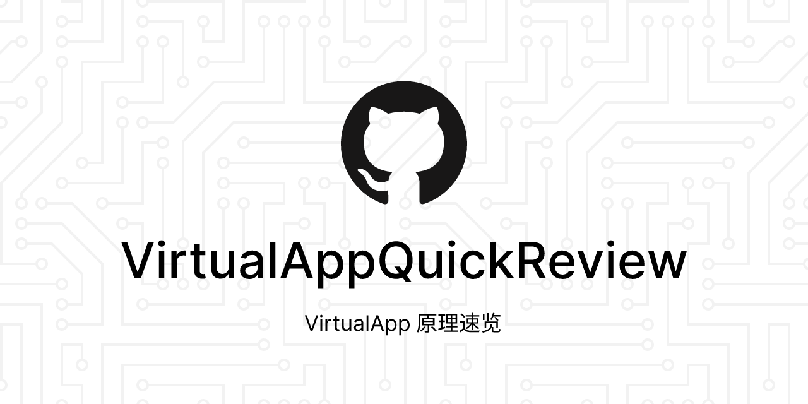
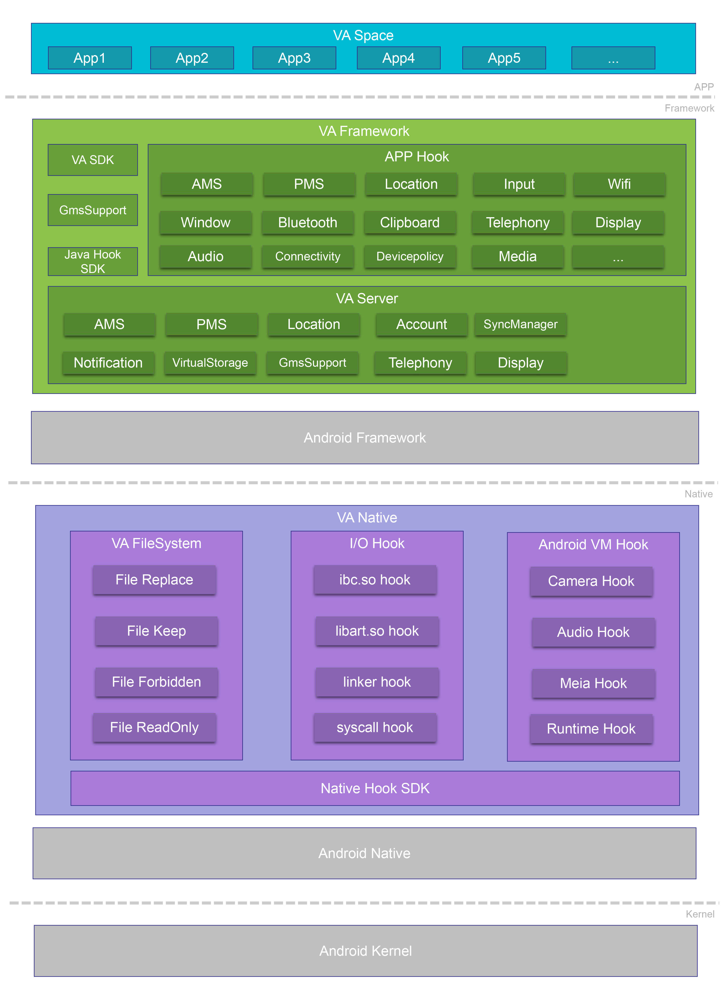

# 前言

从很早以前就一直很好奇 VirtualApp 的相关技术，但是一直抽不出时间。正巧最近想试着自己照猫画虎开发一个类似的容器化应用，并做一些定制化的需求，因此抽空把整个项目过了一遍，也正好帮我整理一遍过去一直对整个 Android 系统较为模糊的认知。
# 速览规划

以下是本系列的速览规划：

0. VirtualApp 原理速览 - 框架体系概述
1. Activity 启动流程 - 我想我们需要先清楚正常的应用是如何启动的
2. 容器内 APP 启动流程 - 四大组件 Activity 是如何实现的
3. 容器内 Service 启动流程 - 四大组件 Service 是如何实现的
4. Broadcast Receiver 容器内实现 - 四大组件 Broadcast Receiver 是如何实现的
5. Content Provider 容器内实现 - 四大组件 Content Provider 是如何实现的
6. 路径重定向和 Xposed 注入时机分析 - 容器内应用的数据访问如何正常进行以及 Xposed 是如何被注入的

# 技术框架
 

VA 框架对应用的操作涉及三个层面：
- Java 
- Framework
- Native
技术只在应用层进行，因此无需 root 。一言蔽之，**欺骗系统**让系统以为应用已安装，同时也**欺骗应用**，让应用以为自己被安装。

| 层次           | 主要工作                                                                                                                                                                                                                                                                                                                                                                                                                                    |
| ------------ | --------------------------------------------------------------------------------------------------------------------------------------------------------------------------------------------------------------------------------------------------------------------------------------------------------------------------------------------------------------------------------------------------------------------------------------- |
| VA Space     | 由VA提供了一个内部的空间，用于安装要在其内部运行的APP，这个空间是系统隔离的。                                                                                                                                                                                                                                                                                                                                                                                               |
| VA Framework | 这一层主要给Android Framework和VAPP做代理，这也是VA的核心。VA提供了一套自己的VA Framework，处于**Android Framework与VA APP之间**。   1. 对于VAPP，其访问的**所有系统Service**均已被 `VA Framework` 代理，它会修改VAPP的请求参数，将其中与VAPP安装信息相关的全部参数**修改为宿主的参数**之后发送给Android Framework（有部分请求会发送给自己的VA Server直接处理而不再发送给Android系统）。这样Android Framework收到VAPP请求后检查参数就会认为没有问题。   2. 待Android系统对该请求处理完成返回结果时，VA Framework同样也会拦截住该返回结果，此时再将原来修改过的参数全部还原为VAPP请求时发送的。   这样VAPP与Android系统的交互也就能跑通了。 |
| VA Native    | 在这一层主要为了完成2个工作，**IO重定向**和VA APP与Android系统交互的**请求修改**。   1. IO重定向是因为可能有部分APP会通过写死的绝对**路径访问**，但是如果APP没有安装到系统，这个路径是不存在的，通过IO重定向，则将其转向VA内部安装的路径。   2. 另外有部分jni函数在**VA Framework中无法hook的**，所以需要在native层来做hook。                                                                                                                                                                                                                         |
# 代码框架

> 考虑到现有开源的 VirtualApp 只支持老版本 Android，因此选择原理相同的 blackbox 进行参考
> 仓库地址：https://github.com/Monster-GM/sandbox

项目代码分为两个模块：
- app模块：用户操作与UI模块
- Bcore模块：此模块为秘盒空间的核心模块，负责完成整个应用的调度
	- src/main：VirtualApp框架代码
	- pine：Hook框架
	- 其他

本系列文章会主要关心其中的 VirtualApp 框架实现部分。
